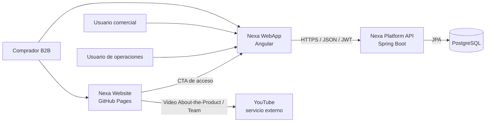
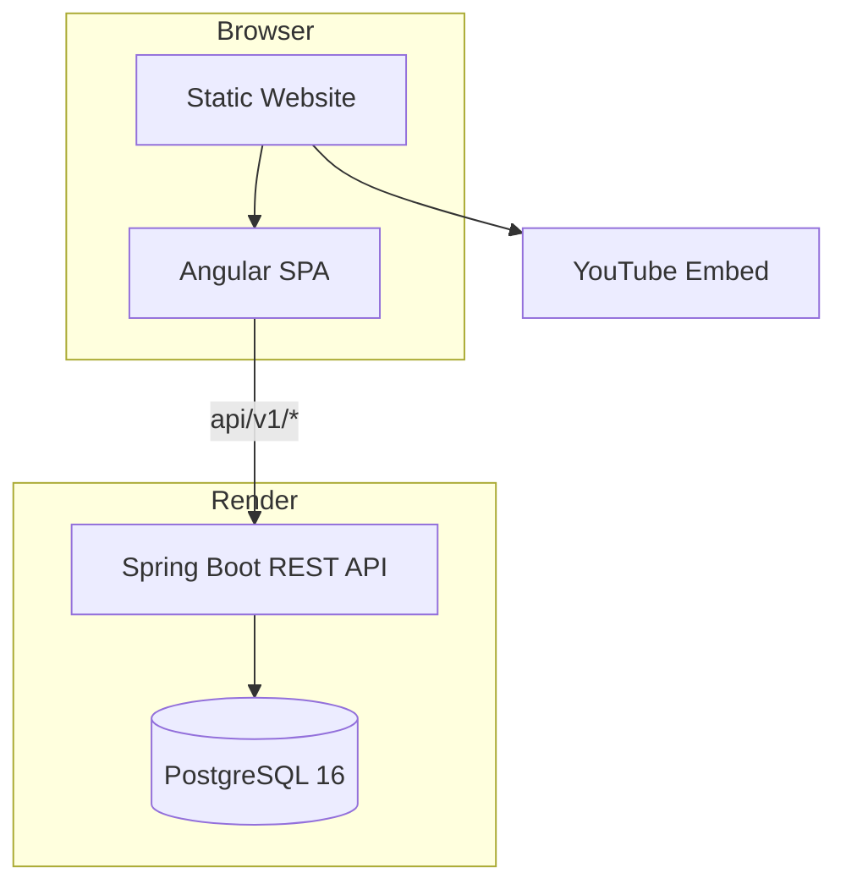
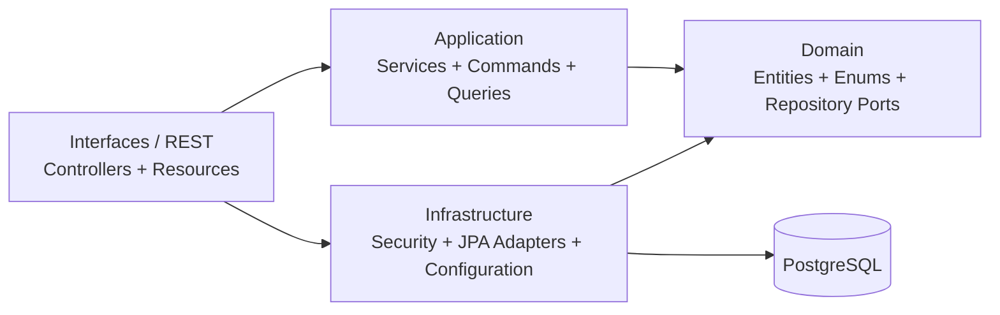

# 4.6. Domain-Driven Software Architecture

Esta sección documenta la arquitectura implementada en los repositorios Open Source de Nexa. Los bounded contexts, componentes y tecnologías descritos a continuación provienen del código actual de `nexa-platform` y `nexa-webapp`.

## 4.6.1. Design-Level EventStorming

El diseño táctico se deriva del flujo principal del producto:

`Catálogo → Solicitud/Pedido → Inventario → Despacho → Documentos/Pago → Seguimiento`

| Bounded context | Comandos principales | Eventos/resultados relevantes | Read models |
|---|---|---|---|
| Identity and Access Management | AuthenticateUser, RegisterUser | UserAuthenticated, AccessRejected | CurrentUser, WorkspaceUser |
| Catalog | CreateProduct, UpdateProduct | ProductCreated, ProductUpdated | ProductResource, CategoryResource |
| Promotions | CreatePromotion | PromotionCreated, PromotionRejected | PromotionResponse |
| Sales | CreateOrder, UpdateOrderStatus | OrderCreated, OrderStatusUpdated | OrderResource, PurchaseRequestResource, CustomerResource |
| Warehouse | RegisterMovement, ReserveStock | InventoryUpdated, StockMovementRegistered | InventoryResource, WarehouseResource |
| Logistics | CreateShipment, RegisterDriverChecklist | ShipmentCreated, ShipmentStatusUpdated | ShipmentResource, DriverChecklistResource |
| Invoicing | CreateInvoice, RegisterPayment | InvoiceCreated, PaymentRegistered | InvoiceResource, PaymentResource, BusinessDocumentResource |

Los puntos de control del dominio se concentran en autenticación y autorización, validación comercial, disponibilidad de inventario, transición de estado del pedido, preparación de despacho y registro documental. El backend aplica estas reglas mediante servicios de aplicación, modelos de dominio, puertos de repositorio y adaptadores JPA.

## 4.6.2. Bounded Contexts

| Contexto | Responsabilidad | Evidencia en `nexa-platform` | Consumidor principal |
|---|---|---|---|
| IAM | Usuarios, roles, JWT y autorización | `iam/application`, `iam/domain`, `iam/infrastructure`, `iam/interfaces` | Login, sesión y guards de WebApp |
| Catalog | Productos, categorías y requerimientos de cadena de frío | `catalog/*` | Catálogo comercial y Buyer Portal |
| Promotions | Promociones vigentes | `promotions/*` | Catálogo y gestión comercial |
| Sales | Clientes, pedidos y solicitudes de compra | `sales/*` | Comercial, pedidos y portal comprador |
| Warehouse | Almacenes, inventario, lotes y movimientos | `warehouse/*` | Operaciones e inventario |
| Logistics | Envíos, rutas y checklist de conductor | `logistics/*` | Despacho y seguimiento |
| Invoicing | Facturas, pagos y documentos comerciales | `invoicing/*` | Comercial y Buyer Portal |
| Shared | Errores, resultados, configuración, health check y compatibilidad | `shared/*` | Todos los contextos |

La WebApp mantiene una separación equivalente por capacidades: `iam`, `catalog`, `clients`, `ordering`, `inventory`, `dispatch`, `analytics`, `dashboard` y `portal`, además de `shared`. Cada capacidad separa `domain`, `application`, `infrastructure` y `presentation` cuando corresponde.

## 4.6.3. Software Architecture Context Diagram

El Website presenta la propuesta de valor, dirige hacia la WebApp e integra YouTube como servicio externo de terceros para publicar los videos About-the-Product y About-the-Team. La WebApp ejecuta los flujos por rol y consume recursos relativos `api/v1/*`. El interceptor compartido compone esas rutas con `environment.apiBaseUrl`. Platform expone REST sobre HTTPS, valida JWT y persiste en PostgreSQL.

## 4.6.4. Software Architecture Container Diagram

| Contenedor | Tecnología real | Responsabilidad | Despliegue |
|---|---|---|---|
| Landing Page | HTML5, CSS3, JavaScript y YouTube Embed | Presentación pública, contenido bilingüe, CTA e integración audiovisual externa | GitHub Pages |
| Web Application | Angular 21, TypeScript 5.9, Angular Router, HttpClient y Angular Material 21 | Experiencia por roles, estado de aplicación e integración REST | Render Static Site |
| REST API | Java 21, Spring Boot 3, Spring Security, Spring Data JPA y springdoc-openapi | Casos de uso, seguridad, reglas y recursos REST | Render Web Service |
| Relational Database | PostgreSQL 16 | Persistencia de negocio y datos seed de revisión | Render PostgreSQL |

## 4.6.5. Software Architecture Component Diagram

La dependencia conceptual apunta hacia el dominio. Los controllers traducen HTTP mediante resources y assemblers; los servicios de aplicación coordinan casos de uso; el dominio contiene entidades y puertos; infraestructura implementa seguridad, persistencia y configuración externa. Esta estructura se verifica directamente en los paquetes Java de cada bounded context.
