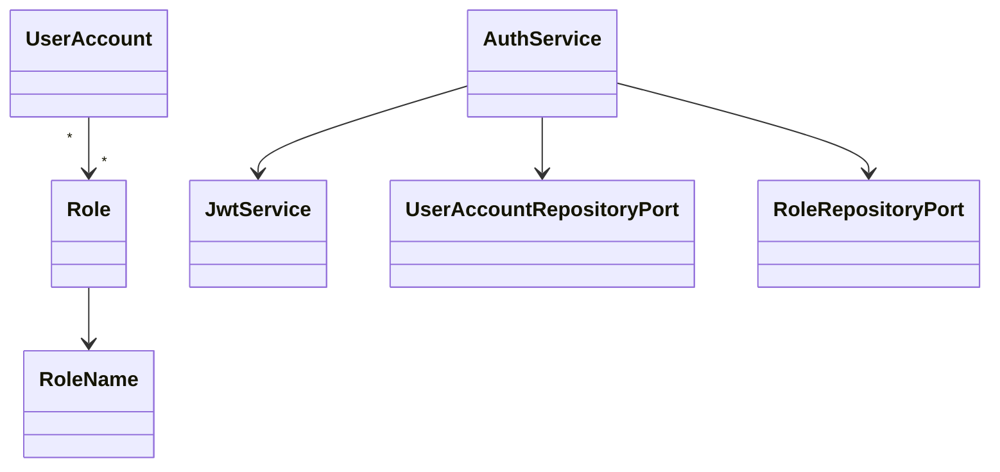
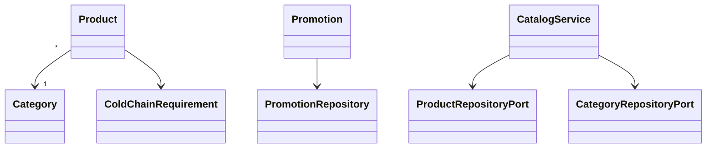
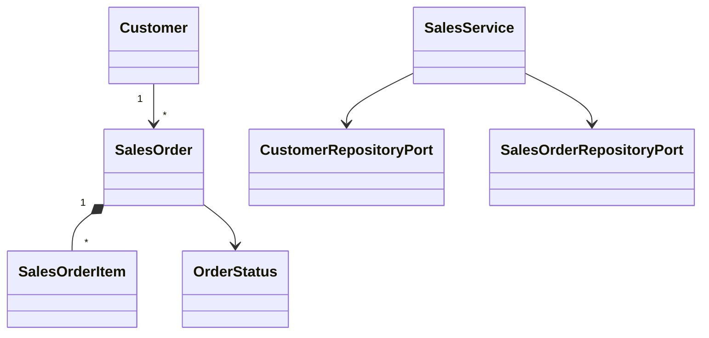
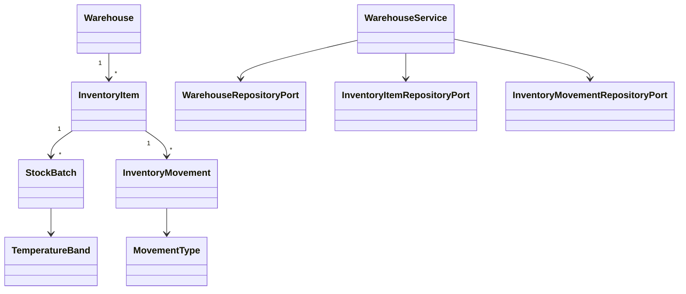
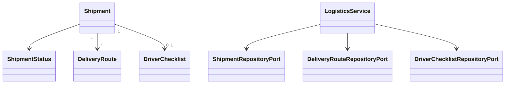
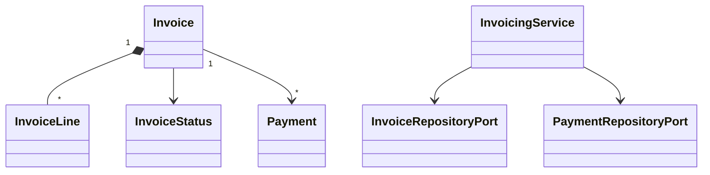

# 4.7. Software Object-Oriented Design

Esta sección representa el diseño orientado a objetos que existe en `nexa-platform`. Se retiraron diagramas heredados de otra implementación tecnológica y se documentan únicamente clases Java, relaciones y responsabilidades verificables en el código Open Source.

## 4.7.1. Class Diagrams

### Identity and Access Management

IAM concentra autenticación, usuarios, roles y emisión/validación de JWT. Spring Security actúa como adaptador técnico y no como lógica de dominio.

### Catalog and Promotions

`Product` y `Category` representan el catálogo real. `ColdChainRequirement` encapsula condiciones de conservación y `Promotion` pertenece a un contexto independiente para evitar mezclar reglas promocionales con persistencia del catálogo.

### Sales

Sales diferencia clientes, órdenes e ítems. Los recursos de solicitudes de compra son proyecciones compatibles con la WebApp y no se presentan como aggregates inexistentes.

### Warehouse

Warehouse modela existencias y movimientos con trazabilidad por lote. Las reglas FEFO se aplican sobre la información de `StockBatch`; no se documenta una clase `FEFOCriteria` porque no existe como tipo independiente en la implementación actual.

### Logistics

Logistics implementa envíos, rutas y checklist operativo. La WebApp presenta el seguimiento a partir del estado del envío y de recursos compatibles expuestos por Platform.

### Invoicing

Invoicing gestiona facturas, líneas, pagos y documentos comerciales. Las respuestas REST se ensamblan en `interfaces/rest/transform`, evitando exponer directamente las entidades JPA.

## 4.7.2. Design Traceability

| Necesidad de negocio | Clases implementadas | API/consumidor |
|---|---|---|
| Autenticar usuarios por rol | UserAccount, Role, AuthService, JwtService | `/api/v1/auth/*`, login WebApp |
| Consultar catálogo refrigerado | Product, Category, ColdChainRequirement | `/api/v1/products`, catálogo y Buyer Portal |
| Gestionar pedidos B2B | Customer, SalesOrder, SalesOrderItem | `/api/v1/orders`, Ordering |
| Consultar y mover inventario | Warehouse, InventoryItem, StockBatch, InventoryMovement | `/api/v1/inventory`, Inventory |
| Coordinar despacho | Shipment, DeliveryRoute, DriverChecklist | `/api/v1/shipments`, Dispatch |
| Consultar documentos y pagos | Invoice, InvoiceLine, Payment | `/api/v1/invoices`, Invoicing/Portal |

El diseño mantiene separación entre recursos HTTP, servicios de aplicación, modelos del dominio y persistencia. Las clases documentadas pueden localizarse en `src/main/java/com/nexa/platform`, lo que permite auditar la correspondencia entre el informe y el software entregado.
