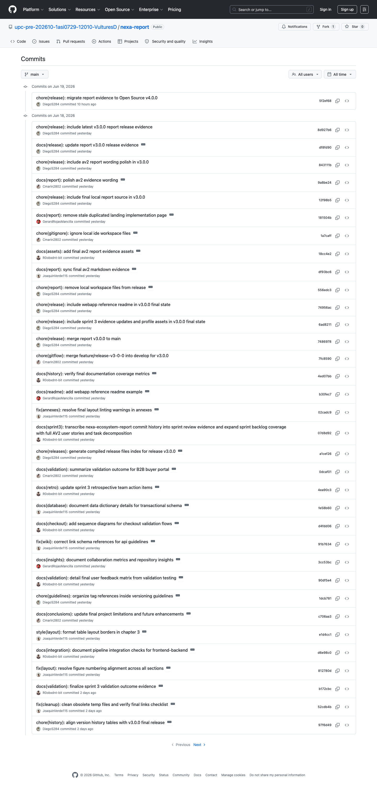
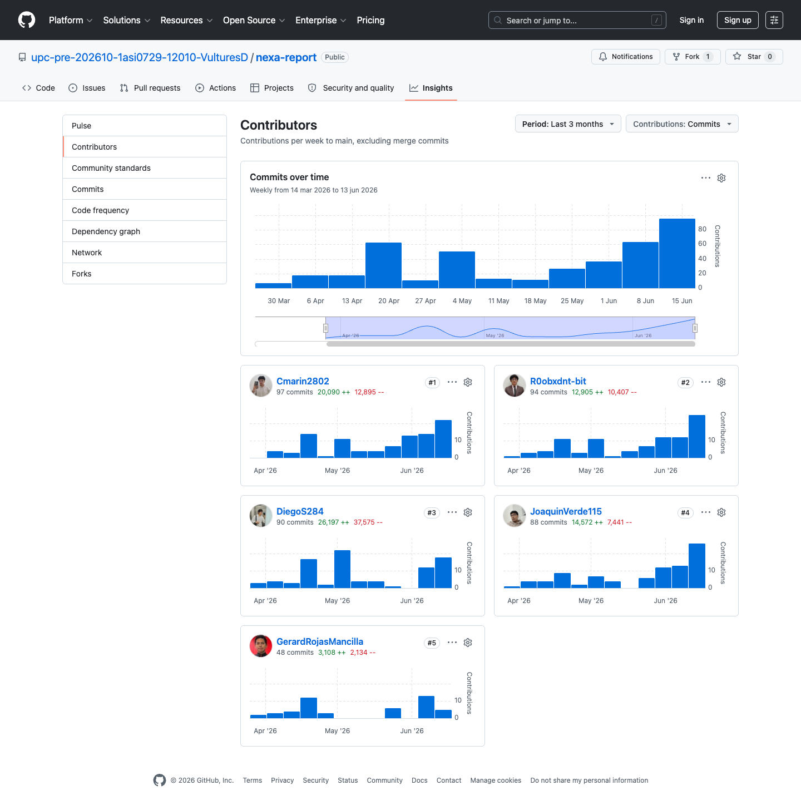
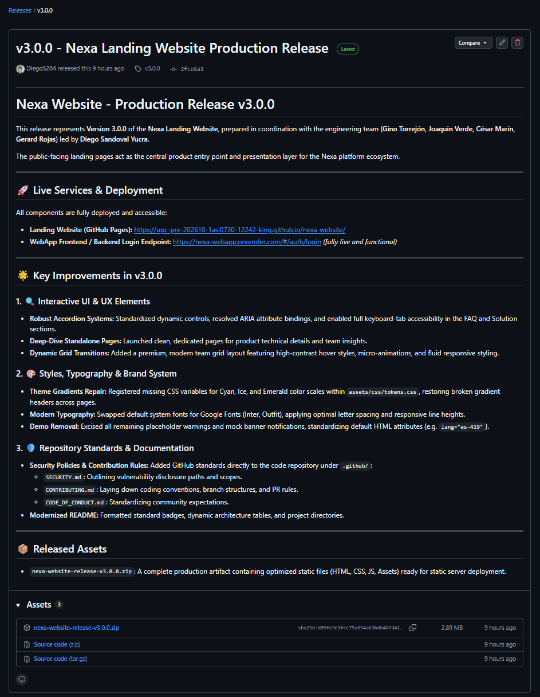
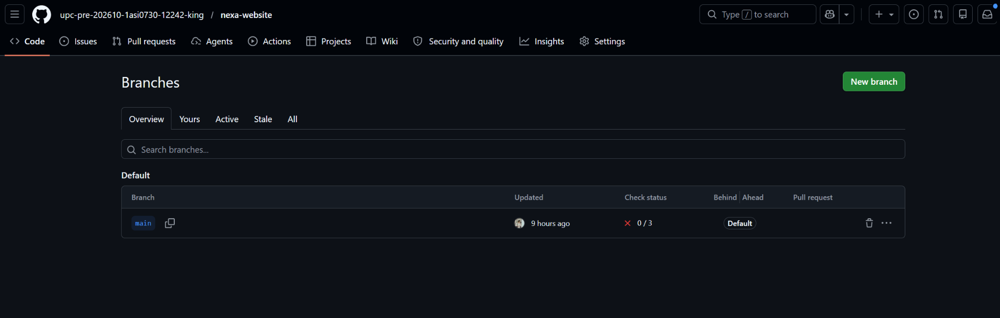
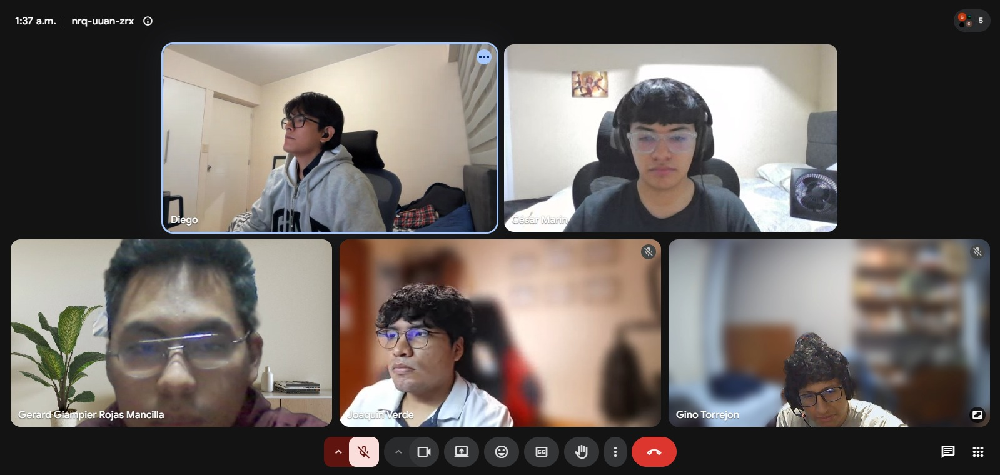

# Annex D: GitHub Repository Evidence

## D.1. Enlaces maestros de repositorios

| Herramienta / Artefacto | Enlace |
|---|---|
| Organización GitHub | [https://github.com/upc-pre-202610-1asi0729-12010-VulturesD](https://github.com/upc-pre-202610-1asi0729-12010-VulturesD) |
| Repositorio GitHub (Reporte) | [https://github.com/upc-pre-202610-1asi0729-12010-VulturesD/nexa-report](https://github.com/upc-pre-202610-1asi0729-12010-VulturesD/nexa-report) |
| Repositorio GitHub (Website) | [https://github.com/upc-pre-202610-1asi0729-12010-VulturesD/nexa-website](https://github.com/upc-pre-202610-1asi0729-12010-VulturesD/nexa-website) |
| Repositorio GitHub (Web Application) | [https://github.com/upc-pre-202610-1asi0729-12010-VulturesD/nexa-webapp](https://github.com/upc-pre-202610-1asi0729-12010-VulturesD/nexa-webapp) |
| Repositorio GitHub (Web Services / Backend) | [https://github.com/upc-pre-202610-1asi0729-12010-VulturesD/nexa-platform](https://github.com/upc-pre-202610-1asi0729-12010-VulturesD/nexa-platform) |

## D.2. Releases auditados para AV2

| Artefacto | Enlace |
|---|---|
| `nexa-report v3.0.0` | [https://github.com/upc-pre-202610-1asi0729-12010-VulturesD/nexa-report/releases/tag/v3.0.0](https://github.com/upc-pre-202610-1asi0729-12010-VulturesD/nexa-report/releases/tag/v3.0.0) |
| `nexa-website v3.0.0` | [https://github.com/upc-pre-202610-1asi0729-12010-VulturesD/nexa-website/releases/tag/v3.0.0](https://github.com/upc-pre-202610-1asi0729-12010-VulturesD/nexa-website/releases/tag/v3.0.0) |
| `nexa-webapp v2.0.0` | [https://github.com/upc-pre-202610-1asi0729-12010-VulturesD/nexa-webapp/releases/tag/v2.0.0](https://github.com/upc-pre-202610-1asi0729-12010-VulturesD/nexa-webapp/releases/tag/v2.0.0) |
| `nexa-platform v1.0.0` | [https://github.com/upc-pre-202610-1asi0729-12010-VulturesD/nexa-platform/releases/tag/v1.0.0](https://github.com/upc-pre-202610-1asi0729-12010-VulturesD/nexa-platform/releases/tag/v1.0.0) |

El release `nexa-report v3.0.0` consolida el corte documental de AV2. Los releases de Website, WebApp y Platform respaldan las piezas implementadas del ecosistema Nexa que se revisan durante Sprint Review.

## D.3. Evidencias GitHub AV2

| Evidencia AV2 | Referencia | Captura |
|---|---|---|
| Commits recientes `nexa-report` | Evidencia de consolidación documental, anexos, Sprint 3, evidencias de despliegue y preparación del release documental. |  |
| Contributors `nexa-report` | Evidencia de colaboración en el repositorio del informe. |  |
| GitHub Release `nexa-website v3.0.0` | Release de cierre AV2 disponible para revisión de Landing Page. |  |
| Branches `nexa-website` | Evidencia de ramas de Landing Page. |  |
| Commits recientes AV2 `nexa-website` | Evidencia de ajustes de contenido, navegación y cierre público de Website. |  |
| Commits históricos de cierre AV2 `nexa-website` | Evidencia complementaria del trabajo acumulado sobre Landing Page. |  |
| GitHub Release `nexa-webapp v2.0.0` | Release de cierre WebApp usado como evidencia de Sprint 3. |  |
| Branches `nexa-webapp` | Evidencia de ramas de Web Application. |  |
| Commits recientes AV2 `nexa-webapp` | Evidencia de estabilización de Web Application durante Sprint 3. |   |
| GitHub Release `nexa-platform v1.0.0` | Release de cierre Web Services usado como evidencia de Sprint 3. |  |
| Branches `nexa-platform` | Evidencia de ramas de Web Services. |  |
| Commits recientes AV2 `nexa-platform` | Evidencia de implementación backend, persistencia, documentación y release. |  |
| Commits por bounded context `nexa-platform` | Evidencia de trabajo modular asociado a Catalog Management, Sales, Warehouse, IAM, Invoicing, Logistics y Shared Kernel. |  |

La revisión también puede realizarse desde las páginas públicas de commits, pull requests, Actions y releases. Las capturas anteriores funcionan como soporte visual del corte, mientras que los enlaces mantienen la trazabilidad navegable del estado entregado.

## D.4. Evidencia de coordinación grupal

Este anexo respalda las secciones de colaboración del informe. Se registran pruebas de coordinación síncrona y preparación de entregas usadas durante los sprints, incluyendo reuniones, revisiones de avance y práctica de exposición.

### Sprint 1

Figura. Trabajo colaborativo del equipo durante Sprint 1. Elaboración propia.

Figura. Reunión virtual de coordinación del equipo durante Sprint 1. Elaboración propia.

Figura. Práctica de exposición para la sustentación AV1. Elaboración propia.

### Sprint 2

Figura. Reunión de coordinación del equipo durante Sprint 2. Elaboración propia.

Figura. Exposición del equipo para la sustentación TB1. Elaboración propia.

### Sprint 3

Figura. Trabajo colaborativo del equipo durante Sprint 3. Elaboración propia.

Figura. Revisión de evidencias y coordinación de cierre durante Sprint 3. Elaboración propia.

Figura. Práctica de exposición y preparación de la sustentación AV2. Elaboración propia.
