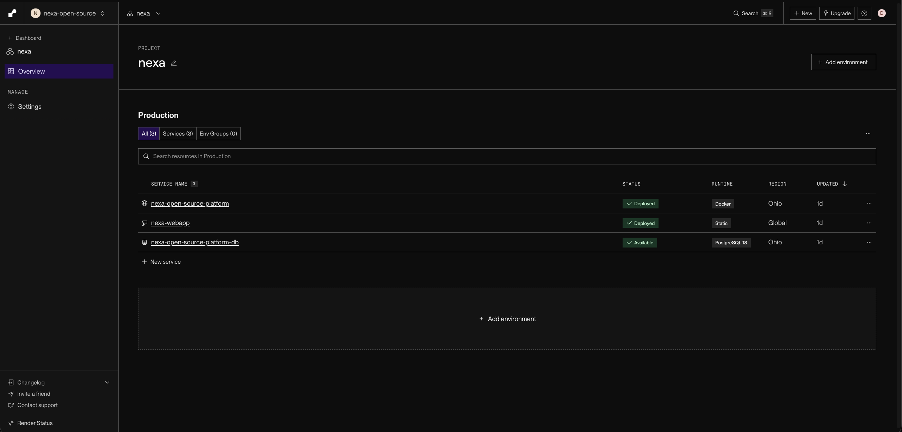
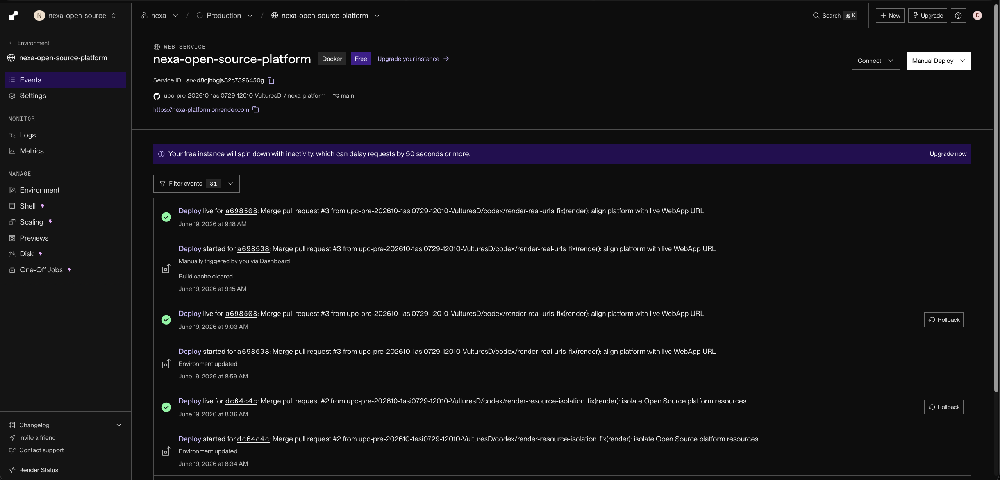
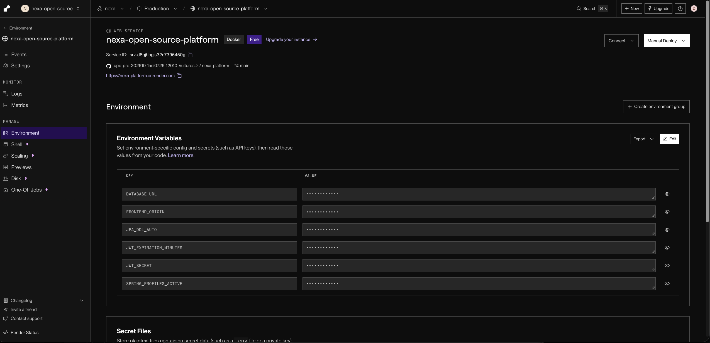
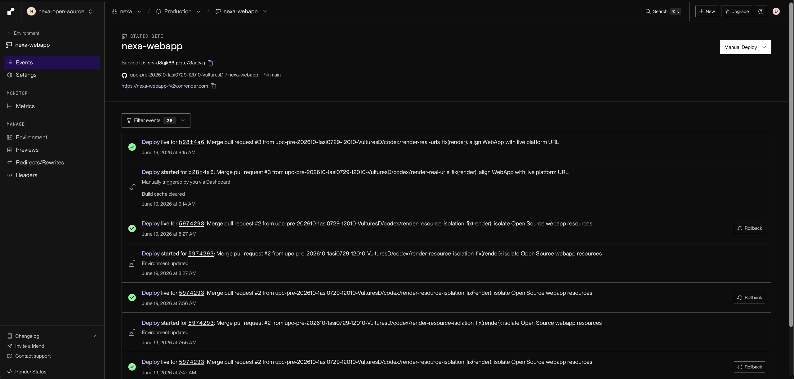
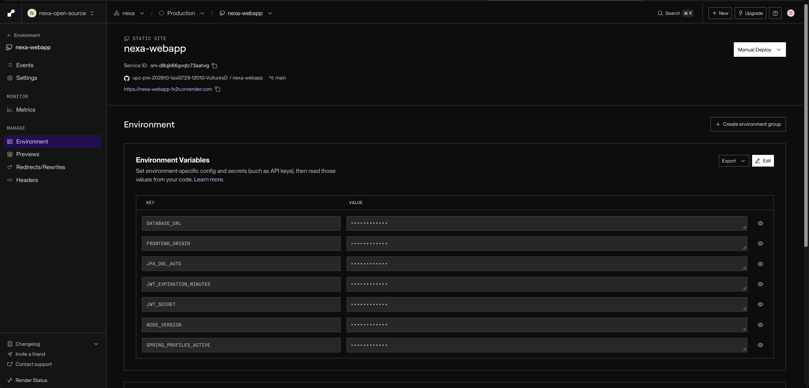
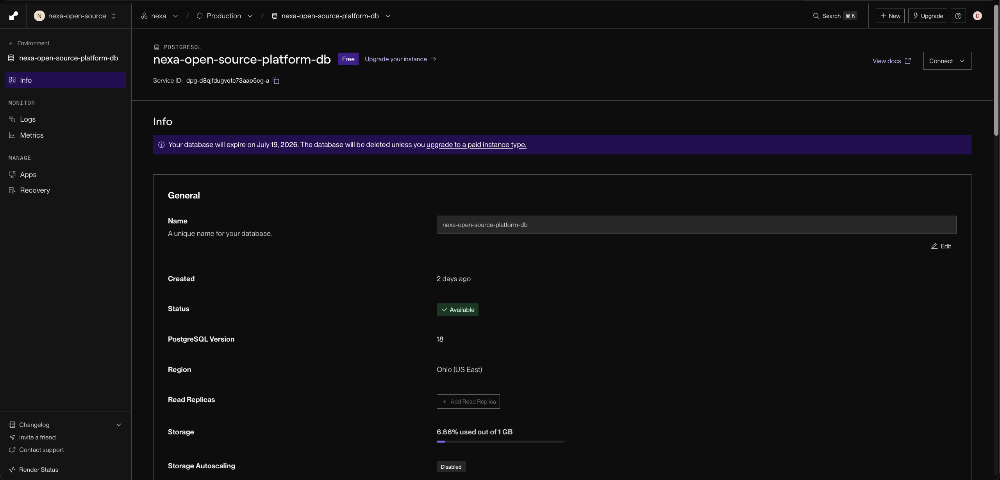
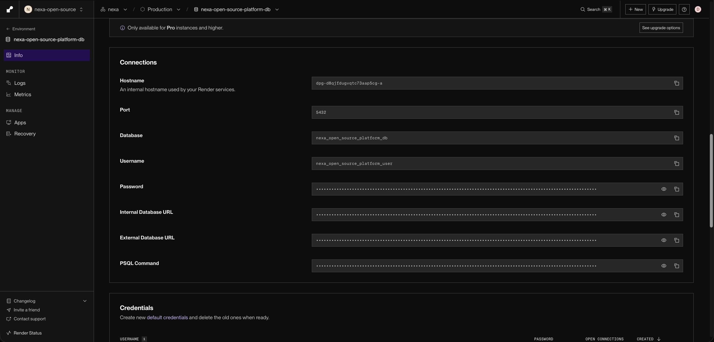

# Annex E: Deployment and Services Evidence

| Servicio | URL | Resultado esperado |
|---|---|---|
| Landing Page | https://upc-pre-202610-1asi0729-12010-vulturesd.github.io/nexa-website/ | Website público |
| WebApp login | https://nexa-webapp-fv2v.onrender.com/login | Pantalla de acceso |
| Platform health | https://nexa-platform.onrender.com/actuator/health | Estado HTTP saludable |
| Platform users | https://nexa-platform.onrender.com/api/v1/users | Usuarios seed en JSON |

## Render configuration

Platform utiliza PostgreSQL 18, perfiles `postgres,seed`, CORS restringido al origen real de WebApp y health check `/actuator/health`. WebApp utiliza un Static Site con fallback SPA hacia `/index.html` y compila la URL `https://nexa-platform.onrender.com/api/v1`.

El entorno Render del proyecto `nexa` agrupa tres recursos principales: `nexa-open-source-platform`, `nexa-webapp` y `nexa-open-source-platform-db`. Esta separación permite revisar frontend, API backend y persistencia como servicios independientes dentro del mismo ambiente de Production.

### Platform API

`nexa-open-source-platform` se mantiene como Web Service Docker conectado al repositorio de Platform. La evidencia registra el historial de eventos de despliegue y la configuración de entorno usada por la API sin exponer valores sensibles.

### WebApp

`nexa-webapp` se mantiene como Static Site conectado al repositorio de WebApp. La evidencia registra el despliegue vigente y las variables de entorno visibles para el corte de Sprint Review.

### PostgreSQL

`nexa-open-source-platform-db` se mantiene como base PostgreSQL administrada por Render. La vista general registra versión, región y estado del servicio; la vista de conexiones documenta los datos técnicos necesarios para enlazar Platform API con la base sin mostrar credenciales.

## Review limitation

Render Free puede suspender Platform por inactividad. El primer request puede requerir alrededor de dos minutos; las solicitudes posteriores responden con normalidad mientras el servicio permanece activo.
