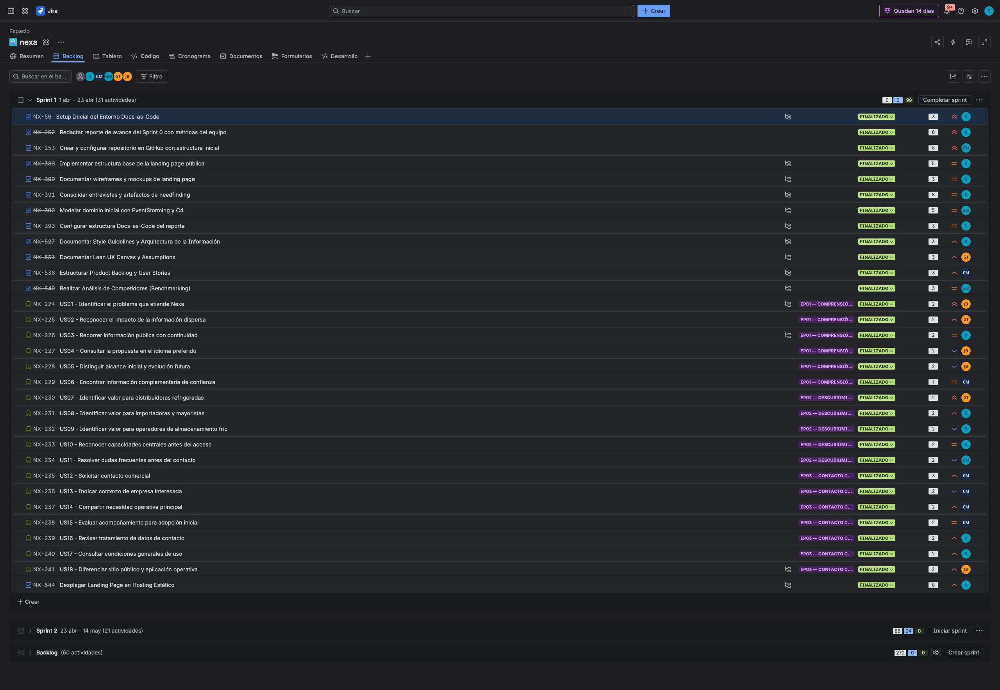
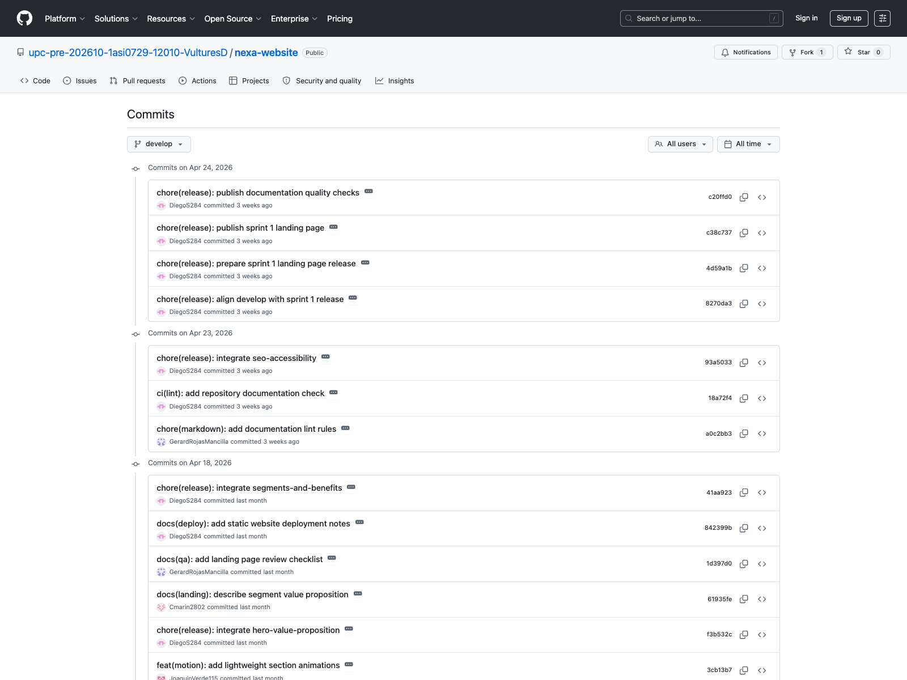
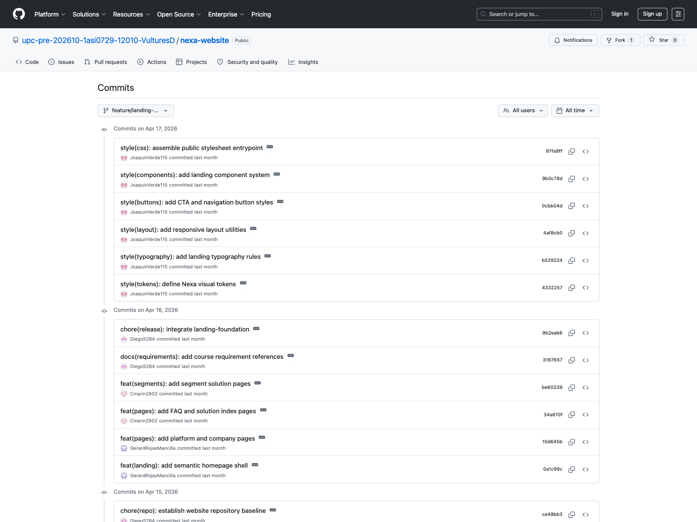
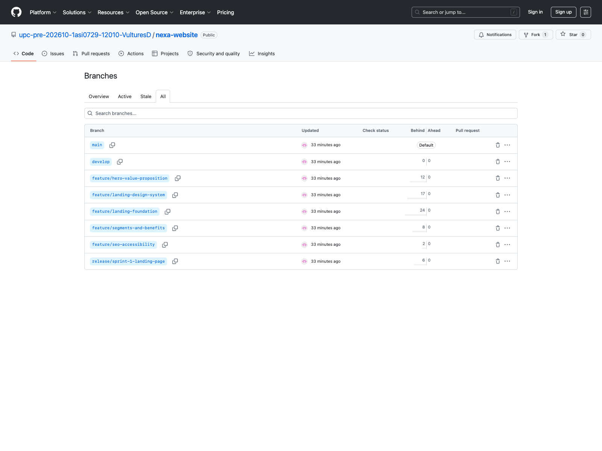
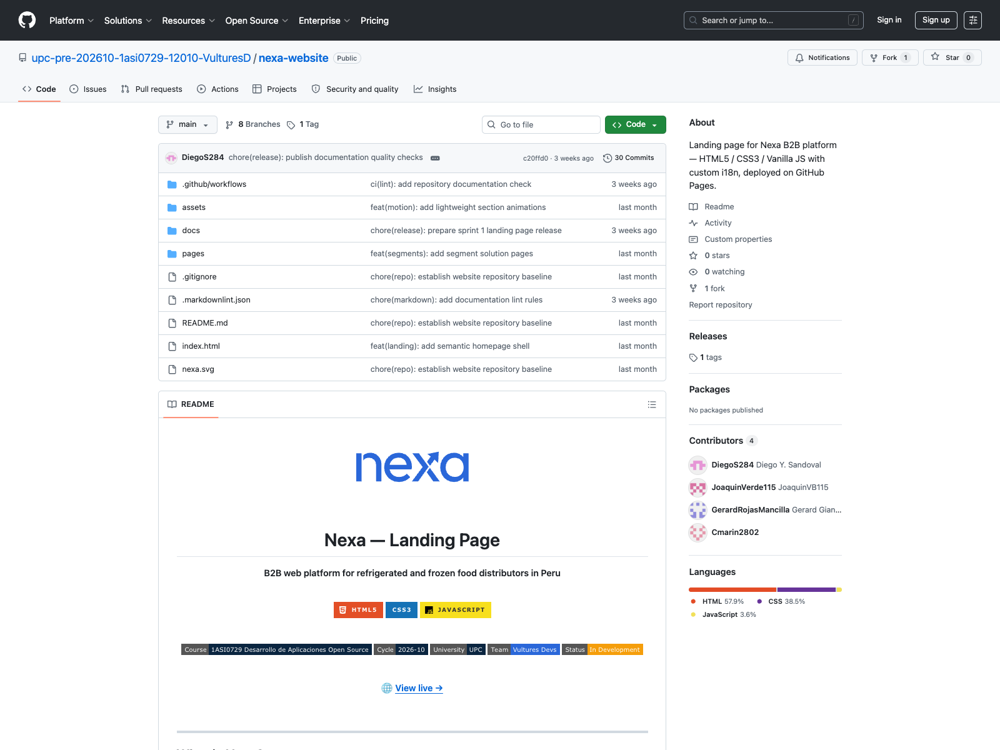
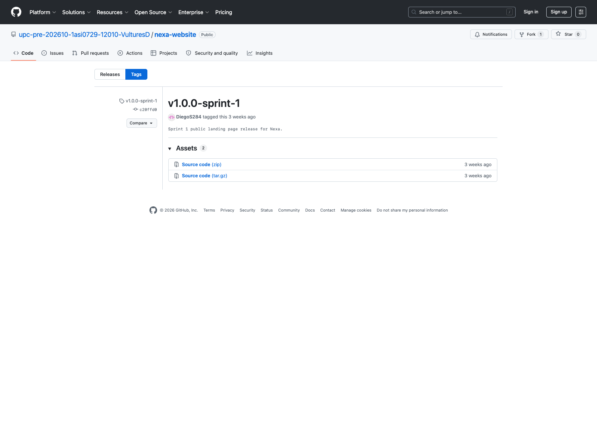

## 5.2.1. Sprint 1

El Sprint 1 corresponde a la línea base AV1. El objetivo fue establecer la estructura Docs-as-Code del informe, documentar los primeros artefactos de discovery y diseño, y publicar la Landing Page como primer incremento visible del producto. La evidencia se organiza en planificación, backlog, commits, ejecución, despliegue y colaboración.

### 5.2.1.1. Sprint Planning 1.

La planificación del Sprint 1 organizó la base documental, visual y pública del proyecto. El alcance del sprint se concentró en Landing Page, reporte Docs-as-Code, Product Backlog inicial, User Stories, discovery y artefactos de diseño.

| Campo | Registro |
|---|---|
| Sprint # | Sprint 1 |
| Sprint Planning Background | Primer incremento del proyecto orientado a establecer la base Docs-as-Code, el discovery inicial, los primeros artefactos UX/UI y la Landing Page pública. |
| Date | 2026-04-01 |
| Time | 19:00 PM |
| Location | Reunión virtual del equipo |
| Prepared By | Yucra Sandoval, Diego Sebastian |
| Attendees (to planning meeting) | Yucra Sandoval, Diego Sebastian / Verde Bueno, Joaquín / Marín Cueva, César / Rojas Mancilla, Gerard / Torrejón, Gino |
| Sprint 0 Review Summary | No aplica por ser el primer sprint del proyecto. |
| Sprint 0 Retrospective Summary | No aplica por ser el primer sprint del proyecto. |
| Sprint Goal & User Stories | Landing Page, estructura Docs-as-Code, artefactos iniciales de discovery y diseño. |
| Sprint 1 Goal | Establecer la base documental y visual del proyecto mediante el reporte Docs-as-Code, la Landing Page y los primeros artefactos de investigación y diseño. |
| Sprint 1 Velocity | 99 Story Points |
| Sum of Story Points | 99 Story Points |

Figura. Reunión virtual del equipo para coordinación de Sprint 1.

### 5.2.1.2. Aspect Leaders and Collaborators.

La ejecución del sprint evidencia una distribución funcional del liderazgo. En lugar de concentrar toda la iteración en un único perfil, el equipo repartió la responsabilidad entre dominio, diseño, arquitectura, documentación y construcción visible del sitio. Esta organización es consistente con el Student Outcome ABET 5 y explica por qué el incremento AV1 combina trabajo público demostrable con profundidad ingenieril.

*Distribución de liderazgos y roles funcionales en el Sprint 1*

| Team Member | GitHub Username | Project Management | UX/UI Design | Software Architecture | Frontend Development | Documentation |
| :--- | :--- | :---: | :---: | :---: | :---: | :---: |
| Yucra Sandoval, Diego Sebastian | DiegoS284 | L | C | C | C | C |
| Verde Bueno, Joaquín Francisco | JoaquinVerde115 | C | L | C | C | C |
| Marín Cueva, César Fernando | Cmarin2802 | C | C | C | C | L |
| Torrejón De Los Santos, Gino Rodrigo | R0obxdnt-bit | C | C | C | C | L |
| Rojas Mancilla, Gerard Gianpier | GerardRojasMancilla | C | C | L | L | C |

### 5.2.1.3. Sprint Backlog 1.

El Sprint Backlog 1 concentra el trabajo realizado entre el **2026-04-01 y 2026-04-23**. El objetivo principal del sprint fue construir la base documental del proyecto, organizar el trabajo bajo Docs-as-Code y consolidar el primer entregable visible mediante el Landing Page, junto con los artefactos iniciales de investigación, diseño y backlog.

**URL del board/backlog:** [Jira Backlog — Proyecto Nexa](https://team-nexa.atlassian.net/jira/software/projects/NX/boards/1/backlog)

La siguiente tabla presenta los User Stories asignados al Sprint 1 y los Work-items utilizados para descomponer el trabajo. Además de las User Stories, el sprint incluye tareas de soporte documental, configuración y evidencia necesarias para completar el incremento comprometido.

| Sprint # | User Story Id | User Story Title | Work-Item / Task Id | Task Title | Description | Estimation (Hours) | Assigned To | Status |
|---|---|---|---|---|---|---:|---|---|
| Sprint 1 | N/A | Setup inicial del entorno Docs-as-Code | NX-56 | Preparar estructura base del reporte | Organizar la base documental en Markdown para registrar el avance del proyecto desde el primer sprint. | 3.5 | Diego Yucra Sandoval | Done |
| Sprint 1 | N/A | Redactar reporte de avance del Sprint 0 con métricas del equipo | NX-252 | Documentar avance inicial del proyecto | Registrar el avance documental inicial y las primeras decisiones del equipo para sostener la trazabilidad del informe. | 7.0 | Diego Yucra Sandoval | Done |
| Sprint 1 | N/A | Crear y configurar repositorio en GitHub con estructura inicial | NX-253 | Configurar repositorio del proyecto | Crear la base del repositorio y organizar la estructura inicial del trabajo colaborativo. | 7.5 | Gerard Rojas Mancilla | Done |
| Sprint 1 | N/A | Implementar estructura base de landing page pública | NX-389 | Construir base del Landing Page | Implementar la estructura inicial del sitio público para presentar la propuesta de valor del producto. | 5.0 | Diego Yucra Sandoval | Done |
| Sprint 1 | N/A | Documentar wireframes y mockups de landing page | NX-390 | Registrar diseño visual del Landing Page | Documentar los wireframes y mockups del sitio público como evidencia de diseño UX/UI. | 3.0 | Diego Yucra Sandoval | Done |
| Sprint 1 | N/A | Consolidar entrevistas y artefactos de needfinding | NX-391 | Organizar evidencia de investigación | Consolidar entrevistas, hallazgos y artefactos iniciales de análisis de usuarios. | 7.5 | Diego Yucra Sandoval | Done |
| Sprint 1 | N/A | Modelar dominio inicial con EventStorming y C4 | NX-392 | Documentar modelado inicial de dominio | Elaborar y registrar artefactos iniciales de dominio y arquitectura de alto nivel. | 5.5 | Gerard Rojas Mancilla | Done |
| Sprint 1 | N/A | Configurar estructura Docs-as-Code del reporte | NX-393 | Ordenar estructura documental del informe | Ajustar la organización del reporte para que siga la estructura solicitada en el statement. | 3.5 | Diego Yucra Sandoval | Done |
| Sprint 1 | N/A | Documentar Lean UX Canvas y Assumptions | NX-534 | Completar artefactos Lean UX | Registrar assumptions, problem statements y canvas como soporte de discovery del proyecto. | 3.5 | Gino Torrejón | Done |
| Sprint 1 | N/A | Estructurar Product Backlog y User Stories | NX-536 | Organizar backlog inicial | Redactar y ordenar las User Stories y el Product Backlog inicial del producto. | 4.0 | César Marín | Done |
| Sprint 1 | N/A | Realizar análisis de competidores | NX-540 | Documentar benchmarking competitivo | Analizar competidores y registrar hallazgos para sustentar la diferenciación de Nexa. | 3.5 | Gerard Rojas Mancilla | Done |
| Sprint 1 | US01 | Identificar el problema que atiende Nexa | NX-224 | Redactar contenido de problema principal | Presentar en el Landing Page el problema central que busca resolver Nexa. | 2.0 | Joaquín Verde | Done |
| Sprint 1 | US02 | Reconocer el impacto de la información dispersa | NX-225 | Documentar impacto del problema | Explicar el impacto operativo de trabajar con información dispersa en pedidos y coordinación. | 2.0 | Gino Torrejón | Done |
| Sprint 1 | US03 | Recorrer información pública con continuidad | NX-226 | Organizar recorrido del sitio público | Definir la continuidad de navegación del Landing Page para visitantes. | 2.5 | Diego Yucra Sandoval | Done |
| Sprint 1 | US04 | Consultar la propuesta en el idioma preferido | NX-227 | Registrar soporte de idioma | Documentar la intención de consulta multilenguaje en la propuesta pública. | 2.0 | Joaquín Verde | Done |
| Sprint 1 | US05 | Distinguir alcance inicial y evolución futura | NX-228 | Explicar alcance inicial del producto | Diferenciar el alcance inicial del producto y su evolución esperada. | 2.0 | Joaquín Verde | Done |
| Sprint 1 | US06 | Encontrar información complementaria de confianza | NX-229 | Organizar información de confianza | Presentar información complementaria que refuerce la credibilidad del Landing Page. | 1.5 | César Marín | Done |
| Sprint 1 | US07 | Identificar valor para distribuidoras refrigeradas | NX-230 | Redactar propuesta para distribuidoras | Explicar el valor de Nexa para distribuidoras de productos refrigerados. | 2.5 | Gino Torrejón | Done |
| Sprint 1 | US08 | Identificar valor para importadoras y mayoristas | NX-231 | Redactar propuesta para importadoras y mayoristas | Presentar el valor de Nexa para importadoras y mayoristas con operación B2B. | 2.0 | Diego Yucra Sandoval | Done |
| Sprint 1 | US09 | Identificar valor para operadores de almacenamiento frío | NX-232 | Redactar propuesta para almacenamiento frío | Explicar el valor del producto para operadores vinculados a almacenamiento refrigerado. | 2.0 | Diego Yucra Sandoval | Done |
| Sprint 1 | US10 | Reconocer capacidades centrales antes del acceso | NX-233 | Documentar capacidades principales | Mostrar capacidades centrales del producto antes de ingresar a la aplicación operativa. | 2.0 | Diego Yucra Sandoval | Done |
| Sprint 1 | US11 | Resolver dudas frecuentes antes del contacto | NX-234 | Estructurar preguntas frecuentes | Organizar dudas frecuentes para reducir fricción antes del contacto comercial. | 2.0 | Gerard Rojas Mancilla | Done |
| Sprint 1 | US12 | Solicitar contacto comercial | NX-235 | Implementar contacto comercial | Habilitar una ruta de contacto para visitantes interesados en la propuesta. | 3.0 | César Marín | Done |
| Sprint 1 | US13 | Indicar contexto de empresa interesada | NX-236 | Capturar contexto de empresa | Permitir que el visitante indique información básica sobre su empresa. | 2.0 | César Marín | Done |
| Sprint 1 | US14 | Compartir necesidad operativa principal | NX-237 | Registrar necesidad operativa | Permitir que el visitante comunique la principal necesidad operativa que desea resolver. | 2.0 | César Marín | Done |
| Sprint 1 | US15 | Evaluar acompañamiento para adopción inicial | NX-238 | Explicar acompañamiento inicial | Mostrar el soporte de adopción inicial considerado para empresas interesadas. | 2.5 | César Marín | Done |
| Sprint 1 | US16 | Revisar tratamiento de datos de contacto | NX-239 | Documentar tratamiento de datos | Presentar el tratamiento básico de datos de contacto del visitante. | 2.0 | Diego Yucra Sandoval | Done |
| Sprint 1 | US17 | Consultar condiciones generales de uso | NX-240 | Documentar condiciones generales | Presentar condiciones generales asociadas al uso de la experiencia pública. | 2.0 | Diego Yucra Sandoval | Done |
| Sprint 1 | US18 | Diferenciar sitio público y aplicación operativa | NX-241 | Explicar relación Landing Page y Web Application | Diferenciar el sitio público informativo de la aplicación operativa interna. | 2.5 | Joaquín Verde | Done |
| Sprint 1 | N/A | Desplegar Landing Page en hosting estático | NX-544 | Publicar Landing Page | Desplegar el Landing Page para disponer de una evidencia pública del primer incremento. | 7.0 | Diego Yucra Sandoval | Done |

Nota. Las estimaciones se registran en horas para el control del Sprint Backlog, mientras que la priorización general del Product Backlog se mantiene en Story Points. Elaboración propia.

### 5.2.1.4. Development Evidence for Sprint Review.

La evidencia de desarrollo del Sprint 1 abarca cuatro repositorios activos dentro de la organización [upc-pre-202610-1asi0729-12010-VulturesD](https://github.com/upc-pre-202610-1asi0729-12010-VulturesD). El repositorio **nexa-report** concentra toda la documentación académica del proyecto, construida de forma incremental desde el 01/04/2026. El repositorio **nexa-website** contiene la implementación real del Landing Page desplegado en GitHub Pages. Los repositorios **[nexa-platform](https://github.com/upc-pre-202610-1asi0729-12010-VulturesD/nexa-platform)** y **[nexa-webapp](https://github.com/upc-pre-202610-1asi0729-12010-VulturesD/nexa-webapp)** fueron inicializados durante el sprint como base para la siguiente iteración. A continuación se presenta la tabla de commits relacionados con el incremento del Sprint 1, organizados por repositorio.

*Commits del repositorio `nexa-report`*

- Complete commit history: [https://github.com/upc-pre-202610-1asi0729-12010-VulturesD/nexa-website/commits](https://github.com/upc-pre-202610-1asi0729-12010-VulturesD/nexa-website/commits)
- Branches: [https://github.com/upc-pre-202610-1asi0729-12010-VulturesD/nexa-website/branches](https://github.com/upc-pre-202610-1asi0729-12010-VulturesD/nexa-website/branches)
- Contributors/Insights: [https://github.com/upc-pre-202610-1asi0729-12010-VulturesD/nexa-website/graphs/contributors](https://github.com/upc-pre-202610-1asi0729-12010-VulturesD/nexa-website/graphs/contributors)
- Network graph: [https://github.com/upc-pre-202610-1asi0729-12010-VulturesD/nexa-website/network](https://github.com/upc-pre-202610-1asi0729-12010-VulturesD/nexa-website/network)
- Release/tag: [https://github.com/upc-pre-202610-1asi0729-12010-VulturesD/nexa-website/releases/tag/v1.0.0-sprint-1](https://github.com/upc-pre-202610-1asi0729-12010-VulturesD/nexa-website/releases/tag/v1.0.0-sprint-1)

La tabla incluye los 30 commits disponibles del historial reconstruido del Landing Page. Ver tabla completa independiente en `website-commit-evidence-full.md`.

| Repository | Branch | Commit Id | Author | Commit Message | Commit Message Body | Sprint Evidence Scope | Committed on |
|---|---|---|---|---|---|---|---|
| `upc-pre-202610-1asi0729-12010-VulturesD/nexa-website` | `main` | [c20ffd0](https://github.com/upc-pre-202610-1asi0729-12010-VulturesD/nexa-website/commit/c20ffd02edc6902a106e40813568eba21ae10371) | DiegoS284 &lt;diego64g284@gmail.com&gt; | `chore(release): publish documentation quality checks` | Merge documentation quality checks into main after Sprint 1 release preparation. This keeps the published website repository aligned with the final reviewed source. Supports GitHub collaboration evidence for Sprint 1. | Cierre GitFlow y release TB1 | 2026-04-23 |
| `upc-pre-202610-1asi0729-12010-VulturesD/nexa-website` | `main` | [c38c737](https://github.com/upc-pre-202610-1asi0729-12010-VulturesD/nexa-website/commit/c38c73747f4610f6396f6a7667287d2af6922855) | DiegoS284 &lt;diego64g284@gmail.com&gt; | `chore(release): publish sprint 1 landing page` | Merge the Sprint 1 landing page release branch into main. This keeps the published branch aligned with the reviewed public website increment. Supports AV1 deployment and GitFlow evidence. | Cierre GitFlow y release TB1 | 2026-04-23 |
| `upc-pre-202610-1asi0729-12010-VulturesD/nexa-website` | `release/sprint-1-landing-page` | [4d59a1b](https://github.com/upc-pre-202610-1asi0729-12010-VulturesD/nexa-website/commit/4d59a1b0cb69ebcc31a592d7a6c109f606fd845e) | DiegoS284 &lt;diego64g284@gmail.com&gt; | `chore(release): prepare sprint 1 landing page release` | Record the Sprint 1 landing page release state with public pages, design system, i18n, and repository documentation. This branch marks the AV1 public website checkpoint. Supports release evidence for Sprint 1 review. | Cierre GitFlow y release TB1 | 2026-04-23 |
| `upc-pre-202610-1asi0729-12010-VulturesD/nexa-website` | `release/sprint-1-landing-page` | [93a5033](https://github.com/upc-pre-202610-1asi0729-12010-VulturesD/nexa-website/commit/93a50336c1b4092d63c07c903a58cae83ddb740d) | DiegoS284 &lt;diego64g284@gmail.com&gt; | `chore(release): integrate seo-accessibility` | Merge feature/seo-accessibility into develop with a no-fast-forward integration commit. This preserves documentation quality evidence for Sprint 1 review. Supports GitFlow traceability for the public Nexa website. | Cierre GitFlow y release TB1 | 2026-04-22 |
| `upc-pre-202610-1asi0729-12010-VulturesD/nexa-website` | `release/sprint-1-landing-page` | [8270da3](https://github.com/upc-pre-202610-1asi0729-12010-VulturesD/nexa-website/commit/8270da31778f0ee0d934b464368d1cc378274903) | DiegoS284 &lt;diego64g284@gmail.com&gt; | `chore(release): align develop with sprint 1 release` | Merge the published Sprint 1 release state back into develop. This keeps long-lived branches aligned for later website improvements. Supports GitFlow continuity after AV1. | Cierre GitFlow y release TB1 | 2026-04-23 |
| `upc-pre-202610-1asi0729-12010-VulturesD/nexa-website` | `feature/seo-accessibility` | [18a72f4](https://github.com/upc-pre-202610-1asi0729-12010-VulturesD/nexa-website/commit/18a72f4241679af768ccf3f5c3fd0feb23009af6) | DiegoS284 &lt;diego64g284@gmail.com&gt; | `ci(lint): add repository documentation check` | Add a GitHub workflow for documentation checks on repository changes. This creates visible collaboration evidence around quality control. Supports Sprint 1 GitHub evidence for the public website. | Landing Page, comunicacion publica y evidencia Sprint 1 | 2026-04-22 |
| `upc-pre-202610-1asi0729-12010-VulturesD/nexa-website` | `feature/seo-accessibility` | [a0c2bb3](https://github.com/upc-pre-202610-1asi0729-12010-VulturesD/nexa-website/commit/a0c2bb314129945accb591be680a360af7206e80) | GerardRojasMancilla &lt;u202413142@upc.edu.pe&gt; | `chore(markdown): add documentation lint rules` | Add Markdown lint configuration for consistent website repository documentation. This keeps README and supporting docs reviewable under a predictable style. Supports Docs-as-Code hygiene for Sprint 1. | Landing Page, comunicacion publica y evidencia Sprint 1 | 2026-04-22 |
| `upc-pre-202610-1asi0729-12010-VulturesD/nexa-website` | `release/sprint-1-landing-page` | [41aa923](https://github.com/upc-pre-202610-1asi0729-12010-VulturesD/nexa-website/commit/41aa923ef132c86c71917b4cb1d35ebd243d0549) | DiegoS284 &lt;diego64g284@gmail.com&gt; | `chore(release): integrate segments-and-benefits` | Merge feature/segments-and-benefits into develop with a no-fast-forward integration commit. This preserves feature branch evidence for Sprint 1 review. Supports GitFlow traceability for the public Nexa website. | Cierre GitFlow y release TB1 | 2026-04-18 |
| `upc-pre-202610-1asi0729-12010-VulturesD/nexa-website` | `feature/segments-and-benefits` | [842399b](https://github.com/upc-pre-202610-1asi0729-12010-VulturesD/nexa-website/commit/842399b38719c443b48e41bdcd443e392f47c4a8) | DiegoS284 &lt;diego64g284@gmail.com&gt; | `docs(deploy): add static website deployment notes` | Document the GitHub Pages static deployment scope and repository limits. This separates public website deployment from later service integration. Supports Sprint 1 deployment evidence. | Landing Page, comunicacion publica y evidencia Sprint 1 | 2026-04-18 |
| `upc-pre-202610-1asi0729-12010-VulturesD/nexa-website` | `feature/segments-and-benefits` | [1d397d0](https://github.com/upc-pre-202610-1asi0729-12010-VulturesD/nexa-website/commit/1d397d07ae49bacab3ac8c9d58ac5e136b78e084) | GerardRojasMancilla &lt;u202413142@upc.edu.pe&gt; | `docs(qa): add landing page review checklist` | Document navigation, language, CTA, and scope checks for the public site. This gives the team a repeatable Sprint 1 validation checklist. Supports execution evidence for the landing page. | QA, estabilizacion y cierre de Sprint | 2026-04-18 |
| `upc-pre-202610-1asi0729-12010-VulturesD/nexa-website` | `feature/landing-foundation` | [61935fe](https://github.com/upc-pre-202610-1asi0729-12010-VulturesD/nexa-website/commit/61935fe26ee4cfdea0371e4f470fc4f184fb7f8b) | Cmarin2802 &lt;cesarmarin2802@gmail.com&gt; | `docs(landing): describe segment value proposition` | Document the public landing scope, target pages, and scope boundaries. This aligns the repository evidence with Sprint 1 public website objectives. Supports segment and benefits traceability for AV1. | Landing Page, comunicacion publica y evidencia Sprint 1 | 2026-04-18 |
| `upc-pre-202610-1asi0729-12010-VulturesD/nexa-website` | `release/sprint-1-landing-page` | [f3b532c](https://github.com/upc-pre-202610-1asi0729-12010-VulturesD/nexa-website/commit/f3b532ccddb4a6034e60ef85a28080c534a7a9bd) | DiegoS284 &lt;diego64g284@gmail.com&gt; | `chore(release): integrate hero-value-proposition` | Merge feature/hero-value-proposition into develop with a no-fast-forward integration commit. This preserves the landing page feature branch evidence for Sprint 1 review. Supports GitFlow traceability for the public Nexa website. | Cierre GitFlow y release TB1 | 2026-04-17 |
| `upc-pre-202610-1asi0729-12010-VulturesD/nexa-website` | `feature/hero-value-proposition` | [3cb13b7](https://github.com/upc-pre-202610-1asi0729-12010-VulturesD/nexa-website/commit/3cb13b7da52a07275786e532fc92920b9486812c) | JoaquinVerde115 &lt;u20241a054@upc.edu.pe&gt; | `feat(motion): add lightweight section animations` | Add lightweight entrance behavior for visible page sections. This improves perceived continuity without changing content scope. Supports Sprint 1 visual polish evidence. | Landing Page, comunicacion publica y evidencia Sprint 1 | 2026-04-17 |
| `upc-pre-202610-1asi0729-12010-VulturesD/nexa-website` | `feature/hero-value-proposition` | [1ae2575](https://github.com/upc-pre-202610-1asi0729-12010-VulturesD/nexa-website/commit/1ae25753f64c9a4a509d354b02cd0d4e91713aa7) | JoaquinVerde115 &lt;u20241a054@upc.edu.pe&gt; | `feat(interactions): add landing interaction layer` | Add navigation, language selection, menu, and UI interaction behavior for the public site. This turns the static pages into a usable landing experience. Supports Sprint 1 execution evidence for visitor navigation. | Landing Page, comunicacion publica y evidencia Sprint 1 | 2026-04-17 |
| `upc-pre-202610-1asi0729-12010-VulturesD/nexa-website` | `feature/hero-value-proposition` | [3c8c43e](https://github.com/upc-pre-202610-1asi0729-12010-VulturesD/nexa-website/commit/3c8c43e32071144b653eafce63a447a0fde11afa) | Cmarin2802 &lt;cesarmarin2802@gmail.com&gt; | `feat(copy): add bilingual landing content` | Add bilingual copy dictionaries for homepage, platform, company, FAQ, and segment pages. This lets the public site communicate the Nexa value proposition in Spanish and English. Supports Sprint 1 internationalization evidence. | Landing Page, comunicacion publica y evidencia Sprint 1 | 2026-04-17 |
| `upc-pre-202610-1asi0729-12010-VulturesD/nexa-website` | `feature/hero-value-proposition` | [10b99e6](https://github.com/upc-pre-202610-1asi0729-12010-VulturesD/nexa-website/commit/10b99e6aa28317102be98a963a0e99e00d1ecb40) | JoaquinVerde115 &lt;u20241a054@upc.edu.pe&gt; | `feat(assets): add warehouse hero visual` | Add the hero background image used to communicate refrigerated operations. This grounds the public page in the actual cold-chain domain. Supports Sprint 1 visual evidence for the product context. | Landing Page, comunicacion publica y evidencia Sprint 1 | 2026-04-17 |
| `upc-pre-202610-1asi0729-12010-VulturesD/nexa-website` | `release/sprint-1-landing-page` | [da8ae67](https://github.com/upc-pre-202610-1asi0729-12010-VulturesD/nexa-website/commit/da8ae67c97cf819cb60022c5b98569190d7af0d3) | DiegoS284 &lt;diego64g284@gmail.com&gt; | `chore(release): integrate landing-design-system` | Merge feature/landing-design-system into develop with a no-fast-forward integration commit. This preserves the landing page feature branch evidence for Sprint 1 review. Supports GitFlow traceability for the public Nexa website. | Cierre GitFlow y release TB1 | 2026-04-16 |
| `upc-pre-202610-1asi0729-12010-VulturesD/nexa-website` | `feature/landing-design-system` | [97fa9ff](https://github.com/upc-pre-202610-1asi0729-12010-VulturesD/nexa-website/commit/97fa9ff112fd1018b1126e076d63fbef673cf741) | JoaquinVerde115 &lt;u20241a054@upc.edu.pe&gt; | `style(css): assemble public stylesheet entrypoint` | Add the main CSS entrypoint that composes tokens, layout, buttons, typography, patterns, and components. This makes page styling predictable through one linked stylesheet. Supports Sprint 1 maintainability evidence. | Landing Page, comunicacion publica y evidencia Sprint 1 | 2026-04-16 |
| `upc-pre-202610-1asi0729-12010-VulturesD/nexa-website` | `feature/landing-design-system` | [9b0c78d](https://github.com/upc-pre-202610-1asi0729-12010-VulturesD/nexa-website/commit/9b0c78d119d0f34c5a5da9335d9a9e52698973be) | JoaquinVerde115 &lt;u20241a054@upc.edu.pe&gt; | `style(components): add landing component system` | Add component styles for hero, cards, sections, forms, footer, and content blocks. This gives the site a complete reusable component layer. Supports Sprint 1 implementation evidence for the landing UI. | Landing Page, comunicacion publica y evidencia Sprint 1 | 2026-04-16 |
| `upc-pre-202610-1asi0729-12010-VulturesD/nexa-website` | `feature/landing-design-system` | [0cbb04d](https://github.com/upc-pre-202610-1asi0729-12010-VulturesD/nexa-website/commit/0cbb04da16083e8d4262f4ce6d17c77a940444b3) | JoaquinVerde115 &lt;u20241a054@upc.edu.pe&gt; | `style(buttons): add CTA and navigation button styles` | Add button styles for primary, secondary, and navigation actions. This makes calls to action consistent across homepage and detail pages. Supports Sprint 1 conversion path evidence. | Landing Page, comunicacion publica y evidencia Sprint 1 | 2026-04-16 |
| `upc-pre-202610-1asi0729-12010-VulturesD/nexa-website` | `feature/landing-design-system` | [4af8cb0](https://github.com/upc-pre-202610-1asi0729-12010-VulturesD/nexa-website/commit/4af8cb0b710a268fca211bc47b7db9d53efdaa66) | JoaquinVerde115 &lt;u20241a054@upc.edu.pe&gt; | `style(layout): add responsive layout utilities` | Add layout containers, spacing helpers, grids, and responsive width rules. This gives the multipage site a stable responsive structure. Supports Sprint 1 device-readiness evidence. | Landing Page, comunicacion publica y evidencia Sprint 1 | 2026-04-16 |
| `upc-pre-202610-1asi0729-12010-VulturesD/nexa-website` | `feature/landing-design-system` | [b529224](https://github.com/upc-pre-202610-1asi0729-12010-VulturesD/nexa-website/commit/b529224fdc405309daabbc05ea6bdc03c909f40d) | JoaquinVerde115 &lt;u20241a054@upc.edu.pe&gt; | `style(typography): add landing typography rules` | Add typography rules for headings, body copy, links, and text rhythm. This keeps the public site readable across content-heavy sections. Supports Sprint 1 UX/UI evidence. | Landing Page, comunicacion publica y evidencia Sprint 1 | 2026-04-16 |
| `upc-pre-202610-1asi0729-12010-VulturesD/nexa-website` | `feature/landing-design-system` | [4332257](https://github.com/upc-pre-202610-1asi0729-12010-VulturesD/nexa-website/commit/4332257fde14896f269e8df387b5bf6a0fb7b6f3) | JoaquinVerde115 &lt;u20241a054@upc.edu.pe&gt; | `style(tokens): define Nexa visual tokens` | Add color, spacing, radius, shadow, and surface tokens for the public website. This gives the landing page a consistent visual foundation. Supports Sprint 1 UI consistency evidence. | Landing Page, comunicacion publica y evidencia Sprint 1 | 2026-04-16 |
| `upc-pre-202610-1asi0729-12010-VulturesD/nexa-website` | `release/sprint-1-landing-page` | [9b2eab6](https://github.com/upc-pre-202610-1asi0729-12010-VulturesD/nexa-website/commit/9b2eab60c39d3576ca19530a0fb9e1c4c6fd9031) | DiegoS284 &lt;diego64g284@gmail.com&gt; | `chore(release): integrate landing-foundation` | Merge feature/landing-foundation into develop with a no-fast-forward integration commit. This preserves the landing page feature branch evidence for Sprint 1 review. Supports GitFlow traceability for the public Nexa website. | Cierre GitFlow y release TB1 | 2026-04-15 |
| `upc-pre-202610-1asi0729-12010-VulturesD/nexa-website` | `feature/landing-foundation` | [3167657](https://github.com/upc-pre-202610-1asi0729-12010-VulturesD/nexa-website/commit/3167657bd1de837f775e509f6bcc3490cf3b5b89) | DiegoS284 &lt;diego64g284@gmail.com&gt; | `docs(requirements): add course requirement references` | Add the requirement reference PDFs used to align the repository with course delivery expectations. This keeps academic constraints near the public website source. Supports Sprint 1 documentation and review traceability. | Landing Page, comunicacion publica y evidencia Sprint 1 | 2026-04-15 |
| `upc-pre-202610-1asi0729-12010-VulturesD/nexa-website` | `feature/landing-foundation` | [be60239](https://github.com/upc-pre-202610-1asi0729-12010-VulturesD/nexa-website/commit/be60239fd1622e13298e5335fc54b09dc47acdcd) | Cmarin2802 &lt;cesarmarin2802@gmail.com&gt; | `feat(segments): add segment solution pages` | Add solution pages for importers, distributors, and cold-storage operators. This maps the landing experience to the target market segments used in the report. Supports Sprint 1 segment-specific value proposition evidence. | Landing Page, comunicacion publica y evidencia Sprint 1 | 2026-04-15 |
| `upc-pre-202610-1asi0729-12010-VulturesD/nexa-website` | `feature/landing-foundation` | [34a610f](https://github.com/upc-pre-202610-1asi0729-12010-VulturesD/nexa-website/commit/34a610f4593afe4252c89e2c3e8c8eb37d9b3939) | Cmarin2802 &lt;cesarmarin2802@gmail.com&gt; | `feat(pages): add FAQ and solution index pages` | Add FAQ and solution overview pages for common questions and segment discovery. This helps visitors understand scope before requesting contact. Supports Sprint 1 public content evidence. | Landing Page, comunicacion publica y evidencia Sprint 1 | 2026-04-15 |
| `upc-pre-202610-1asi0729-12010-VulturesD/nexa-website` | `feature/landing-foundation` | [10d645b](https://github.com/upc-pre-202610-1asi0729-12010-VulturesD/nexa-website/commit/10d645bbc9d70d1dca78ea030d793e12ed620739) | GerardRojasMancilla &lt;u202413142@upc.edu.pe&gt; | `feat(pages): add platform and company pages` | Add platform and company pages to separate product explanation from team and company context. This gives the public site a multipage information architecture. Supports Sprint 1 navigation and solution-profile evidence. | Landing Page, comunicacion publica y evidencia Sprint 1 | 2026-04-15 |
| `upc-pre-202610-1asi0729-12010-VulturesD/nexa-website` | `feature/landing-foundation` | [0a1c99c](https://github.com/upc-pre-202610-1asi0729-12010-VulturesD/nexa-website/commit/0a1c99c4d8348ed00958de04647c9267233bdb96) | GerardRojasMancilla &lt;u202413142@upc.edu.pe&gt; | `feat(landing): add semantic homepage shell` | Add the main landing page document with semantic sections for the public Nexa story. This establishes the homepage route used by visitors and reviewers. Supports Sprint 1 evidence for the public product increment. | Landing Page, comunicacion publica y evidencia Sprint 1 | 2026-04-15 |
| `upc-pre-202610-1asi0729-12010-VulturesD/nexa-website` | `main` | [ce49bb3](https://github.com/upc-pre-202610-1asi0729-12010-VulturesD/nexa-website/commit/ce49bb3acfb7c3ec5bb20930232697af67a3729b) | DiegoS284 &lt;diego64g284@gmail.com&gt; | `chore(repo): establish website repository baseline` | Add ignore rules and repository presentation for the public Nexa landing page. This gives the Sprint 1 website a clean source baseline before feature work. Supports the AV1 public-facing increment and GitHub collaboration evidence. | Evidencia de repositorio y trazabilidad de Sprint | 2026-04-14 |

*Evidencia visual del repositorio `nexa-website`*

Figura. Historial de commits de `nexa-website` en GitHub sobre la rama `develop`.

Figura. Historial de commits de la rama `feature/landing-design-system`.

Figura. Ramas GitFlow conservadas en `nexa-website` para sustentar colaboracion y release.

Figura. README renderizado del repositorio `nexa-website`.

Figura. Tag `v1.0.0-sprint-1` usado como evidencia de cierre del Landing Page.

Figura. Vista general del repositorio `nexa-website` en GitHub.

> Nota de captura: las vistas GitHub Insights Contributors y Network Graph no se incluyen como imagen porque quedaron en estado de carga durante la captura. Para evitar evidencia debil, se usan como evidencia primaria el historial de commits, ramas, release tag y README.

### 5.2.1.5. Execution Evidence for Sprint Review.

La ejecución visible del sprint ya se materializa en una landing page pública operativa con navegación multipágina, selector bilingüe, CTA de demostración, páginas por segmento y un relato claro sobre inventario, pedidos, temperatura y entrega. Esta salida confirma que el equipo sí llevó una parte del producto hasta una instancia de exposición real, lo que permite validación comercial y revisión técnica de consistencia entre lo prometido y lo implementado.

*Ejecución observable del incremento Sprint 1*

| Elemento ejecutado | Evidencia observable | Estado |
|---|---|---|
| Home pública | `index.html` desplegado en GitHub Pages | Implementado |
| Página Platform | `pages/platform.html` | Implementado |
| Página Solutions y subpáginas por segmento | `pages/solutions/index.html`, `importers.html`, `distributors.html`, `cold-storage.html` | Implementado |
| Página Company | `pages/company.html` | Implementado |
| Página FAQ | `pages/faq.html` | Implementado |
| Sistema bilingüe | `assets/js/i18n.js` y selector EN/ES | Implementado |
| Interacciones del sitio | `assets/js/interactions.js` y `assets/js/animations.js` | Implementado |
| Portal B2B autenticado | Solo modelado en backlog y diseño | No forma parte de AV1 |
| API y servicios REST | Solo modelados en backlog y arquitectura | No forma parte de AV1 |

Al mismo tiempo, la ejecución debe leerse con honestidad de alcance: el portal B2B autenticado, la captura transaccional de pedidos, el catálogo privado, la autenticación y el seguimiento operativo aún no forman parte del incremento entregado. Su presencia en backlog y en arquitectura demuestra preparación, pero no debe confundirse con ejecución completada dentro de AV1.

### 5.2.1.6. Services Documentation Evidence for Sprint Review.

La documentación de servicios en AV1 existe principalmente como **evidencia de diseño y preparación técnica**. El backlog ya incorpora historias de API y documentación (`NX-138`, además de las historias técnicas del bloque US58-US64), mientras que el capítulo 4 conserva la arquitectura DDD/C4, el diseño orientado a objetos y la base de datos que servirán de soporte a una fase posterior. Esta base es válida como sustento de ingeniería, porque muestra contratos previstos, separación de capas y reglas de negocio modeladas antes de implementar controladores productivos.

*Evidencia disponible de documentación de servicios en AV1*

| Tipo de evidencia | Fuente | Alcance defendible |
|---|---|---|
| Historias técnicas de API | Capítulo 3 y backlog priorizado | Define necesidades y operaciones previstas |
| Diseño DDD y bounded contexts | Sección 4.6 | Delimita responsabilidades del dominio |
| Diseño orientado a objetos | Sección 4.7 | Anticipa entidades y relaciones del backend |
| Diseño de base de datos | Sección 4.8 | Prepara persistencia para futuros servicios |
| Implementación ejecutable de servicios | **No corresponde en esta entrega** | Queda fuera del alcance observable de AV1 |

Por tanto, esta subsección debe defenderse como **documentación técnica preparada**, no como servicio implementado ni desplegado en producción. En AV1 basta con demostrar que el producto ya tiene una base de arquitectura y de contratos pensada para la siguiente fase, sin sobredeclarar software que todavía no corresponde a esta entrega.

### 5.2.1.7. Software Deployment Evidence for Sprint Review.

La evidencia de despliegue de AV1 sí existe, pero está concentrada en el frente público. La siguiente tabla separa lo que ya es demostrable de lo que todavía permanece en fase preparatoria.

*Estado de despliegue y evidencia verificable de artefactos en AV1*

| Artefacto | Estado observable en AV1 | Evidencia |
|---|---|---|
| Landing page pública | **Desplegada y navegable** | [GitHub Pages](https://upc-pre-202610-1asi0729-12010-vulturesd.github.io/nexa-website/) |
| Repositorio documental | **Versionado y colaborativo** | [nexa-report](https://github.com/upc-pre-202610-1asi0729-12010-VulturesD/nexa-report) |
| Repositorio del sitio público | **Implementación visible del frontend público** | [nexa-website](https://github.com/upc-pre-202610-1asi0729-12010-VulturesD/nexa-website) |
| Web application autenticada | **Fase posterior del producto** | [nexa-webapp](https://github.com/upc-pre-202610-1asi0729-12010-VulturesD/nexa-webapp). Nombrada en diseño y backlog, no como evidencia de despliegue AV1 |
| Backend / servicios | **Fase posterior del producto** | [nexa-platform](https://github.com/upc-pre-202610-1asi0729-12010-VulturesD/nexa-platform). Nombrado en arquitectura y backlog, no como evidencia de despliegue AV1 |

Esta lectura permite defender el despliegue con precisión: Nexa ya tiene una capa pública activa y demostrable, pero la capa transaccional aún debe presentarse como roadmap técnico respaldado por backlog y arquitectura, no como despliegue concluido ni como parte del alcance observable de esta entrega.

### 5.2.1.8. Team Collaboration Insights during Sprint.

El Sprint 1 distribuyó responsabilidades entre investigación, UX/UI, implementación pública, arquitectura y documentación. Esta organización permitió avanzar en paralelo sin separar el reporte del software visible.

La principal conclusión colaborativa del sprint es que Nexa no se construyó como un esfuerzo fragmentado entre “los que escriben” y “los que programan”. El incremento visible solo fue posible porque Jira, el reporte, el diseño y la landing page evolucionaron de manera sincronizada. Aun cuando persista backlog remanente para portal B2B, autenticación, inventario transaccional y servicios, el equipo deja en AV1 una base metodológica sólida, trazable y escalable para la siguiente iteración.

*Síntesis de colaboración del Sprint 1*

| Frente | Evidencia usada en el sprint | Resultado |
|---|---|---|
| Gestión y trazabilidad | Jira Software, commits en `nexa-report` y estructura Docs-as-Code | Backlog, capítulos y evidencias quedaron conectados al avance AV1 |
| Diseño UX/UI | Wireframes, mockups y decisiones de navegación de Landing Page | La propuesta pública pudo explicarse con pantallas y recorrido de usuario |
| Implementación pública | Repositorio `nexa-website` y despliegue en GitHub Pages | Landing Page navegable para revisión académica |
| Coordinación del equipo | Sesión remota enlazada en Sprint Planning 1 y distribución LACX | Responsabilidades separadas por gestión, diseño, arquitectura, frontend y documentación |

La evidencia visual del tablero se concentra en la captura principal de Sprint Backlog 1 incluida en §5.2.1.3. Las capturas antiguas del tablero y de commits no se duplican en esta subsección para mantener una sola lectura de evidencia por sprint.
