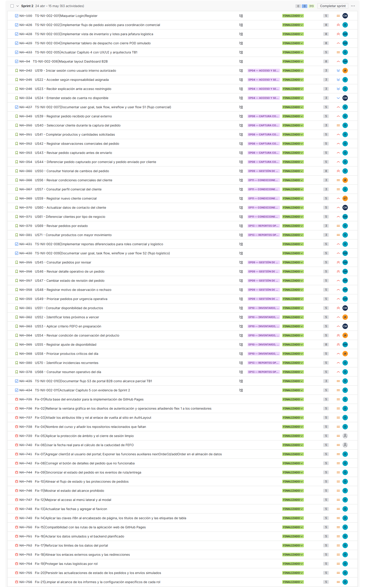
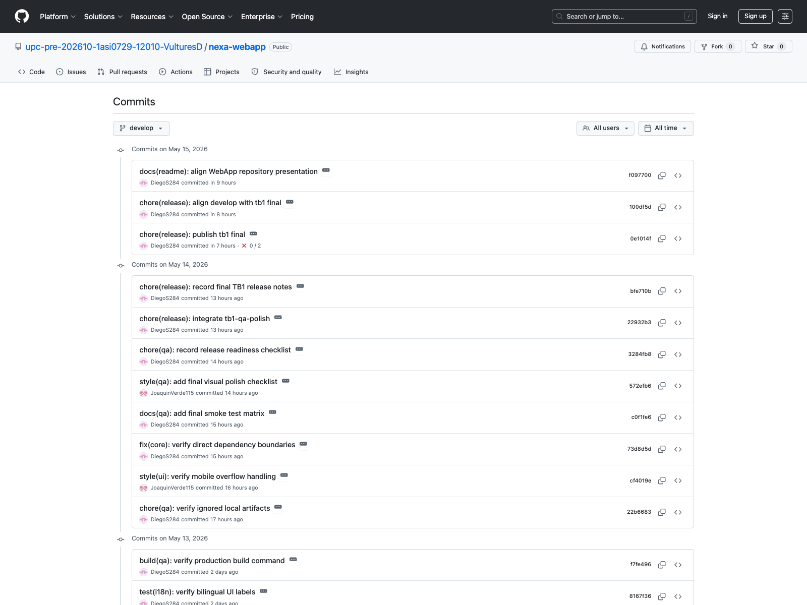
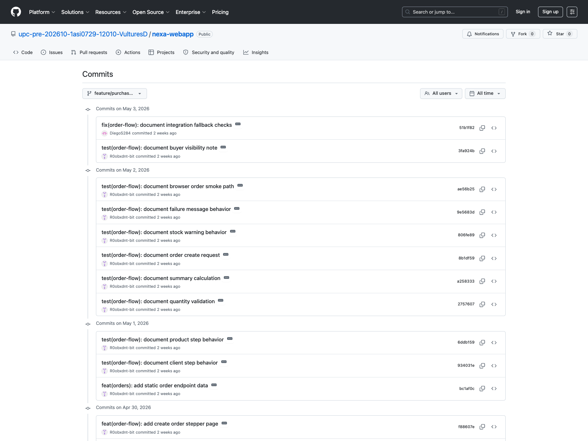
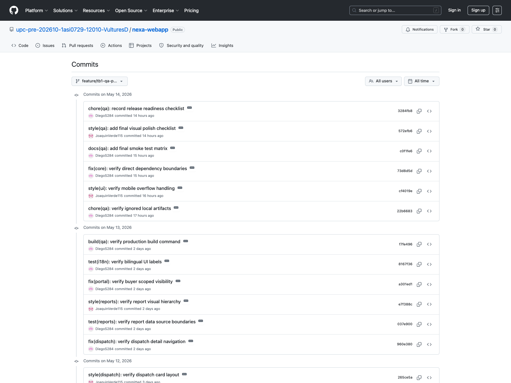
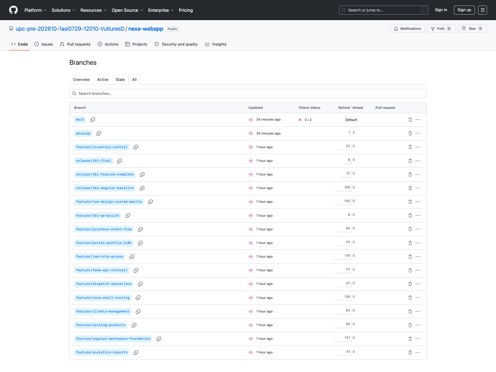
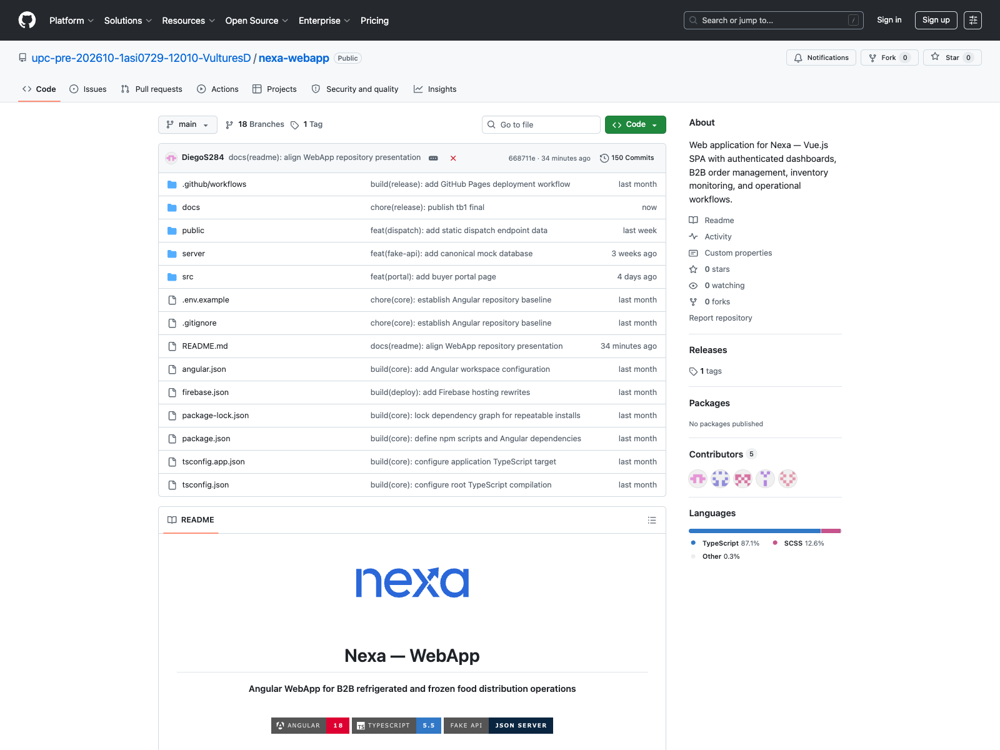
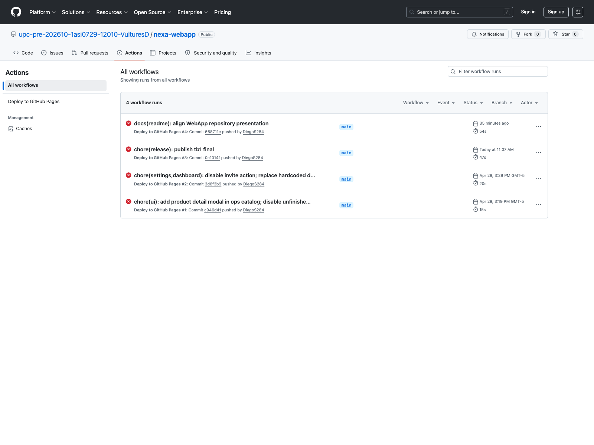

## 5.2.2. Sprint 2

El Sprint 2 corresponde al incremento TB1. El objetivo fue consolidar la Web Application con flujos internos para coordinación comercial y jefatura logística, actualizar la evidencia UX/UI y documentar la implementación frontend asociada al alcance de la entrega.

La evidencia de Sprint 2 se organiza mediante planificación, Sprint Backlog, commits, ejecución, servicios simulados, despliegue y colaboración. S1 y S2 son los flujos principales de la entrega. S3 se mantiene como alcance parcial de planificación y trazabilidad, sin declarar cobertura completa de UI ni validación final del segmento en TB1.

### 5.2.2.1. Sprint Planning 2

| Campo | Registro |
|---|---|
| Sprint # | Sprint 2 |
| Sprint Planning Background | Segundo incremento del proyecto orientado a consolidar la Web Application TB1, documentar flujos S1/S2 y actualizar evidencia de diseño, implementación y colaboración. |
| Date | 2026-04-24 |
| Time | 19:00 PM |
| Location | Reunión virtual del equipo |
| Prepared By | Yucra Sandoval, Diego Sebastian |
| Attendees (to planning meeting) | Yucra Sandoval, Diego Sebastian / Verde Bueno, Joaquín / Marín Cueva, César / Rojas Mancilla, Gerard / Torrejón, Gino |
| Sprint 1 Review Summary | Sprint 1 dejó como base la Landing Page, la estructura Docs-as-Code, el Product Backlog, las User Stories iniciales y los primeros artefactos UX/domain. |
| Sprint 1 Retrospective Summary | El equipo identificó la necesidad de ordenar mejor la evidencia por sprint, reforzar la trazabilidad con Jira y concentrar TB1 en los flujos internos de la Web Application. |
| Sprint Goal & User Stories | Web Application TB1, flujos internos S1/S2, evidencia UX/UI, Sprint Backlog y documentación de implementación. |
| Sprint 2 Goal | Consolidar la Web Application (Angular SPA) con los flujos de coordinación comercial (S1) y logística (S2), integrando el diseño DDD y la simulación de datos mediante Fake API. |
| Sprint 2 Velocity | 208 Story Points |
| Sum of Story Points | 208 Story Points |

Figura. Reunión virtual del equipo para coordinación de Sprint 2.

### 5.2.2.2. Aspect Leaders and Collaborators

| Team Member | GitHub Username | Project Management | UX/UI Design | Software Architecture | Frontend Development | Documentation |
|---|---|:---:|:---:|:---:|:---:|:---:|
| Yucra Sandoval, Diego Sebastian | DiegoS284 | L | C | C | L | L |
| Verde Bueno, Joaquín Francisco | JoaquinVerde115 | C | C | C | C | C |
| Marín Cueva, César Fernando | Cmarin2802 | C | C | C | C | C |
| Torrejón De Los Santos, Gino Rodrigo | R0obxdnt-bit | C | L | C | C | C |
| Rojas Mancilla, Gerard Gianpier | GerardRojasMancilla | C | C | L | C | C |

### 5.2.2.3. Sprint Backlog 2

El Sprint Backlog 2 concentra el trabajo realizado entre el **2026-04-24 y 2026-05-07**. El objetivo principal del sprint fue consolidar la Web Application TB1, documentar los flujos internos de S1 y S2, actualizar la evidencia UX/UI y registrar el avance de implementación correspondiente al incremento de la entrega.

**URL del board/backlog:** [Jira Backlog — Proyecto Nexa](https://team-nexa.atlassian.net/jira/software/projects/NX/boards/1/backlog)

La siguiente tabla presenta los User Stories asignados al Sprint 2 y los Work-items utilizados para descomponer el trabajo. Además de las User Stories, el sprint incluye tareas de soporte documental, configuración y evidencia necesarias para completar el incremento comprometido.

| Sprint # | User Story Id | User Story Title | Work-Item / Task Id | Task Title | Description | Estimation (Hours) | Assigned To | Status |
|---|---|---|---------------------|---|---|---:|---|---|
| Sprint 2 | N/A | Maquetar Login/Register | TS-NX-002-001       | Implementar pantalla de acceso | Construir la pantalla de login utilizada para seleccionar perfiles y acceder a los flujos internos de la Web Application. | 5.0 | César Marín | Done |
| Sprint 2 | N/A | Implementar flujo de pedido asistido para coordinación comercial | TS-NX-002-002       | Construir flujo de pedido asistido | Implementar el recorrido comercial para registrar pedidos internos desde el perfil de coordinación comercial. | 8.0 | Diego Yucra Sandoval | Done |
| Sprint 2 | N/A | Implementar vista de inventario y lotes para jefatura logística | TS-NX-002-003       | Construir vista de inventario y lotes | Implementar la vista de inventario, disponibilidad y lotes como soporte del flujo logístico. | 9.0 | Gerard Rojas Mancilla | Done |
| Sprint 2 | N/A | Implementar tablero de despacho con cierre POD simulado | TS-NX-002-004       | Construir tablero de despacho | Implementar el tablero de despacho y el cierre simulado con evidencia POD para la operación logística. | 8.0 | César Marín | Done |
| Sprint 2 | N/A | Actualizar Capítulo 4 con UX/UI y arquitectura TB1 | TS-NX-002-005       | Actualizar diseño UX/UI y arquitectura | Actualizar la documentación de UX/UI, flujos, mockups y arquitectura correspondiente al avance TB1. | 5.0 | Diego Yucra Sandoval | Done |
| Sprint 2 | N/A | Maquetar layout Dashboard B2B | TS-NX-002-006       | Construir layout principal de dashboard | Preparar la estructura visual base para dashboards y navegación de la Web Application. | 8.0 | Gerard Rojas Mancilla | Done |
| Sprint 2 | US19 | Iniciar sesión como usuario interno autorizado | NX-242              | Implementar acceso de usuario interno | Permitir el ingreso de usuarios internos mediante perfiles usados en la simulación de la Web Application. | 3.0 | Joaquín Verde | Done |
| Sprint 2 | US22 | Acceder según responsabilidad asignada | NX-245              | Configurar acceso por responsabilidad | Diferenciar el acceso de usuarios internos según el perfil operativo seleccionado. | 3.0 | Diego Yucra Sandoval | Done |
| Sprint 2 | US23 | Recibir explicación ante acceso restringido | NX-248              | Documentar restricción de acceso | Mostrar una explicación cuando un perfil intenta ingresar a una ruta que no corresponde a su responsabilidad. | 3.0 | Diego Yucra Sandoval | Done |
| Sprint 2 | US24 | Entender estado de cuenta no disponible | NX-334              | Definir estado de cuenta no disponible | Representar el estado de cuenta no disponible dentro del flujo de acceso y operación. | 3.0 | César Marín | Done |
| Sprint 2 | N/A | Documentar user goal, task flow, wireflow y user flow S1 | TS-NX-002-007       | Documentar flujo comercial S1 | Registrar la relación entre user goal, task flow, wireflow y user flow para coordinación comercial. | 5.0 | Diego Yucra Sandoval | Done |
| Sprint 2 | US39 | Registrar pedido recibido por canal externo | NX-349              | Registrar pedido interno | Permitir que coordinación comercial registre un pedido recibido por canales externos. | 5.0 | Diego Yucra Sandoval | Done |
| Sprint 2 | US40 | Seleccionar cliente durante la captura del pedido | NX-350              | Seleccionar cliente en pedido | Asociar el pedido interno con el cliente correspondiente durante la captura comercial. | 3.0 | Diego Yucra Sandoval | Done |
| Sprint 2 | US41 | Completar productos y cantidades solicitadas | NX-351              | Completar productos y cantidades | Registrar productos y cantidades solicitadas dentro del pedido asistido. | 5.0 | Diego Yucra Sandoval | Done |
| Sprint 2 | US42 | Registrar observaciones comerciales del pedido | NX-352              | Registrar observaciones comerciales | Incluir observaciones comerciales relevantes durante la captura del pedido. | 5.0 | Diego Yucra Sandoval | Done |
| Sprint 2 | US43 | Revisar pedido capturado antes de enviarlo | NX-353              | Revisar pedido antes de enviar | Permitir una revisión previa del pedido para reducir errores antes de enviarlo a revisión. | 5.0 | Diego Yucra Sandoval | Done |
| Sprint 2 | US44 | Diferenciar pedido capturado por comercial y pedido enviado por cliente | NX-354              | Diferenciar origen del pedido | Identificar si el pedido fue capturado internamente o enviado por el comprador. | 5.0 | Diego Yucra Sandoval | Done |
| Sprint 2 | US50 | Consultar historial de cambios del pedido | NX-360              | Consultar historial del pedido | Mostrar cambios relevantes asociados a un pedido para apoyar trazabilidad comercial. | 8.0 | Diego Yucra Sandoval | Done |
| Sprint 2 | US56 | Revisar condiciones comerciales del cliente | NX-366              | Revisar condiciones del cliente | Permitir la consulta de condiciones comerciales antes de confirmar acciones del pedido. | 3.0 | Gino Torrejón | Done |
| Sprint 2 | US57 | Consultar perfil comercial del cliente | NX-367              | Consultar perfil comercial | Mostrar información comercial del cliente para apoyar la captura y seguimiento del pedido. | 3.0 | Diego Yucra Sandoval | Done |
| Sprint 2 | US59 | Registrar nuevo cliente comercial | NX-369              | Registrar cliente comercial | Registrar información básica de un nuevo cliente comercial en la Web Application. | 5.0 | Gino Torrejón | Done |
| Sprint 2 | US60 | Actualizar datos de contacto del cliente | NX-370              | Actualizar datos de contacto | Actualizar información de contacto del cliente comercial. | 5.0 | César Marín | Done |
| Sprint 2 | US61 | Diferenciar clientes por tipo de negocio | NX-371              | Clasificar clientes por tipo | Diferenciar clientes según tipo de negocio para facilitar la lectura comercial. | 5.0 | Gerard Rojas Mancilla | Done |
| Sprint 2 | US69 | Revisar pedidos por estado | NX-379              | Revisar pedidos por estado | Consultar pedidos agrupados por estado para facilitar seguimiento comercial y operativo. | 5.0 | Diego Yucra Sandoval | Done |
| Sprint 2 | US71 | Consultar productos con mayor movimiento | NX-381              | Consultar productos de mayor movimiento | Revisar productos con mayor movimiento como apoyo a reportes comerciales. | 3.0 | Diego Yucra Sandoval | Done |
| Sprint 2 | N/A | Implementar reportes diferenciados para roles comercial y logístico | TS-NX-002-008       | Construir reportes por rol | Implementar reportes separados para lectura comercial y logística según perfil de usuario. | 5.0 | Diego Yucra Sandoval | Done |
| Sprint 2 | N/A | Documentar user goal, task flow, wireflow y user flow S2 | TS-NX-002-009       | Documentar flujo logístico S2 | Registrar la relación entre user goal, task flow, wireflow y user flow para jefatura logística. | 5.0 | Gerard Rojas Mancilla | Done |
| Sprint 2 | US45 | Consultar pedidos por revisar | NX-355              | Consultar pedidos por revisar | Mostrar pedidos en revisión operativa para jefatura logística. | 5.0 | Gerard Rojas Mancilla | Done |
| Sprint 2 | US46 | Revisar detalle operativo de un pedido | NX-356              | Revisar detalle operativo | Permitir la lectura del detalle operativo de un pedido antes de cambiar su estado. | 5.0 | Gerard Rojas Mancilla | Done |
| Sprint 2 | US47 | Cambiar estado de revisión del pedido | NX-357              | Cambiar estado de revisión | Actualizar el estado de revisión de un pedido durante el flujo logístico. | 5.0 | César Marín | Done |
| Sprint 2 | US48 | Registrar motivo de observación o rechazo | NX-358              | Registrar observación o rechazo | Registrar el motivo cuando un pedido queda observado o rechazado. | 5.0 | César Marín | Done |
| Sprint 2 | US49 | Priorizar pedidos por urgencia operativa | NX-359              | Priorizar pedidos urgentes | Ordenar pedidos según urgencia operativa para orientar la revisión logística. | 5.0 | Gerard Rojas Mancilla | Done |
| Sprint 2 | US51 | Consultar disponibilidad de productos | NX-361              | Consultar disponibilidad | Consultar disponibilidad de productos para apoyar decisiones de pedido y preparación. | 5.0 | César Marín | Done |
| Sprint 2 | US52 | Identificar lotes próximos a vencer | NX-362              | Identificar lotes próximos a vencer | Visualizar lotes con riesgo de vencimiento para aplicar criterio operativo. | 5.0 | Joaquín Verde | Done |
| Sprint 2 | US53 | Aplicar criterio FEFO en preparación | NX-363              | Aplicar criterio FEFO | Priorizar productos según vencimiento para reducir merma y mejorar rotación. | 5.0 | César Marín | Done |
| Sprint 2 | US54 | Revisar condición de conservación del producto | NX-364              | Revisar condición de conservación | Consultar información de conservación asociada al producto o lote. | 5.0 | Joaquín Verde | Done |
| Sprint 2 | US55 | Registrar ajuste de disponibilidad | NX-365              | Registrar ajuste de disponibilidad | Actualizar disponibilidad cuando se detecten diferencias operativas. | 8.0 | César Marín | Done |
| Sprint 2 | US58 | Priorizar productos críticos del día | NX-368              | Priorizar productos críticos | Ordenar y priorizar el manejo de productos críticos durante la jornada operativa. | 5.0 | Joaquín Verde | Done |
| Sprint 2 | US70 | Identificar incidencias recurrentes | NX-380              | Identificar incidencias recurrentes | Registrar lectura de incidencias recurrentes como parte de reportes operativos. | 5.0 | Diego Yucra Sandoval | Done |
| Sprint 2 | US68 | Consultar resumen operativo del día | NX-378              | Consultar resumen operativo | Revisar una síntesis operativa diaria para apoyar seguimiento de pedidos e inventario. | 5.0 | Diego Yucra Sandoval | Done |
| Sprint 2 | N/A | Documentar flujo S3 de portal B2B como alcance parcial TB1 | TS-NX-002-010       | Documentar flujo comprador B2B | Registrar el flujo comprador como planificación de alcance, sin afirmar implementación completa de mockups S3. | 5.0 | Diego Yucra Sandoval | Done |
| Sprint 2 | N/A | Actualizar Capítulo 5 con evidencia de Sprint 2 | TS-NX-002-011       | Actualizar evidencias de implementación TB1 | Consolidar en el reporte las evidencias del Sprint 2, incluyendo alcance, implementación y documentación del incremento. | 5.0 | Diego Yucra Sandoval | Done |
| Sprint 2 | N/A | Ruta base del enrutador para la implementación de GitHub Pages | Fix-01              | Configurar ruta base del enrutador | Ajustar la ruta base del enrutador para asegurar el correcto funcionamiento en GitHub Pages. | 5.0 | Diego Yucra Sandoval | Done |
| Sprint 2 | N/A | Rellenar la ventana gráfica en los diseños de autenticación y operaciones añadiendo flex 1 a los contenedores | Fix-02              | Ajustar estilos de contenedores | Añadir la propiedad flex 1 a los contenedores de los diseños de autenticación y operaciones para rellenar la ventana gráfica. | 5.0 | Diego Yucra Sandoval | Done |
| Sprint 2 | N/A | Añadir los atributos title y rel al enlace de vuelta al sitio en AuthLayout | Fix-03              | Añadir atributos a enlace de AuthLayout | Incorporar los atributos title y rel al enlace de retorno al sitio dentro del componente AuthLayout. | 5.0 | Diego Yucra Sandoval | Done |
| Sprint 2 | N/A | Nombre del curso y añadir los repositorios relacionados que faltan | Fix-04              | Actualizar nombre del curso y repositorios | Corregir el nombre del curso y agregar los enlaces a los repositorios relacionados faltantes en la documentación. | 5.0 | Diego Yucra Sandoval | Done |
| Sprint 2 | N/A | Aplicar la protección de ámbito y el cierre de sesión limpio | Fix-05              | Aplicar protección y cierre de sesión | Implementar la protección de ámbito en las rutas y asegurar un proceso de cierre de sesión sin errores. | 5.0 | Sin asignar | Done |
| Sprint 2 | N/A | Usar la fecha real para el cálculo de la caducidad de FEFO | Fix-06              | Corregir cálculo de caducidad FEFO | Modificar la lógica para utilizar la fecha real en el cálculo de la caducidad bajo el criterio FEFO. | 5.0 | Sin asignar | Done |
| Sprint 2 | N/A | Agregar clientId al usuario del portal; Exponer las funciones auxiliares nextOrderId/addOrder en el almacén de datos | Fix-07              | Actualizar datos de usuario y almacén | Agregar el campo clientId al usuario del portal y exponer las funciones nextOrderId y addOrder en el almacén. | 5.0 | Diego Yucra Sandoval | Done |
| Sprint 2 | N/A | Corregir el botón de detalles del pedido que no funcionaba | Fix-08              | Corregir botón de detalles del pedido | Solucionar el problema que impedía el funcionamiento correcto del botón para ver los detalles del pedido. | 5.0 | Diego Yucra Sandoval | Done |
| Sprint 2 | N/A | Sincronizar el estado del pedido en los eventos de ruta/entrega | Fix-09              | Sincronizar estado en ruta/entrega | Asegurar la correcta sincronización del estado del pedido durante los eventos de en ruta y entrega. | 5.0 | Diego Yucra Sandoval | Done |
| Sprint 2 | N/A | Alinear el flujo de estado y las protecciones de pedidos | Fix-10              | Alinear flujo de estado de pedidos | Corregir y alinear las transiciones del flujo de estado y aplicar las protecciones correspondientes a los pedidos. | 5.0 | Diego Yucra Sandoval | Done |
| Sprint 2 | N/A | Mostrar el estado del alcance prohibido | Fix-11              | Mostrar estado de alcance prohibido | Implementar la visualización adecuada para informar al usuario cuando intenta acceder a un alcance prohibido. | 5.0 | Diego Yucra Sandoval | Done |
| Sprint 2 | N/A | Mejorar el acceso al menú lateral y al modal | Fix-12              | Mejorar acceso a menú y modal | Optimizar la usabilidad y el acceso a los componentes del menú lateral y las ventanas modales. | 5.0 | Diego Yucra Sandoval | Done |
| Sprint 2 | N/A | Actualizar las fechas y agregar el favicon | Fix-13              | Actualizar fechas y favicon | Corregir las fechas mostradas en la interfaz y añadir el favicon al proyecto. | 5.0 | Diego Yucra Sandoval | Done |
| Sprint 2 | N/A | Aplicar las claves i18n al encabezado de página, los títulos de sección y las etiquetas de tabla | Fix-14              | Aplicar internacionalización (i18n) | Implementar las claves de internacionalización en el encabezado, títulos de sección y etiquetas de tablas. | 5.0 | Diego Yucra Sandoval | Done |
| Sprint 2 | N/A | Compatibilidad con las rutas de la aplicación web de GitHub Pages | Fix-15              | Corregir rutas para GitHub Pages | Ajustar la configuración de rutas para asegurar la compatibilidad total al desplegar en GitHub Pages. | 5.0 | Diego Yucra Sandoval | Done |
| Sprint 2 | N/A | Aclarar los datos simulados y el backend planificado | Fix-16              | Aclarar datos simulados y backend | Documentar y diferenciar claramente el uso de datos simulados (mock) respecto a la integración con el backend. | 5.0 | Diego Yucra Sandoval | Done |
| Sprint 2 | N/A | Reforzar los límites de los datos del portal | Fix-17              | Reforzar límites de datos | Implementar validaciones adicionales para reforzar los límites y restricciones de datos en el portal. | 5.0 | Diego Yucra Sandoval | Done |
| Sprint 2 | N/A | Alinear los enlaces externos seguros y las redirecciones | Fix-18              | Alinear enlaces y redirecciones | Revisar y asegurar que los enlaces externos y redirecciones sigan las prácticas de seguridad. | 5.0 | Diego Yucra Sandoval | Done |
| Sprint 2 | N/A | Proteger las rutas logísticas por rol | Fix-19              | Proteger rutas logísticas | Aplicar guardias de navegación para proteger el acceso a las rutas logísticas según el rol del usuario. | 5.0 | Diego Yucra Sandoval | Done |
| Sprint 2 | N/A | Persistir las actualizaciones de estado de los pedidos y los envíos simulados | Fix-20              | Persistir estado de pedidos | Configurar la persistencia de datos para las actualizaciones de estado de pedidos y envíos simulados. | 5.0 | Diego Yucra Sandoval | Done |
| Sprint 2 | N/A | Limpiar el alcance de los informes y la configuración específica de cada rol | Fix-21              | Limpiar informes y configuración de rol | Depurar y ajustar el alcance de los informes mostrados y la configuración específica asignada a cada rol. | 5.0 | Diego Yucra Sandoval | Done |

Nota. Las horas estimadas se usan para control operativo del Sprint Backlog. Los Story Points se conservan como estimación relativa dentro del Product Backlog y Jira. Elaboración propia.

### 5.2.2.4. Development Evidence for Sprint Review

La evidencia de desarrollo del Sprint 2 se organiza por repositorio para mantener trazabilidad directa con cada frente de trabajo. Los commits se verifican desde el historial público de GitHub de la organización [upc-pre-202610-1asi0729-12010-VulturesD](https://github.com/upc-pre-202610-1asi0729-12010-VulturesD).

*Commits del repositorio `nexa-webapp`*
En esta version se incluye la historia completa disponible: 152 commits.`.

- Complete commit history: [https://github.com/upc-pre-202610-1asi0729-12010-VulturesD/nexa-webapp/commits](https://github.com/upc-pre-202610-1asi0729-12010-VulturesD/nexa-webapp/commits)
- Branches: [https://github.com/upc-pre-202610-1asi0729-12010-VulturesD/nexa-webapp/branches](https://github.com/upc-pre-202610-1asi0729-12010-VulturesD/nexa-webapp/branches)
- Contributors/Insights: [https://github.com/upc-pre-202610-1asi0729-12010-VulturesD/nexa-webapp/graphs/contributors](https://github.com/upc-pre-202610-1asi0729-12010-VulturesD/nexa-webapp/graphs/contributors)
- Network graph: [https://github.com/upc-pre-202610-1asi0729-12010-VulturesD/nexa-webapp/network](https://github.com/upc-pre-202610-1asi0729-12010-VulturesD/nexa-webapp/network)

| Repository | Branch | Commit Id | Author | Commit Message | Commit Message Body | Sprint Evidence Scope | Committed on |
|---|---|---|---|---|---|---|---|
| `upc-pre-202610-1asi0729-12010-VulturesD/nexa-webapp` | `main` | [f097700](https://github.com/upc-pre-202610-1asi0729-12010-VulturesD/nexa-webapp/commit/f0977000f906eaacd23a6cfe707441b2d26164ff) | DiegoS284 &lt;diego64g284@gmail.com&gt; | `docs(readme): align WebApp repository presentation` | Update the WebApp README with the same visual structure used by the public project repositories. The document clarifies stack, bounded contexts, routes, scripts, demo users, and Fake API scope for TB1 frontend validation. | Evidencia de repositorio y trazabilidad de Sprint | 2026-05-14 |
| `upc-pre-202610-1asi0729-12010-VulturesD/nexa-webapp` | `release/tb1-final` | [100df5d](https://github.com/upc-pre-202610-1asi0729-12010-VulturesD/nexa-webapp/commit/100df5ded1351a27ec10e7244d284934e5b546ed) | DiegoS284 &lt;diego64g284@gmail.com&gt; | `chore(release): align develop with tb1 final` | Merge final main release state back into develop. This keeps both long-lived GitFlow branches aligned after the TB1 release. Supports continued development from the published Angular baseline. | Cierre GitFlow y release TB1 | 2026-05-14 |
| `upc-pre-202610-1asi0729-12010-VulturesD/nexa-webapp` | `release/tb1-final` | [0e1014f](https://github.com/upc-pre-202610-1asi0729-12010-VulturesD/nexa-webapp/commit/0e1014f47ae760894c7f030cc9cdc12c5c8175cc) | DiegoS284 &lt;diego64g284@gmail.com&gt; | `chore(release): publish tb1 final` | Merge release/tb1-final into main for the final TB1 Angular WebApp release. This keeps main on the reviewed release branch state. Supports the final course delivery checkpoint. # Conflicts: #	docs/release-log.md | Cierre GitFlow y release TB1 | 2026-05-14 |
| `upc-pre-202610-1asi0729-12010-VulturesD/nexa-webapp` | `main` | [668711e](https://github.com/upc-pre-202610-1asi0729-12010-VulturesD/nexa-webapp/commit/668711e0cdc3ed8754ab74df274b9b815fad1561) | DiegoS284 &lt;diego64g284@gmail.com&gt; | `docs(readme): align WebApp repository presentation` | Update the WebApp README with the same visual structure used by the public project repositories. The document clarifies stack, bounded contexts, routes, scripts, demo users, and Fake API scope for TB1 frontend validation. | Evidencia de repositorio y trazabilidad de Sprint | 2026-05-14 |
| `upc-pre-202610-1asi0729-12010-VulturesD/nexa-webapp` | `release/tb1-final` | [bfe710b](https://github.com/upc-pre-202610-1asi0729-12010-VulturesD/nexa-webapp/commit/bfe710b4116817d4dcff37c80231dd89894faf67) | DiegoS284 &lt;diego64g284@gmail.com&gt; | `chore(release): record final TB1 release notes` | Add final TB1 release notes for the Angular WebApp. This records the release scope after QA polish and build verification. Supports the final main branch publication checkpoint. | Cierre GitFlow y release TB1 | 2026-05-13 |
| `upc-pre-202610-1asi0729-12010-VulturesD/nexa-webapp` | `release/tb1-final` | [22932b3](https://github.com/upc-pre-202610-1asi0729-12010-VulturesD/nexa-webapp/commit/22932b31913773c57e0d53be0e52db950f17dfca) | DiegoS284 &lt;diego64g284@gmail.com&gt; | `chore(release): integrate tb1-qa-polish` | Merge feature/tb1-qa-polish into develop using a no-fast-forward integration commit. This preserves feature ownership while keeping develop as the TB1 integration branch. Supports GitFlow traceability for the Angular WebApp. | Cierre GitFlow y release TB1 | 2026-05-13 |
| `upc-pre-202610-1asi0729-12010-VulturesD/nexa-webapp` | `release/tb1-final` | [3284fb8](https://github.com/upc-pre-202610-1asi0729-12010-VulturesD/nexa-webapp/commit/3284fb808cfe093e35c9f76ca73776759cf949ae) | DiegoS284 &lt;diego64g284@gmail.com&gt; | `chore(qa): record release readiness checklist` | Record the final release readiness checks for branches, build, mock API files, and clean repository state. The checklist supports GitFlow release review for the final TB1 push. Supports final TB1 QA before release. | Cierre GitFlow y release TB1 | 2026-05-13 |
| `upc-pre-202610-1asi0729-12010-VulturesD/nexa-webapp` | `feature/tb1-qa-polish` | [572efb6](https://github.com/upc-pre-202610-1asi0729-12010-VulturesD/nexa-webapp/commit/572efb60560aba8c3c92da7691113a2486db3d41) | JoaquinVerde115 &lt;u20241a054@upc.edu.pe&gt; | `style(qa): add final visual polish checklist` | Record the final visual polish checklist for spacing, typography, cards, badges, and responsive behavior. The checklist documents the UI quality bar used before release. Supports final TB1 QA before release. | QA, estabilizacion y cierre de Sprint | 2026-05-13 |
| `upc-pre-202610-1asi0729-12010-VulturesD/nexa-webapp` | `feature/tb1-qa-polish` | [c0f1fe6](https://github.com/upc-pre-202610-1asi0729-12010-VulturesD/nexa-webapp/commit/c0f1fe6fb7e5e7ad1afb6da1b971746bf116c41c) | DiegoS284 &lt;diego64g284@gmail.com&gt; | `docs(qa): add final smoke test matrix` | Record the final smoke matrix covering login, dashboard, catalog, clients, orders, inventory, dispatch, reports, profile, and portal. The smoke matrix gives reviewers one concise source for end-to-end TB1 validation. Supports final TB1 QA before release. | QA, estabilizacion y cierre de Sprint | 2026-05-13 |
| `upc-pre-202610-1asi0729-12010-VulturesD/nexa-webapp` | `feature/tb1-qa-polish` | [73d8d5d](https://github.com/upc-pre-202610-1asi0729-12010-VulturesD/nexa-webapp/commit/73d8d5d01edf84a52e21e363f72125971fc60129) | DiegoS284 &lt;diego64g284@gmail.com&gt; | `fix(core): verify direct dependency boundaries` | Record checks for Angular dependency usage and absence of inactive frontend libraries in package metadata. Dependency checks keep the final WebApp aligned with the Angular implementation. Supports final TB1 QA before release. | QA, estabilizacion y cierre de Sprint | 2026-05-13 |
| `upc-pre-202610-1asi0729-12010-VulturesD/nexa-webapp` | `feature/tb1-qa-polish` | [cf4019e](https://github.com/upc-pre-202610-1asi0729-12010-VulturesD/nexa-webapp/commit/cf4019ede7f1ca8d345624dea8248a26689d2ee9) | JoaquinVerde115 &lt;u20241a054@upc.edu.pe&gt; | `style(ui): verify mobile overflow handling` | Record mobile checks for card grids, tables, side navigation, and action wrapping. Mobile overflow checks avoid visual breaks during responsive review. Supports final TB1 QA before release. | QA, estabilizacion y cierre de Sprint | 2026-05-13 |
| `upc-pre-202610-1asi0729-12010-VulturesD/nexa-webapp` | `feature/tb1-qa-polish` | [22b6683](https://github.com/upc-pre-202610-1asi0729-12010-VulturesD/nexa-webapp/commit/22b6683bdcd148a66054d8285aeb90816628a22d) | DiegoS284 &lt;diego64g284@gmail.com&gt; | `chore(qa): verify ignored local artifacts` | Record checks that node_modules, dist, .angular, logs, and private env files remain untracked. Repository hygiene checks prevent local machine artifacts from entering the public repo. Supports final TB1 QA before release. | QA, estabilizacion y cierre de Sprint | 2026-05-13 |
| `upc-pre-202610-1asi0729-12010-VulturesD/nexa-webapp` | `feature/tb1-qa-polish` | [f7fe496](https://github.com/upc-pre-202610-1asi0729-12010-VulturesD/nexa-webapp/commit/f7fe496e2b6fb0bf0fc31c1e00fec49c57425c2d) | DiegoS284 &lt;diego64g284@gmail.com&gt; | `build(qa): verify production build command` | Record the production build command and expected bundle output path. Build checks prove the final Angular source compiles before release. Supports final TB1 QA before release. | QA, estabilizacion y cierre de Sprint | 2026-05-12 |
| `upc-pre-202610-1asi0729-12010-VulturesD/nexa-webapp` | `feature/tb1-qa-polish` | [8167f36](https://github.com/upc-pre-202610-1asi0729-12010-VulturesD/nexa-webapp/commit/8167f364603e7db9c1740a8f67fdbad59e7aa8dd) | DiegoS284 &lt;diego64g284@gmail.com&gt; | `test(i18n): verify bilingual UI labels` | Record checks for Spanish and English labels in shell, portal, profile, and status controls. Language checks keep TB1 UX text consistent across user roles. Supports final TB1 QA before release. | QA, estabilizacion y cierre de Sprint | 2026-05-12 |
| `upc-pre-202610-1asi0729-12010-VulturesD/nexa-webapp` | `feature/tb1-qa-polish` | [a301ed1](https://github.com/upc-pre-202610-1asi0729-12010-VulturesD/nexa-webapp/commit/a301ed133dcd2243f46a0e5638b475c745ccbfa5) | DiegoS284 &lt;diego64g284@gmail.com&gt; | `fix(portal): verify buyer scoped visibility` | Record checks that buyer users see portal data tied to their account scope only. Portal scope checks protect role separation between buyer and internal users. Supports final TB1 QA before release. | QA, estabilizacion y cierre de Sprint | 2026-05-12 |
| `upc-pre-202610-1asi0729-12010-VulturesD/nexa-webapp` | `feature/tb1-qa-polish` | [e7f388c](https://github.com/upc-pre-202610-1asi0729-12010-VulturesD/nexa-webapp/commit/e7f388ca20771a8c4bba4bc34601b37a5e33be58) | JoaquinVerde115 &lt;u20241a054@upc.edu.pe&gt; | `style(reports): verify report visual hierarchy` | Record checks for KPI cards, status grouping, and empty state spacing in reports. Report visual checks make management summaries readable during review. Supports final TB1 QA before release. | QA, estabilizacion y cierre de Sprint | 2026-05-12 |
| `upc-pre-202610-1asi0729-12010-VulturesD/nexa-webapp` | `feature/tb1-qa-polish` | [037e900](https://github.com/upc-pre-202610-1asi0729-12010-VulturesD/nexa-webapp/commit/037e9006b798ff7717e5aace1750eada6a130289) | DiegoS284 &lt;diego64g284@gmail.com&gt; | `test(reports): verify report data source boundaries` | Record checks that reports use available mock API data and avoid unsupported calculations. Report checks keep analytics grounded in the TB1 data contract. Supports final TB1 QA before release. | QA, estabilizacion y cierre de Sprint | 2026-05-12 |
| `upc-pre-202610-1asi0729-12010-VulturesD/nexa-webapp` | `feature/tb1-qa-polish` | [960e380](https://github.com/upc-pre-202610-1asi0729-12010-VulturesD/nexa-webapp/commit/960e380e8639270fa07b87745dc1197a77bb8d0b) | DiegoS284 &lt;diego64g284@gmail.com&gt; | `fix(dispatch): verify dispatch detail navigation` | Record checks for dispatch list to detail navigation and fallback state handling. Dispatch navigation checks protect the S2 evidence review flow. Supports final TB1 QA before release. | QA, estabilizacion y cierre de Sprint | 2026-05-12 |
| `upc-pre-202610-1asi0729-12010-VulturesD/nexa-webapp` | `feature/tb1-qa-polish` | [265ce5a](https://github.com/upc-pre-202610-1asi0729-12010-VulturesD/nexa-webapp/commit/265ce5a4f27fb77d095d0332d6af8081a0d80226) | JoaquinVerde115 &lt;u20241a054@upc.edu.pe&gt; | `style(dispatch): verify dispatch card layout` | Record dispatch card checks for KPI alignment, checklist sections, and responsive wrapping. Dispatch layout checks keep logistics operations usable on varied screen widths. Supports final TB1 QA before release. | QA, estabilizacion y cierre de Sprint | 2026-05-11 |
| `upc-pre-202610-1asi0729-12010-VulturesD/nexa-webapp` | `feature/tb1-qa-polish` | [9e2a884](https://github.com/upc-pre-202610-1asi0729-12010-VulturesD/nexa-webapp/commit/9e2a884da7d5e50a7b0bbd2951056d1ba6b5ae8e) | DiegoS284 &lt;diego64g284@gmail.com&gt; | `fix(inventory): verify stock status mapping` | Record inventory checks for low stock, reserved stock, lot age, and movement labels. Inventory checks support S2 logistics review of cold-chain stock. Supports final TB1 QA before release. | QA, estabilizacion y cierre de Sprint | 2026-05-11 |
| `upc-pre-202610-1asi0729-12010-VulturesD/nexa-webapp` | `feature/tb1-qa-polish` | [fade8a7](https://github.com/upc-pre-202610-1asi0729-12010-VulturesD/nexa-webapp/commit/fade8a702abe6242f0707c00b05bb6854d85a822) | DiegoS284 &lt;diego64g284@gmail.com&gt; | `test(clients): verify client content labels` | Record client checks for segment labels, credit state, contact information, and status copy. Client copy checks support commercial account review before order creation. Supports final TB1 QA before release. | QA, estabilizacion y cierre de Sprint | 2026-05-11 |
| `upc-pre-202610-1asi0729-12010-VulturesD/nexa-webapp` | `feature/tb1-qa-polish` | [7a101e9](https://github.com/upc-pre-202610-1asi0729-12010-VulturesD/nexa-webapp/commit/7a101e915d057c5a02becf06b17dc982477dfe55) | JoaquinVerde115 &lt;u20241a054@upc.edu.pe&gt; | `style(catalog): verify catalog card fidelity` | Record card checks for product name, SKU, category, temperature, price, and stock state. Catalog visual checks keep product browsing consistent and scannable. Supports final TB1 QA before release. | QA, estabilizacion y cierre de Sprint | 2026-05-11 |
| `upc-pre-202610-1asi0729-12010-VulturesD/nexa-webapp` | `feature/tb1-qa-polish` | [dd566af](https://github.com/upc-pre-202610-1asi0729-12010-VulturesD/nexa-webapp/commit/dd566af472ddff16854dd848287fb3b94af6f236) | DiegoS284 &lt;diego64g284@gmail.com&gt; | `fix(orders): verify order creation fallback messaging` | Record checks for graceful messaging when the mock API rejects or cannot persist an order. Failure-state checks keep the flow understandable during local API interruptions. Supports final TB1 QA before release. | QA, estabilizacion y cierre de Sprint | 2026-05-11 |
| `upc-pre-202610-1asi0729-12010-VulturesD/nexa-webapp` | `feature/tb1-qa-polish` | [3ae403e](https://github.com/upc-pre-202610-1asi0729-12010-VulturesD/nexa-webapp/commit/3ae403eb55927bc3ac0010f0c79e3d45781baf75) | DiegoS284 &lt;diego64g284@gmail.com&gt; | `fix(orders): verify create order route contract` | Record checks that /orders/new loads the create order workflow and keeps confirmation reachable. Order route checks protect the main S1 commercial scenario. Supports final TB1 QA before release. | QA, estabilizacion y cierre de Sprint | 2026-05-11 |
| `upc-pre-202610-1asi0729-12010-VulturesD/nexa-webapp` | `feature/tb1-qa-polish` | [ae9d9f6](https://github.com/upc-pre-202610-1asi0729-12010-VulturesD/nexa-webapp/commit/ae9d9f68c36040ab348c11eddb36c55fd135054a) | JoaquinVerde115 &lt;u20241a054@upc.edu.pe&gt; | `style(ui): verify topbar visual alignment` | Record topbar checks for logo, role badge, language control, and profile actions. Topbar alignment keeps navigation clear for commercial, logistics, and buyer users. Supports final TB1 QA before release. | QA, estabilizacion y cierre de Sprint | 2026-05-10 |
| `upc-pre-202610-1asi0729-12010-VulturesD/nexa-webapp` | `feature/tb1-qa-polish` | [43d77a9](https://github.com/upc-pre-202610-1asi0729-12010-VulturesD/nexa-webapp/commit/43d77a96afbf55ac7abe77d63990068959ff905f) | JoaquinVerde115 &lt;u20241a054@upc.edu.pe&gt; | `style(ui): verify sidebar responsive behavior` | Record responsive shell checks for collapsed width, menu labels, and active states. Responsive shell checks protect repeated desktop and mobile navigation. Supports final TB1 QA before release. | QA, estabilizacion y cierre de Sprint | 2026-05-10 |
| `upc-pre-202610-1asi0729-12010-VulturesD/nexa-webapp` | `feature/tb1-qa-polish` | [c774a01](https://github.com/upc-pre-202610-1asi0729-12010-VulturesD/nexa-webapp/commit/c774a01b53bd0ac2de94735a7e0e6c9c709be6b3) | DiegoS284 &lt;diego64g284@gmail.com&gt; | `fix(fake-api): verify JSON Server route ids` | Record checks for collection routes and id routes across products, clients, orders, inventory, and dispatches. Route checks prevent broken detail screens in TB1 browser flows. Supports final TB1 QA before release. | QA, estabilizacion y cierre de Sprint | 2026-05-10 |
| `upc-pre-202610-1asi0729-12010-VulturesD/nexa-webapp` | `feature/tb1-qa-polish` | [b4eca52](https://github.com/upc-pre-202610-1asi0729-12010-VulturesD/nexa-webapp/commit/b4eca52b0befc7c49fc03d1d157a1dd3a3f67ef3) | DiegoS284 &lt;diego64g284@gmail.com&gt; | `fix(api): verify API base URL behavior` | Record checks for environment API roots, interceptor mapping, and JSON Server compatibility. API checks keep /api/v1 calls stable across local and hosted review paths. Supports final TB1 QA before release. | QA, estabilizacion y cierre de Sprint | 2026-05-10 |
| `upc-pre-202610-1asi0729-12010-VulturesD/nexa-webapp` | `feature/tb1-qa-polish` | [6f3e884](https://github.com/upc-pre-202610-1asi0729-12010-VulturesD/nexa-webapp/commit/6f3e88412f1d74e3f6e16f74bdfebd0f88663f06) | DiegoS284 &lt;diego64g284@gmail.com&gt; | `fix(auth): verify guarded shell redirects` | Record checks for unauthenticated access, login success, role redirects, and logout behavior. Guard validation protects internal and buyer screens during TB1 review. Supports final TB1 QA before release. | QA, estabilizacion y cierre de Sprint | 2026-05-10 |
| `upc-pre-202610-1asi0729-12010-VulturesD/nexa-webapp` | `feature/tb1-qa-polish` | [381d59f](https://github.com/upc-pre-202610-1asi0729-12010-VulturesD/nexa-webapp/commit/381d59f9389141b65ab8b7c9612568ebdf767eb8) | DiegoS284 &lt;diego64g284@gmail.com&gt; | `fix(routing): verify legacy route aliases` | Record checks for /catalog, /dispatch, /create-order, and ops aliases so old bookmarks reach canonical Angular routes. Routing aliases keep TB1 demos stable while preserving the final Angular route names. Supports final TB1 QA before release. | QA, estabilizacion y cierre de Sprint | 2026-05-10 |
| `upc-pre-202610-1asi0729-12010-VulturesD/nexa-webapp` | `release/tb1-feature-complete` | [bc9bb18](https://github.com/upc-pre-202610-1asi0729-12010-VulturesD/nexa-webapp/commit/bc9bb18b86c376400b0ddfc63d7ddc4b693b4fd4) | DiegoS284 &lt;diego64g284@gmail.com&gt; | `chore(release): publish tb1-feature-complete` | Merge release/tb1-feature-complete into main for the published release checkpoint. This keeps main aligned with reviewed TB1 release snapshots. Supports release traceability for the Angular WebApp. # Conflicts: #	docs/release-log.md | Cierre GitFlow y release TB1 | 2026-05-10 |
| `upc-pre-202610-1asi0729-12010-VulturesD/nexa-webapp` | `develop` | [e7f2e45](https://github.com/upc-pre-202610-1asi0729-12010-VulturesD/nexa-webapp/commit/e7f2e457c904e5ff4713e7f56d590d0b2699939f) | DiegoS284 &lt;diego64g284@gmail.com&gt; | `chore(release): record feature complete checkpoint` | Add release notes for the feature complete checkpoint. This records the scope entering the GitFlow release branch. Supports academic review of the TB1 Angular release progression. | Cierre GitFlow y release TB1 | 2026-05-10 |
| `upc-pre-202610-1asi0729-12010-VulturesD/nexa-webapp` | `develop` | [debb047](https://github.com/upc-pre-202610-1asi0729-12010-VulturesD/nexa-webapp/commit/debb047d355abfe3796c9dc5ce84e22614cd6232) | DiegoS284 &lt;diego64g284@gmail.com&gt; | `chore(release): integrate portal-profile-i18n` | Merge feature/portal-profile-i18n into develop using a no-fast-forward integration commit. This preserves feature ownership while keeping develop as the TB1 integration branch. Supports GitFlow traceability for the Angular WebApp. | Cierre GitFlow y release TB1 | 2026-05-10 |
| `upc-pre-202610-1asi0729-12010-VulturesD/nexa-webapp` | `feature/portal-profile-i18n` | [5acfda1](https://github.com/upc-pre-202610-1asi0729-12010-VulturesD/nexa-webapp/commit/5acfda16145263cfa14c52b9a1c006fa65ed2df0) | DiegoS284 &lt;diego64g284@gmail.com&gt; | `fix(portal): document cross-role profile checks` | Add profile and portal integration notes for role transitions and shell access. This keeps final QA focused on role boundaries and UX text consistency. Supports TB1 access-control stabilization. | Portal comprador, perfil e internacionalizacion | 2026-05-10 |
| `upc-pre-202610-1asi0729-12010-VulturesD/nexa-webapp` | `feature/portal-profile-i18n` | [92ac03c](https://github.com/upc-pre-202610-1asi0729-12010-VulturesD/nexa-webapp/commit/92ac03cc4413e22a41e6e950d9975350ba3ac982) | Cmarin2802 &lt;cesarmarin2802@gmail.com&gt; | `docs(portal): document buyer visibility rules` | Add portal QA notes for buyer order visibility, account scope, and navigation boundaries. This keeps final QA focused on role boundaries and UX text consistency. Supports TB1 access-control stabilization. | Portal comprador, perfil e internacionalizacion | 2026-05-10 |
| `upc-pre-202610-1asi0729-12010-VulturesD/nexa-webapp` | `feature/portal-profile-i18n` | [8418d4e](https://github.com/upc-pre-202610-1asi0729-12010-VulturesD/nexa-webapp/commit/8418d4e5e0ef4f6d0fd52f9608fdc5d52be1c14d) | Cmarin2802 &lt;cesarmarin2802@gmail.com&gt; | `docs(i18n): document bilingual label checks` | Add bilingual label QA notes for shell, portal, profile, and shared status text. This keeps final QA focused on role boundaries and UX text consistency. Supports TB1 access-control stabilization. | Portal comprador, perfil e internacionalizacion | 2026-05-10 |
| `upc-pre-202610-1asi0729-12010-VulturesD/nexa-webapp` | `feature/portal-profile-i18n` | [1446087](https://github.com/upc-pre-202610-1asi0729-12010-VulturesD/nexa-webapp/commit/144608748c89ae73fc8049a5c61af2506048122f) | Cmarin2802 &lt;cesarmarin2802@gmail.com&gt; | `feat(portal): add buyer portal page` | Add the portal page with buyer-scoped order and catalog summaries. This gives buyer users a minimal self-service view without operational screens. Supports role separation between buyer and internal users. | Portal comprador, perfil e internacionalizacion | 2026-05-10 |
| `upc-pre-202610-1asi0729-12010-VulturesD/nexa-webapp` | `feature/portal-profile-i18n` | [c3d3f5e](https://github.com/upc-pre-202610-1asi0729-12010-VulturesD/nexa-webapp/commit/c3d3f5ef21f3f0531355f2fa01705c0c573cbe02) | Cmarin2802 &lt;cesarmarin2802@gmail.com&gt; | `feat(portal): add portal route configuration` | Add route definitions for the buyer portal bounded context. This lets buyer users reach their scoped portal through role-based routing. Supports TB1 buyer navigation after login. | Portal comprador, perfil e internacionalizacion | 2026-05-09 |
| `upc-pre-202610-1asi0729-12010-VulturesD/nexa-webapp` | `feature/portal-profile-i18n` | [7164139](https://github.com/upc-pre-202610-1asi0729-12010-VulturesD/nexa-webapp/commit/716413970ff12de931b307ce49bfb658d553ba5e) | Cmarin2802 &lt;cesarmarin2802@gmail.com&gt; | `feat(portal): add portal store` | Add the portal store for buyer-scoped data loading and state. This keeps portal presentation code focused on rendering buyer information. Supports B2B buyer self-service flow. | Portal comprador, perfil e internacionalizacion | 2026-05-09 |
| `upc-pre-202610-1asi0729-12010-VulturesD/nexa-webapp` | `feature/portal-profile-i18n` | [0fd7c21](https://github.com/upc-pre-202610-1asi0729-12010-VulturesD/nexa-webapp/commit/0fd7c21db8a2b996c0485eeae84eaa70e1fda417) | Cmarin2802 &lt;cesarmarin2802@gmail.com&gt; | `feat(portal): add portal domain model` | Add buyer portal snapshot models for scoped catalog and order data. This defines the buyer-facing view contract. Supports buyer portal review in TB1. | Portal comprador, perfil e internacionalizacion | 2026-05-09 |
| `upc-pre-202610-1asi0729-12010-VulturesD/nexa-webapp` | `develop` | [198a584](https://github.com/upc-pre-202610-1asi0729-12010-VulturesD/nexa-webapp/commit/198a584ef96fc9d4f228f3c55e4b543e30df043b) | DiegoS284 &lt;diego64g284@gmail.com&gt; | `chore(release): integrate analytics-reports` | Merge feature/analytics-reports into develop using a no-fast-forward integration commit. This preserves feature ownership while keeping develop as the TB1 integration branch. Supports GitFlow traceability for the Angular WebApp. | Cierre GitFlow y release TB1 | 2026-05-09 |
| `upc-pre-202610-1asi0729-12010-VulturesD/nexa-webapp` | `feature/analytics-reports` | [9dfe969](https://github.com/upc-pre-202610-1asi0729-12010-VulturesD/nexa-webapp/commit/9dfe969cc854be6efab5ee740de67ed188cf9bd5) | JoaquinVerde115 &lt;u20241a054@upc.edu.pe&gt; | `docs(reports): document report visual QA checks` | Add reporting QA notes for KPI cards, status sections, empty states, and responsive layout. This aligns reports with the shared visual system. Supports TB1 reporting polish and review. | Analitica y reportes basados en datos disponibles | 2026-05-09 |
| `upc-pre-202610-1asi0729-12010-VulturesD/nexa-webapp` | `feature/analytics-reports` | [904b0b0](https://github.com/upc-pre-202610-1asi0729-12010-VulturesD/nexa-webapp/commit/904b0b0e22acd5bae5a8912c1943fcdd08d4d61a) | Cmarin2802 &lt;cesarmarin2802@gmail.com&gt; | `feat(analytics): add analytics and reports pages` | Add analytics and reports pages that summarize orders, dispatches, stock, and operational KPIs from mock data. This gives reviewers reporting views grounded in available API resources. Supports TB1 management review without invented metrics. | Analitica y reportes basados en datos disponibles | 2026-05-09 |
| `upc-pre-202610-1asi0729-12010-VulturesD/nexa-webapp` | `feature/analytics-reports` | [657be51](https://github.com/upc-pre-202610-1asi0729-12010-VulturesD/nexa-webapp/commit/657be5134140a58ef7a4029c84e6bf0ead8c36ff) | Cmarin2802 &lt;cesarmarin2802@gmail.com&gt; | `feat(analytics): add analytics routes` | Add route definitions for analytics and reports entry points. This lets permitted roles navigate reporting screens through lazy-loaded routes. Supports TB1 reporting access from the shell. | Analitica y reportes basados en datos disponibles | 2026-05-08 |
| `upc-pre-202610-1asi0729-12010-VulturesD/nexa-webapp` | `feature/analytics-reports` | [c6f3ee0](https://github.com/upc-pre-202610-1asi0729-12010-VulturesD/nexa-webapp/commit/c6f3ee0439e473511fe44c3c5994e42b00677d64) | Cmarin2802 &lt;cesarmarin2802@gmail.com&gt; | `feat(analytics): add analytics store` | Add the analytics store for API-derived report summaries and reactive page state. This keeps reporting state management outside templates. Supports commercial and logistics reporting views. | Analitica y reportes basados en datos disponibles | 2026-05-08 |
| `upc-pre-202610-1asi0729-12010-VulturesD/nexa-webapp` | `feature/analytics-reports` | [23fcb79](https://github.com/upc-pre-202610-1asi0729-12010-VulturesD/nexa-webapp/commit/23fcb79385351ef825e586cb8ef88aa9be77fbf1) | Cmarin2802 &lt;cesarmarin2802@gmail.com&gt; | `feat(analytics): add report domain models` | Add commercial report, operations report, order status, and dispatch status model definitions. This gives reporting pages typed summary data. Supports TB1 analytics without unsupported metrics. | Analitica y reportes basados en datos disponibles | 2026-05-08 |
| `upc-pre-202610-1asi0729-12010-VulturesD/nexa-webapp` | `develop` | [eebf2d5](https://github.com/upc-pre-202610-1asi0729-12010-VulturesD/nexa-webapp/commit/eebf2d5ed1661742fc6393d0af5d56c003de77d7) | DiegoS284 &lt;diego64g284@gmail.com&gt; | `chore(release): integrate dispatch-operations` | Merge feature/dispatch-operations into develop using a no-fast-forward integration commit. This preserves feature ownership while keeping develop as the TB1 integration branch. Supports GitFlow traceability for the Angular WebApp. | Cierre GitFlow y release TB1 | 2026-05-07 |
| `upc-pre-202610-1asi0729-12010-VulturesD/nexa-webapp` | `feature/dispatch-operations` | [e4839a2](https://github.com/upc-pre-202610-1asi0729-12010-VulturesD/nexa-webapp/commit/e4839a2084f6e04040b04cb1e272059cc436012a) | JoaquinVerde115 &lt;u20241a054@upc.edu.pe&gt; | `test(dispatch): document dispatch visual pass` | Add dispatch QA note for dispatch visual pass. This records validation criteria for logistics dispatch screens. Supports TB1 S2 dispatch acceptance review. | Despachos, rutas, checklist y operacion logistica | 2026-05-07 |
| `upc-pre-202610-1asi0729-12010-VulturesD/nexa-webapp` | `feature/dispatch-operations` | [3f4d3ad](https://github.com/upc-pre-202610-1asi0729-12010-VulturesD/nexa-webapp/commit/3f4d3adf73e9e260555c5ef1845df652f94fded2) | R0obxdnt-bit &lt;u202416289@upc.edu.pe&gt; | `test(dispatch): document checklist evidence` | Add dispatch QA note for checklist evidence. This records validation criteria for logistics dispatch screens. Supports TB1 S2 dispatch acceptance review. | Despachos, rutas, checklist y operacion logistica | 2026-05-07 |
| `upc-pre-202610-1asi0729-12010-VulturesD/nexa-webapp` | `feature/dispatch-operations` | [725218a](https://github.com/upc-pre-202610-1asi0729-12010-VulturesD/nexa-webapp/commit/725218aeb3aa201282b441f2c4d9c99fbbc5fe79) | R0obxdnt-bit &lt;u202416289@upc.edu.pe&gt; | `test(dispatch): document dispatch card states` | Add dispatch QA note for dispatch card states. This records validation criteria for logistics dispatch screens. Supports TB1 S2 dispatch acceptance review. | Despachos, rutas, checklist y operacion logistica | 2026-05-07 |
| `upc-pre-202610-1asi0729-12010-VulturesD/nexa-webapp` | `feature/dispatch-operations` | [1731761](https://github.com/upc-pre-202610-1asi0729-12010-VulturesD/nexa-webapp/commit/1731761bffcc4a01181e35ce1910431cac7639ec) | R0obxdnt-bit &lt;u202416289@upc.edu.pe&gt; | `feat(dispatch): add static dispatch endpoint data` | Add public dispatch JSON data for static API fallback deployments. This keeps dispatch cards and detail screens available in hosted reviews. Supports TB1 logistics demos without a running mock API. | Despachos, rutas, checklist y operacion logistica | 2026-05-07 |
| `upc-pre-202610-1asi0729-12010-VulturesD/nexa-webapp` | `feature/dispatch-operations` | [adfa1d1](https://github.com/upc-pre-202610-1asi0729-12010-VulturesD/nexa-webapp/commit/adfa1d163b98758c81bfae2dc9f04ae432c9d74a) | R0obxdnt-bit &lt;u202416289@upc.edu.pe&gt; | `feat(dispatch): add dispatch detail page` | Add the dispatch detail page with checklist sections, evidence banners, and delivery state details. This makes each dispatch auditable from list to detail. Supports S2 evidence review for cold-chain delivery operations. | Despachos, rutas, checklist y operacion logistica | 2026-05-06 |
| `upc-pre-202610-1asi0729-12010-VulturesD/nexa-webapp` | `feature/dispatch-operations` | [6f07600](https://github.com/upc-pre-202610-1asi0729-12010-VulturesD/nexa-webapp/commit/6f076000b9a5bd27d784f022086e79347a84256a) | R0obxdnt-bit &lt;u202416289@upc.edu.pe&gt; | `feat(dispatch): add dispatch cards page` | Add the dispatch list page with cards, KPIs, route state, and delivery status indicators. This gives logistics users a scan-friendly outbound operations board. Supports TB1 dispatch monitoring. | Despachos, rutas, checklist y operacion logistica | 2026-05-06 |
| `upc-pre-202610-1asi0729-12010-VulturesD/nexa-webapp` | `feature/dispatch-operations` | [4edc547](https://github.com/upc-pre-202610-1asi0729-12010-VulturesD/nexa-webapp/commit/4edc54724b0b8214a7c94807cbe679d96fa03bac) | R0obxdnt-bit &lt;u202416289@upc.edu.pe&gt; | `feat(dispatch): add dispatch routes` | Add route definitions for dispatch list and detail screens. This lets logistics users lazy-load outbound operation views. Supports S2 dispatch navigation in TB1. | Despachos, rutas, checklist y operacion logistica | 2026-05-06 |
| `upc-pre-202610-1asi0729-12010-VulturesD/nexa-webapp` | `feature/dispatch-operations` | [66a8d67](https://github.com/upc-pre-202610-1asi0729-12010-VulturesD/nexa-webapp/commit/66a8d67c8870c57a62f0c230bce2c8e16124a1d0) | R0obxdnt-bit &lt;u202416289@upc.edu.pe&gt; | `feat(dispatch): add dispatch API adapter` | Add the dispatch API adapter for reading dispatch operation records. This keeps logistics data access outside the presentation layer. Supports dispatch list and detail flows. | Despachos, rutas, checklist y operacion logistica | 2026-05-05 |
| `upc-pre-202610-1asi0729-12010-VulturesD/nexa-webapp` | `feature/dispatch-operations` | [ad5a4f3](https://github.com/upc-pre-202610-1asi0729-12010-VulturesD/nexa-webapp/commit/ad5a4f38ee0d529405db39c891928c7877244c36) | R0obxdnt-bit &lt;u202416289@upc.edu.pe&gt; | `feat(dispatch): add dispatch domain model` | Add dispatch, route, checklist, evidence, and delivery status model definitions. This gives dispatch screens typed logistics data. Supports S2 outbound operation tracking. | Despachos, rutas, checklist y operacion logistica | 2026-05-05 |
| `upc-pre-202610-1asi0729-12010-VulturesD/nexa-webapp` | `develop` | [0043294](https://github.com/upc-pre-202610-1asi0729-12010-VulturesD/nexa-webapp/commit/0043294e1784ff3361f5f5bf51c0541c71687d51) | DiegoS284 &lt;diego64g284@gmail.com&gt; | `chore(release): integrate inventory-control` | Merge feature/inventory-control into develop using a no-fast-forward integration commit. This preserves feature ownership while keeping develop as the TB1 integration branch. Supports GitFlow traceability for the Angular WebApp. | Cierre GitFlow y release TB1 | 2026-05-05 |
| `upc-pre-202610-1asi0729-12010-VulturesD/nexa-webapp` | `feature/inventory-control` | [6ad31f1](https://github.com/upc-pre-202610-1asi0729-12010-VulturesD/nexa-webapp/commit/6ad31f1272ef4ff7f2d31bd26e9c4cfb6a4b13a0) | GerardRojasMancilla &lt;u202413142@upc.edu.pe&gt; | `docs(inventory): document logistics stock checks` | Add inventory QA notes for low stock, lot freshness, temperature labels, and movement auditability. This records what S2 logistics reviewers should validate. Supports TB1 inventory acceptance review. | Inventario, lotes, movimientos y control logistico | 2026-05-05 |
| `upc-pre-202610-1asi0729-12010-VulturesD/nexa-webapp` | `feature/inventory-control` | [cf0f8ea](https://github.com/upc-pre-202610-1asi0729-12010-VulturesD/nexa-webapp/commit/cf0f8ea2e5eb38bc94aa2421e0b9be6a76236dab) | GerardRojasMancilla &lt;u202413142@upc.edu.pe&gt; | `feat(inventory): add static inventory endpoint data` | Add public JSON snapshots for warehouses, inventory lots, and stock movements. This keeps inventory screens available in static-hosted review builds. Supports TB1 logistics demos without a live mock server. | Inventario, lotes, movimientos y control logistico | 2026-05-05 |
| `upc-pre-202610-1asi0729-12010-VulturesD/nexa-webapp` | `feature/inventory-control` | [e40c582](https://github.com/upc-pre-202610-1asi0729-12010-VulturesD/nexa-webapp/commit/e40c582c5a5293ec224007fde7b782925ba980ba) | GerardRojasMancilla &lt;u202413142@upc.edu.pe&gt; | `feat(inventory): add lots and movement pages` | Add lot and stock movement pages for deeper logistics inspection. This separates lot status from operational movement history. Supports traceability for cold-chain stock control. | Inventario, lotes, movimientos y control logistico | 2026-05-04 |
| `upc-pre-202610-1asi0729-12010-VulturesD/nexa-webapp` | `feature/inventory-control` | [8140a1a](https://github.com/upc-pre-202610-1asi0729-12010-VulturesD/nexa-webapp/commit/8140a1a7bdef0cb6c0f3f1bbd85e93b5e4e3d1bf) | GerardRojasMancilla &lt;u202413142@upc.edu.pe&gt; | `feat(inventory): add inventory overview page` | Add the inventory overview page with warehouse, stock, and cold-chain status sections. This gives logistics users a high-level control panel. Supports TB1 inventory monitoring. | Inventario, lotes, movimientos y control logistico | 2026-05-04 |
| `upc-pre-202610-1asi0729-12010-VulturesD/nexa-webapp` | `feature/inventory-control` | [98be598](https://github.com/upc-pre-202610-1asi0729-12010-VulturesD/nexa-webapp/commit/98be598e82bd903aeb37990b165e752658b8cfec) | GerardRojasMancilla &lt;u202413142@upc.edu.pe&gt; | `feat(inventory): add inventory routes` | Add route definitions for inventory overview, lots, and stock movements. This lets logistics users navigate inventory screens through lazy-loaded routes. Supports S2 inventory control workflows. | Inventario, lotes, movimientos y control logistico | 2026-05-04 |
| `upc-pre-202610-1asi0729-12010-VulturesD/nexa-webapp` | `feature/inventory-control` | [7565281](https://github.com/upc-pre-202610-1asi0729-12010-VulturesD/nexa-webapp/commit/7565281a733a49ba92641327dd83e73f993b1dd6) | GerardRojasMancilla &lt;u202413142@upc.edu.pe&gt; | `feat(inventory): add inventory API adapter` | Add the inventory API adapter for warehouses, lots, and stock movements. This keeps logistics data access in the inventory infrastructure layer. Supports inventory overview and movement review flows. | Inventario, lotes, movimientos y control logistico | 2026-05-03 |
| `upc-pre-202610-1asi0729-12010-VulturesD/nexa-webapp` | `feature/inventory-control` | [2299a44](https://github.com/upc-pre-202610-1asi0729-12010-VulturesD/nexa-webapp/commit/2299a447b962d7298ecd222c48be9aa690d601d2) | GerardRojasMancilla &lt;u202413142@upc.edu.pe&gt; | `feat(inventory): add inventory domain model` | Add warehouse, lot, movement, and stock summary model definitions. This gives logistics screens typed inventory data. Supports S2 cold-chain inventory control in TB1. | Inventario, lotes, movimientos y control logistico | 2026-05-03 |
| `upc-pre-202610-1asi0729-12010-VulturesD/nexa-webapp` | `develop` | [8e9a7a1](https://github.com/upc-pre-202610-1asi0729-12010-VulturesD/nexa-webapp/commit/8e9a7a11696bc173c59cd922f5cc77b159314bef) | DiegoS284 &lt;diego64g284@gmail.com&gt; | `chore(release): integrate purchase-order-flow` | Merge feature/purchase-order-flow into develop using a no-fast-forward integration commit. This preserves feature ownership while keeping develop as the TB1 integration branch. Supports GitFlow traceability for the Angular WebApp. | Cierre GitFlow y release TB1 | 2026-05-03 |
| `upc-pre-202610-1asi0729-12010-VulturesD/nexa-webapp` | `feature/purchase-order-flow` | [51b1f82](https://github.com/upc-pre-202610-1asi0729-12010-VulturesD/nexa-webapp/commit/51b1f82432ee3c0f75ef5b90862bf5c9f9ef6265) | DiegoS284 &lt;diego64g284@gmail.com&gt; | `fix(order-flow): document integration fallback checks` | Add order-flow QA note for integration fallback checks. This records validation evidence for the purchase order workflow. Supports TB1 browser flow review for S1 commercial users. | Flujo de compra, pedidos y validacion de cantidades | 2026-05-03 |
| `upc-pre-202610-1asi0729-12010-VulturesD/nexa-webapp` | `feature/purchase-order-flow` | [3fa924b](https://github.com/upc-pre-202610-1asi0729-12010-VulturesD/nexa-webapp/commit/3fa924b02d1c7a329727f01ef4d64961bced19d3) | R0obxdnt-bit &lt;u202416289@upc.edu.pe&gt; | `test(order-flow): document buyer visibility note` | Add order-flow QA note for buyer visibility note. This records validation evidence for the purchase order workflow. Supports TB1 browser flow review for S1 commercial users. | Flujo de compra, pedidos y validacion de cantidades | 2026-05-03 |
| `upc-pre-202610-1asi0729-12010-VulturesD/nexa-webapp` | `feature/tb1-qa-polish` | [ae56b25](https://github.com/upc-pre-202610-1asi0729-12010-VulturesD/nexa-webapp/commit/ae56b25d98594dab50028359c30715cf9e9f311a) | R0obxdnt-bit &lt;u202416289@upc.edu.pe&gt; | `test(order-flow): document browser order smoke path` | Add order-flow QA note for browser order smoke path. This records validation evidence for the purchase order workflow. Supports TB1 browser flow review for S1 commercial users. | QA, estabilizacion y cierre de Sprint | 2026-05-02 |
| `upc-pre-202610-1asi0729-12010-VulturesD/nexa-webapp` | `feature/purchase-order-flow` | [9e5683d](https://github.com/upc-pre-202610-1asi0729-12010-VulturesD/nexa-webapp/commit/9e5683d20be82e3d14c410ef8bbbe128ba23bc73) | R0obxdnt-bit &lt;u202416289@upc.edu.pe&gt; | `test(order-flow): document failure message behavior` | Add order-flow QA note for failure message behavior. This records validation evidence for the purchase order workflow. Supports TB1 browser flow review for S1 commercial users. | Flujo de compra, pedidos y validacion de cantidades | 2026-05-02 |
| `upc-pre-202610-1asi0729-12010-VulturesD/nexa-webapp` | `feature/purchase-order-flow` | [806fe89](https://github.com/upc-pre-202610-1asi0729-12010-VulturesD/nexa-webapp/commit/806fe89f5fe5ad9bbc77dc1144bfaf0955065780) | R0obxdnt-bit &lt;u202416289@upc.edu.pe&gt; | `test(order-flow): document stock warning behavior` | Add order-flow QA note for stock warning behavior. This records validation evidence for the purchase order workflow. Supports TB1 browser flow review for S1 commercial users. | Flujo de compra, pedidos y validacion de cantidades | 2026-05-02 |
| `upc-pre-202610-1asi0729-12010-VulturesD/nexa-webapp` | `feature/purchase-order-flow` | [8b1df59](https://github.com/upc-pre-202610-1asi0729-12010-VulturesD/nexa-webapp/commit/8b1df5938050c72e82ac9c9cc16c7da3ae741ce2) | R0obxdnt-bit &lt;u202416289@upc.edu.pe&gt; | `test(order-flow): document order create request` | Add order-flow QA note for order create request. This records validation evidence for the purchase order workflow. Supports TB1 browser flow review for S1 commercial users. | Flujo de compra, pedidos y validacion de cantidades | 2026-05-01 |
| `upc-pre-202610-1asi0729-12010-VulturesD/nexa-webapp` | `feature/purchase-order-flow` | [a258333](https://github.com/upc-pre-202610-1asi0729-12010-VulturesD/nexa-webapp/commit/a2583334fe2e2b038d1b52a7635c320be95c1881) | R0obxdnt-bit &lt;u202416289@upc.edu.pe&gt; | `test(order-flow): document summary calculation` | Add order-flow QA note for summary calculation. This records validation evidence for the purchase order workflow. Supports TB1 browser flow review for S1 commercial users. | Flujo de compra, pedidos y validacion de cantidades | 2026-05-01 |
| `upc-pre-202610-1asi0729-12010-VulturesD/nexa-webapp` | `feature/purchase-order-flow` | [2757607](https://github.com/upc-pre-202610-1asi0729-12010-VulturesD/nexa-webapp/commit/27576077d26d92e100bdb4f179ff8d4e5d8c54bf) | R0obxdnt-bit &lt;u202416289@upc.edu.pe&gt; | `test(order-flow): document quantity validation` | Add order-flow QA note for quantity validation. This records validation evidence for the purchase order workflow. Supports TB1 browser flow review for S1 commercial users. | Flujo de compra, pedidos y validacion de cantidades | 2026-05-01 |
| `upc-pre-202610-1asi0729-12010-VulturesD/nexa-webapp` | `feature/purchase-order-flow` | [6ddb159](https://github.com/upc-pre-202610-1asi0729-12010-VulturesD/nexa-webapp/commit/6ddb159c153e97dd1769f79d02c2e0d089a33c84) | R0obxdnt-bit &lt;u202416289@upc.edu.pe&gt; | `test(order-flow): document product step behavior` | Add order-flow QA note for product step behavior. This records validation evidence for the purchase order workflow. Supports TB1 browser flow review for S1 commercial users. | Flujo de compra, pedidos y validacion de cantidades | 2026-04-30 |
| `upc-pre-202610-1asi0729-12010-VulturesD/nexa-webapp` | `feature/purchase-order-flow` | [934031e](https://github.com/upc-pre-202610-1asi0729-12010-VulturesD/nexa-webapp/commit/934031e70b9dddba965ee62a121d84aaef539dd9) | R0obxdnt-bit &lt;u202416289@upc.edu.pe&gt; | `test(order-flow): document client step behavior` | Add order-flow QA note for client step behavior. This records validation evidence for the purchase order workflow. Supports TB1 browser flow review for S1 commercial users. | Flujo de compra, pedidos y validacion de cantidades | 2026-04-30 |
| `upc-pre-202610-1asi0729-12010-VulturesD/nexa-webapp` | `feature/purchase-order-flow` | [bc1af0c](https://github.com/upc-pre-202610-1asi0729-12010-VulturesD/nexa-webapp/commit/bc1af0c0f92eb2e8eec3f7e2ff922b649b5d8ed5) | R0obxdnt-bit &lt;u202416289@upc.edu.pe&gt; | `feat(orders): add static order endpoint data` | Add public order JSON data for static API fallback deployments. This keeps order list and detail views available in hosted review environments. Supports TB1 browser validation without a running mock API. | Flujo de compra, pedidos y validacion de cantidades | 2026-04-30 |
| `upc-pre-202610-1asi0729-12010-VulturesD/nexa-webapp` | `feature/purchase-order-flow` | [f88607e](https://github.com/upc-pre-202610-1asi0729-12010-VulturesD/nexa-webapp/commit/f88607e00aa4e9fad26ca0cc726f6a9ccfbfae0c) | R0obxdnt-bit &lt;u202416289@upc.edu.pe&gt; | `feat(order-flow): add create order stepper page` | Add the create order page with client selection, product selection, quantity validation, summary, and confirmation sections. This builds the main S1 commercial purchase order workflow. Supports creating a B2B order against validated client and product data. | Flujo de compra, pedidos y validacion de cantidades | 2026-04-29 |
| `upc-pre-202610-1asi0729-12010-VulturesD/nexa-webapp` | `feature/purchase-order-flow` | [c291426](https://github.com/upc-pre-202610-1asi0729-12010-VulturesD/nexa-webapp/commit/c29142647d3521229a407ba922d26c6b222143a8) | R0obxdnt-bit &lt;u202416289@upc.edu.pe&gt; | `feat(orders): add order detail page` | Add the order detail page with line items, totals, status, and dispatch-related information. This makes order inspection available from lists and portal flows. Supports TB1 traceability from purchase order to dispatch state. | Flujo de compra, pedidos y validacion de cantidades | 2026-04-29 |
| `upc-pre-202610-1asi0729-12010-VulturesD/nexa-webapp` | `feature/purchase-order-flow` | [e93b388](https://github.com/upc-pre-202610-1asi0729-12010-VulturesD/nexa-webapp/commit/e93b388f036e69b0b82721d7acd3254b54f3456c) | R0obxdnt-bit &lt;u202416289@upc.edu.pe&gt; | `feat(orders): add orders list page` | Add the orders list page with status, client, total, and operational summary data. This gives users a way to review existing purchase orders. Supports commercial and logistics order monitoring. | Flujo de compra, pedidos y validacion de cantidades | 2026-04-29 |
| `upc-pre-202610-1asi0729-12010-VulturesD/nexa-webapp` | `feature/purchase-order-flow` | [95c8693](https://github.com/upc-pre-202610-1asi0729-12010-VulturesD/nexa-webapp/commit/95c869351394c5f9186ac807a9ba110741ff1767) | R0obxdnt-bit &lt;u202416289@upc.edu.pe&gt; | `feat(orders): add ordering route configuration` | Add route definitions for orders list, detail, and new order creation. This exposes /orders/new as the canonical purchase order route. Supports S1 and buyer order navigation. | Flujo de compra, pedidos y validacion de cantidades | 2026-04-29 |
| `upc-pre-202610-1asi0729-12010-VulturesD/nexa-webapp` | `feature/purchase-order-flow` | [719f0b9](https://github.com/upc-pre-202610-1asi0729-12010-VulturesD/nexa-webapp/commit/719f0b9118c8623c6c12dd5306b8f4433f884d30) | R0obxdnt-bit &lt;u202416289@upc.edu.pe&gt; | `feat(orders): add orders API adapter` | Add the orders API adapter for list, detail, and create operations. This keeps HttpClient usage behind the ordering infrastructure layer. Supports POST /api/v1/orders in the TB1 create order flow. | Flujo de compra, pedidos y validacion de cantidades | 2026-04-28 |
| `upc-pre-202610-1asi0729-12010-VulturesD/nexa-webapp` | `feature/purchase-order-flow` | [7fee465](https://github.com/upc-pre-202610-1asi0729-12010-VulturesD/nexa-webapp/commit/7fee4652f2019c642fcdfbdbb47b6023be94c26a) | R0obxdnt-bit &lt;u202416289@upc.edu.pe&gt; | `feat(orders): add order domain models` | Add order, order item, totals, status, and creation payload model definitions. This gives the ordering context a typed domain contract. Supports purchase order list, detail, and creation flows. | Flujo de compra, pedidos y validacion de cantidades | 2026-04-28 |
| `upc-pre-202610-1asi0729-12010-VulturesD/nexa-webapp` | `develop` | [796410e](https://github.com/upc-pre-202610-1asi0729-12010-VulturesD/nexa-webapp/commit/796410e9c555880fce340d6f1d47dfabf055fcd5) | DiegoS284 &lt;diego64g284@gmail.com&gt; | `chore(release): integrate clients-management` | Merge feature/clients-management into develop using a no-fast-forward integration commit. This preserves feature ownership while keeping develop as the TB1 integration branch. Supports GitFlow traceability for the Angular WebApp. | Cierre GitFlow y release TB1 | 2026-04-28 |
| `upc-pre-202610-1asi0729-12010-VulturesD/nexa-webapp` | `feature/clients-management` | [a2a259f](https://github.com/upc-pre-202610-1asi0729-12010-VulturesD/nexa-webapp/commit/a2a259f9e872f3b86118ed53fc7210209a008c75) | JoaquinVerde115 &lt;u20241a054@upc.edu.pe&gt; | `docs(clients): document client visual QA rules` | Add client view QA notes for status badges, credit labels, and responsive card behavior. This aligns account screens with the shared visual system. Supports TB1 UI parity checks for commercial views. | Gestion de clientes B2B y segmentacion comercial | 2026-04-28 |
| `upc-pre-202610-1asi0729-12010-VulturesD/nexa-webapp` | `feature/clients-management` | [4d42ae1](https://github.com/upc-pre-202610-1asi0729-12010-VulturesD/nexa-webapp/commit/4d42ae12b3d6f1a3b180ac95f0efc59ec2bfc183) | Cmarin2802 &lt;cesarmarin2802@gmail.com&gt; | `feat(clients): add static client endpoint data` | Add public client JSON data for static API fallback deployments. This keeps client views and order client selection available in hosted builds. Supports TB1 commercial demos without a live server. | Gestion de clientes B2B y segmentacion comercial | 2026-04-28 |
| `upc-pre-202610-1asi0729-12010-VulturesD/nexa-webapp` | `feature/clients-management` | [811218c](https://github.com/upc-pre-202610-1asi0729-12010-VulturesD/nexa-webapp/commit/811218ca390fc6e7f7c6e65f09a9386bfedd6fe9) | Cmarin2802 &lt;cesarmarin2802@gmail.com&gt; | `feat(clients): add clients management page` | Add the clients page with status, segment, credit, and account summary visualization. This gives commercial users a scan-friendly B2B account list. Supports client selection decisions before order creation. | Gestion de clientes B2B y segmentacion comercial | 2026-04-28 |
| `upc-pre-202610-1asi0729-12010-VulturesD/nexa-webapp` | `feature/clients-management` | [d94f85e](https://github.com/upc-pre-202610-1asi0729-12010-VulturesD/nexa-webapp/commit/d94f85e83f2e5faa747cdc31b06e414b5239de96) | Cmarin2802 &lt;cesarmarin2802@gmail.com&gt; | `feat(clients): add clients route configuration` | Add route definitions for the clients bounded context. This lets the shell lazy-load the clients page for permitted roles. Supports commercial and logistics account lookup. | Gestion de clientes B2B y segmentacion comercial | 2026-04-28 |
| `upc-pre-202610-1asi0729-12010-VulturesD/nexa-webapp` | `feature/clients-management` | [45a1c2a](https://github.com/upc-pre-202610-1asi0729-12010-VulturesD/nexa-webapp/commit/45a1c2a951f1015807b115caa702c8ecfa289e8d) | Cmarin2802 &lt;cesarmarin2802@gmail.com&gt; | `feat(clients): add clients API adapter` | Add the clients API adapter for reading B2B account data. This keeps data access separate from the clients page. Supports S1 commercial coordinator workflows. | Gestion de clientes B2B y segmentacion comercial | 2026-04-27 |
| `upc-pre-202610-1asi0729-12010-VulturesD/nexa-webapp` | `feature/clients-management` | [0804c17](https://github.com/upc-pre-202610-1asi0729-12010-VulturesD/nexa-webapp/commit/0804c17c53309530d4d589d4ac663cc2944e4951) | Cmarin2802 &lt;cesarmarin2802@gmail.com&gt; | `feat(clients): add client domain model` | Add client model definitions for B2B status, credit, segment, and contact details. This gives the commercial context typed client data. Supports purchase order preparation and client account review. | Gestion de clientes B2B y segmentacion comercial | 2026-04-27 |
| `upc-pre-202610-1asi0729-12010-VulturesD/nexa-webapp` | `develop` | [bdbec29](https://github.com/upc-pre-202610-1asi0729-12010-VulturesD/nexa-webapp/commit/bdbec2965d250e32368b8dced242ec24db8052e4) | DiegoS284 &lt;diego64g284@gmail.com&gt; | `chore(release): integrate catalog-products` | Merge feature/catalog-products into develop using a no-fast-forward integration commit. This preserves feature ownership while keeping develop as the TB1 integration branch. Supports GitFlow traceability for the Angular WebApp. | Cierre GitFlow y release TB1 | 2026-04-27 |
| `upc-pre-202610-1asi0729-12010-VulturesD/nexa-webapp` | `feature/catalog-products` | [4134c06](https://github.com/upc-pre-202610-1asi0729-12010-VulturesD/nexa-webapp/commit/4134c06662346e276ec3db0755952191b983831a) | Cmarin2802 &lt;cesarmarin2802@gmail.com&gt; | `docs(catalog): document catalog content rules` | Add catalog documentation for catalog content rules. This keeps product browsing behavior and content checks explicit. Supports TB1 catalog validation. | Catalogo de productos y busqueda comercial | 2026-04-27 |
| `upc-pre-202610-1asi0729-12010-VulturesD/nexa-webapp` | `feature/catalog-products` | [9c2679c](https://github.com/upc-pre-202610-1asi0729-12010-VulturesD/nexa-webapp/commit/9c2679c3614a5ca0b9314397e7dc9d0a99efad2d) | Cmarin2802 &lt;cesarmarin2802@gmail.com&gt; | `docs(catalog): document catalog content qa` | Add catalog documentation for catalog content qa. This keeps product browsing behavior and content checks explicit. Supports TB1 catalog validation. | Catalogo de productos y busqueda comercial | 2026-04-27 |
| `upc-pre-202610-1asi0729-12010-VulturesD/nexa-webapp` | `feature/catalog-products` | [236bc33](https://github.com/upc-pre-202610-1asi0729-12010-VulturesD/nexa-webapp/commit/236bc33b51a50d3967d969d2141b776f0a837d26) | JoaquinVerde115 &lt;u20241a054@upc.edu.pe&gt; | `docs(catalog): document catalog filter acceptance` | Add catalog documentation for catalog filter acceptance. This keeps product browsing behavior and content checks explicit. Supports TB1 catalog validation. | Catalogo de productos y busqueda comercial | 2026-04-27 |
| `upc-pre-202610-1asi0729-12010-VulturesD/nexa-webapp` | `feature/catalog-products` | [c40cd78](https://github.com/upc-pre-202610-1asi0729-12010-VulturesD/nexa-webapp/commit/c40cd782fd6ad827183ef33a283cb07a38c18908) | JoaquinVerde115 &lt;u20241a054@upc.edu.pe&gt; | `feat(catalog): add static category endpoint data` | Add public category JSON data for catalog filter chips. This keeps catalog segmentation consistent with the mock API contract. Supports product filtering during TB1 demos. | Catalogo de productos y busqueda comercial | 2026-04-26 |
| `upc-pre-202610-1asi0729-12010-VulturesD/nexa-webapp` | `feature/catalog-products` | [9a1b01b](https://github.com/upc-pre-202610-1asi0729-12010-VulturesD/nexa-webapp/commit/9a1b01b58cabc169e91ca58200e4a5b755dc758d) | JoaquinVerde115 &lt;u20241a054@upc.edu.pe&gt; | `feat(catalog): add static product endpoint data` | Add public product JSON data for static API fallback deployments. This keeps product cards available when the app is served without JSON Server. Supports catalog smoke testing in hosted environments. | Catalogo de productos y busqueda comercial | 2026-04-26 |
| `upc-pre-202610-1asi0729-12010-VulturesD/nexa-webapp` | `feature/catalog-products` | [8591cd8](https://github.com/upc-pre-202610-1asi0729-12010-VulturesD/nexa-webapp/commit/8591cd8c3db3fb3861ed0c6c48c079f4d4cc9a81) | JoaquinVerde115 &lt;u20241a054@upc.edu.pe&gt; | `feat(catalog): add product catalog page` | Add the catalog page with cards, search, category filters, stock badges, and temperature details. This recreates the validated product browsing workflow in Angular. Supports S1 order preparation and S2 stock review. | Catalogo de productos y busqueda comercial | 2026-04-26 |
| `upc-pre-202610-1asi0729-12010-VulturesD/nexa-webapp` | `feature/catalog-products` | [a4d6964](https://github.com/upc-pre-202610-1asi0729-12010-VulturesD/nexa-webapp/commit/a4d6964f8f6e417b1e925086f41524a510291cd4) | JoaquinVerde115 &lt;u20241a054@upc.edu.pe&gt; | `feat(catalog): add catalog route configuration` | Add catalog routes for the product listing entry point. This lets the shell lazy-load catalog screens through the router. Supports role-aware navigation to product browsing. | Catalogo de productos y busqueda comercial | 2026-04-25 |
| `upc-pre-202610-1asi0729-12010-VulturesD/nexa-webapp` | `feature/catalog-products` | [c877fd2](https://github.com/upc-pre-202610-1asi0729-12010-VulturesD/nexa-webapp/commit/c877fd252d24822869fb874ece7ee93090bdd29c) | JoaquinVerde115 &lt;u20241a054@upc.edu.pe&gt; | `feat(catalog): add catalog API adapter` | Add the catalog API adapter for product and category resources. This keeps product data access isolated from presentation code. Supports the product catalog bounded context. | Catalogo de productos y busqueda comercial | 2026-04-25 |
| `upc-pre-202610-1asi0729-12010-VulturesD/nexa-webapp` | `feature/catalog-products` | [8f41e00](https://github.com/upc-pre-202610-1asi0729-12010-VulturesD/nexa-webapp/commit/8f41e00bd977d9ccb727d22b25549b0d27023d0f) | JoaquinVerde115 &lt;u20241a054@upc.edu.pe&gt; | `feat(catalog): add product domain model` | Add product, category, stock, and temperature model definitions for the catalog context. This gives the catalog view typed data from the mock API contract. Supports commercial and logistics product browsing in TB1. | Catalogo de productos y busqueda comercial | 2026-04-25 |
| `upc-pre-202610-1asi0729-12010-VulturesD/nexa-webapp` | `develop` | [fed3797](https://github.com/upc-pre-202610-1asi0729-12010-VulturesD/nexa-webapp/commit/fed3797aeba2abcd53493e54c0c5506a4e23f99f) | DiegoS284 &lt;diego64g284@gmail.com&gt; | `chore(release): integrate vue-design-system-parity` | Merge feature/vue-design-system-parity into develop using a no-fast-forward integration commit. This preserves feature ownership while keeping develop as the TB1 integration branch. Supports GitFlow traceability for the Angular WebApp. | Cierre GitFlow y release TB1 | 2026-04-25 |
| `upc-pre-202610-1asi0729-12010-VulturesD/nexa-webapp` | `feature/vue-design-system-parity` | [d9c5ffb](https://github.com/upc-pre-202610-1asi0729-12010-VulturesD/nexa-webapp/commit/d9c5ffb1701f90d9c6084c349ee08eaf74a029c8) | DiegoS284 &lt;diego64g284@gmail.com&gt; | `docs(design-system): document visual acceptance checklist` | Add design system notes for visual acceptance checklist. This records the visual rules used to keep the Angular implementation consistent. Supports TB1 UI review and future maintenance. | Paridad visual, sistema de diseno y responsive UI | 2026-04-25 |
| `upc-pre-202610-1asi0729-12010-VulturesD/nexa-webapp` | `feature/vue-design-system-parity` | [a6f2e03](https://github.com/upc-pre-202610-1asi0729-12010-VulturesD/nexa-webapp/commit/a6f2e0398e75ee1c52aeea478208933a426a1241) | JoaquinVerde115 &lt;u20241a054@upc.edu.pe&gt; | `docs(design-system): document status color semantics` | Add design system notes for status color semantics. This records the visual rules used to keep the Angular implementation consistent. Supports TB1 UI review and future maintenance. | Paridad visual, sistema de diseno y responsive UI | 2026-04-24 |
| `upc-pre-202610-1asi0729-12010-VulturesD/nexa-webapp` | `feature/vue-design-system-parity` | [92d771a](https://github.com/upc-pre-202610-1asi0729-12010-VulturesD/nexa-webapp/commit/92d771a7f4df4fac9e85fcadcc046b3d2cf88bc2) | JoaquinVerde115 &lt;u20241a054@upc.edu.pe&gt; | `docs(design-system): document responsive breakpoints` | Add design system notes for responsive breakpoints. This records the visual rules used to keep the Angular implementation consistent. Supports TB1 UI review and future maintenance. | Paridad visual, sistema de diseno y responsive UI | 2026-04-24 |
| `upc-pre-202610-1asi0729-12010-VulturesD/nexa-webapp` | `feature/vue-design-system-parity` | [84138f3](https://github.com/upc-pre-202610-1asi0729-12010-VulturesD/nexa-webapp/commit/84138f3be2c3c8d3e4d871afd1a4bde673001407) | JoaquinVerde115 &lt;u20241a054@upc.edu.pe&gt; | `docs(design-system): document button and form states` | Add design system notes for button and form states. This records the visual rules used to keep the Angular implementation consistent. Supports TB1 UI review and future maintenance. | Paridad visual, sistema de diseno y responsive UI | 2026-04-24 |
| `upc-pre-202610-1asi0729-12010-VulturesD/nexa-webapp` | `feature/vue-design-system-parity` | [f81b8e8](https://github.com/upc-pre-202610-1asi0729-12010-VulturesD/nexa-webapp/commit/f81b8e878f79735a0bda3e6d5b5aaf707e089698) | JoaquinVerde115 &lt;u20241a054@upc.edu.pe&gt; | `docs(design-system): document card and table patterns` | Add design system notes for card and table patterns. This records the visual rules used to keep the Angular implementation consistent. Supports TB1 UI review and future maintenance. | Paridad visual, sistema de diseno y responsive UI | 2026-04-23 |
| `upc-pre-202610-1asi0729-12010-VulturesD/nexa-webapp` | `feature/vue-design-system-parity` | [daf44cf](https://github.com/upc-pre-202610-1asi0729-12010-VulturesD/nexa-webapp/commit/daf44cfefe19f3fb02da2c3195ba8461c747c8bf) | JoaquinVerde115 &lt;u20241a054@upc.edu.pe&gt; | `docs(design-system): document shell layout rules` | Add design system notes for shell layout rules. This records the visual rules used to keep the Angular implementation consistent. Supports TB1 UI review and future maintenance. | Paridad visual, sistema de diseno y responsive UI | 2026-04-23 |
| `upc-pre-202610-1asi0729-12010-VulturesD/nexa-webapp` | `feature/vue-design-system-parity` | [fe93ed3](https://github.com/upc-pre-202610-1asi0729-12010-VulturesD/nexa-webapp/commit/fe93ed370fa0ad8b092beb34f504cd44356e8b46) | JoaquinVerde115 &lt;u20241a054@upc.edu.pe&gt; | `docs(design-system): document color and spacing tokens` | Add design system notes for color and spacing tokens. This records the visual rules used to keep the Angular implementation consistent. Supports TB1 UI review and future maintenance. | Paridad visual, sistema de diseno y responsive UI | 2026-04-23 |
| `upc-pre-202610-1asi0729-12010-VulturesD/nexa-webapp` | `feature/vue-design-system-parity` | [3b53590](https://github.com/upc-pre-202610-1asi0729-12010-VulturesD/nexa-webapp/commit/3b53590c59b9ca9054c512cefcb165db99b23376) | JoaquinVerde115 &lt;u20241a054@upc.edu.pe&gt; | `style(design-system): add global Nexa styles` | Add the global SCSS design system with tokens, layout, cards, badges, forms, and responsive shell behavior. This gives Angular screens the validated Nexa visual language. Supports dashboard, catalog, orders, inventory, dispatch, reports, and portal UI consistency. | Paridad visual, sistema de diseno y responsive UI | 2026-04-23 |
| `upc-pre-202610-1asi0729-12010-VulturesD/nexa-webapp` | `feature/vue-design-system-parity` | [01d3720](https://github.com/upc-pre-202610-1asi0729-12010-VulturesD/nexa-webapp/commit/01d3720a9581526827559b0b8493b37253d3378d) | JoaquinVerde115 &lt;u20241a054@upc.edu.pe&gt; | `style(design-system): add public brand assets` | Add public logo assets for static hosting and runtime asset references. This avoids broken images after production builds and static deployment. Supports sidebar, topbar, and branded fallback usage. | Paridad visual, sistema de diseno y responsive UI | 2026-04-22 |
| `upc-pre-202610-1asi0729-12010-VulturesD/nexa-webapp` | `feature/vue-design-system-parity` | [da11825](https://github.com/upc-pre-202610-1asi0729-12010-VulturesD/nexa-webapp/commit/da118250742a8f189709556080fead9f979db3ce) | JoaquinVerde115 &lt;u20241a054@upc.edu.pe&gt; | `style(design-system): add source brand assets` | Add the Nexa logo assets used by the Angular shell and public pages. This keeps the visual identity consistent across source and deployed asset paths. Supports TB1 visual parity and brand recognition. | Paridad visual, sistema de diseno y responsive UI | 2026-04-22 |
| `upc-pre-202610-1asi0729-12010-VulturesD/nexa-webapp` | `release/tb1-angular-baseline` | [1f205e3](https://github.com/upc-pre-202610-1asi0729-12010-VulturesD/nexa-webapp/commit/1f205e3e281e56e8b20903f36ae2acb5282cc0a7) | DiegoS284 &lt;diego64g284@gmail.com&gt; | `chore(release): publish tb1-angular-baseline` | Merge release/tb1-angular-baseline into main for the published release checkpoint. This keeps main aligned with reviewed TB1 release snapshots. Supports release traceability for the Angular WebApp. | Cierre GitFlow y release TB1 | 2026-04-22 |
| `upc-pre-202610-1asi0729-12010-VulturesD/nexa-webapp` | `release/tb1-angular-baseline` | [5d08202](https://github.com/upc-pre-202610-1asi0729-12010-VulturesD/nexa-webapp/commit/5d0820241c115adada45b1c0fc7314e6236558a2) | DiegoS284 &lt;diego64g284@gmail.com&gt; | `chore(release): record Angular baseline checkpoint` | Add release notes for Angular baseline checkpoint. This records the scope entering the GitFlow release branch. Supports academic review of the TB1 Angular release progression. | Cierre GitFlow y release TB1 | 2026-04-22 |
| `upc-pre-202610-1asi0729-12010-VulturesD/nexa-webapp` | `develop` | [23df0b4](https://github.com/upc-pre-202610-1asi0729-12010-VulturesD/nexa-webapp/commit/23df0b4c3bcc5231803461017b6cf997c612444d) | DiegoS284 &lt;diego64g284@gmail.com&gt; | `chore(release): integrate fake-api-contract` | Merge feature/fake-api-contract into develop using a no-fast-forward integration commit. This preserves feature ownership while keeping develop as the TB1 integration branch. Supports GitFlow traceability for the Angular WebApp. | Cierre GitFlow y release TB1 | 2026-04-22 |
| `upc-pre-202610-1asi0729-12010-VulturesD/nexa-webapp` | `feature/fake-api-contract` | [df8ceae](https://github.com/upc-pre-202610-1asi0729-12010-VulturesD/nexa-webapp/commit/df8ceae2949aa0f0e88fdec4df82477db48a6294) | DiegoS284 &lt;diego64g284@gmail.com&gt; | `feat(api): add API base URL interceptor` | Add the shared HTTP interceptor that maps relative api/v1 requests to the configured environment API root. This keeps bounded contexts from hardcoding host-specific URLs. Supports local JSON Server, static API files, and production-style deployments. | Contrato /api/v1 y Fake API para validacion frontend | 2026-04-22 |
| `upc-pre-202610-1asi0729-12010-VulturesD/nexa-webapp` | `feature/fake-api-contract` | [f7fb57b](https://github.com/upc-pre-202610-1asi0729-12010-VulturesD/nexa-webapp/commit/f7fb57bf516d512a76199b72a78aee388dc11914) | GerardRojasMancilla &lt;u202413142@upc.edu.pe&gt; | `feat(api): add static user and support endpoint data` | Add public JSON snapshots for users, alerts, and activity log resources. These files support static hosting environments that need API-like data responses. Supports profile, dashboard, and alert-driven TB1 screens. | Contrato /api/v1 y Fake API para validacion frontend | 2026-04-22 |
| `upc-pre-202610-1asi0729-12010-VulturesD/nexa-webapp` | `feature/fake-api-contract` | [051d3fd](https://github.com/upc-pre-202610-1asi0729-12010-VulturesD/nexa-webapp/commit/051d3fdf51071a0de91eb23084dda9039d24b188) | GerardRojasMancilla &lt;u202413142@upc.edu.pe&gt; | `feat(fake-api): add canonical mock database` | Add the canonical mock database with users, products, clients, orders, inventory, dispatches, alerts, and activity log data. This gives the Angular app a complete local dataset for TB1 validation. Supports S1 commercial, S2 logistics, and buyer portal scenarios. | Contrato /api/v1 y Fake API para validacion frontend | 2026-04-21 |
| `upc-pre-202610-1asi0729-12010-VulturesD/nexa-webapp` | `feature/fake-api-contract` | [d153522](https://github.com/upc-pre-202610-1asi0729-12010-VulturesD/nexa-webapp/commit/d15352223b90a78b22efffa7e5f6bb23cc85dab3) | GerardRojasMancilla &lt;u202413142@upc.edu.pe&gt; | `feat(fake-api): add API route rewrite map` | Add JSON Server route rewrites from /api/v1 endpoints to internal resources. This preserves the public API contract while using JSON Server data collections. Supports stable Angular HttpClient calls across all bounded contexts. | Contrato /api/v1 y Fake API para validacion frontend | 2026-04-21 |
| `upc-pre-202610-1asi0729-12010-VulturesD/nexa-webapp` | `feature/fake-api-contract` | [27490fd](https://github.com/upc-pre-202610-1asi0729-12010-VulturesD/nexa-webapp/commit/27490fdd6c0d0dab73d18169e93abc6e87c0322f) | GerardRojasMancilla &lt;u202413142@upc.edu.pe&gt; | `build(fake-api): add mock server launcher` | Add the server launcher script for JSON Server with the route map and database file. This provides a single executable path for local API startup. Supports browser testing of order, catalog, inventory, and dispatch flows. | Contrato /api/v1 y Fake API para validacion frontend | 2026-04-21 |
| `upc-pre-202610-1asi0729-12010-VulturesD/nexa-webapp` | `feature/fake-api-contract` | [0b1dbf3](https://github.com/upc-pre-202610-1asi0729-12010-VulturesD/nexa-webapp/commit/0b1dbf3aee4ff0ca3c6cadea1735cc7847859a61) | GerardRojasMancilla &lt;u202413142@upc.edu.pe&gt; | `docs(fake-api): document mock API startup` | Add server documentation for local endpoint startup and contract usage. This gives teammates and reviewers a repeatable way to run the mock API. Supports validation of /api/v1 flows during TB1 testing. | Contrato /api/v1 y Fake API para validacion frontend | 2026-04-20 |
| `upc-pre-202610-1asi0729-12010-VulturesD/nexa-webapp` | `feature/fake-api-contract` | [32a62ef](https://github.com/upc-pre-202610-1asi0729-12010-VulturesD/nexa-webapp/commit/32a62ef900e215076c251686a94a08d3539d4f86) | GerardRojasMancilla &lt;u202413142@upc.edu.pe&gt; | `build(fake-api): add mock server package` | Add the JSON Server package metadata for running the local mock REST API. This isolates mock API tooling from the Angular package while keeping setup simple. Supports TB1 API-backed development without requiring a deployed backend. | Contrato /api/v1 y Fake API para validacion frontend | 2026-04-20 |
| `upc-pre-202610-1asi0729-12010-VulturesD/nexa-webapp` | `develop` | [5538492](https://github.com/upc-pre-202610-1asi0729-12010-VulturesD/nexa-webapp/commit/553849290579f2ef38a5c9f0a3d48bd9a94fc75c) | DiegoS284 &lt;diego64g284@gmail.com&gt; | `chore(release): integrate iam-role-access` | Merge feature/iam-role-access into develop using a no-fast-forward integration commit. This preserves feature ownership while keeping develop as the TB1 integration branch. Supports GitFlow traceability for the Angular WebApp. | Cierre GitFlow y release TB1 | 2026-04-20 |
| `upc-pre-202610-1asi0729-12010-VulturesD/nexa-webapp` | `feature/iam-role-access` | [0422b45](https://github.com/upc-pre-202610-1asi0729-12010-VulturesD/nexa-webapp/commit/0422b4587421f9d30f7622d45989e2b1262fda7b) | DiegoS284 &lt;diego64g284@gmail.com&gt; | `feat(auth): add login and profile routes` | Add IAM route definitions plus login and profile pages for session entry and account review. This connects identity infrastructure to user-facing screens. Supports role-scoped navigation from initial login through profile access. | Acceso, sesion, login y rutas por rol | 2026-04-20 |
| `upc-pre-202610-1asi0729-12010-VulturesD/nexa-webapp` | `feature/iam-role-access` | [2ad619c](https://github.com/upc-pre-202610-1asi0729-12010-VulturesD/nexa-webapp/commit/2ad619c4789e3c99fc065ae80c3dd97e34470516) | GerardRojasMancilla &lt;u202413142@upc.edu.pe&gt; | `feat(guards): add role-based route guard` | Add the role guard factory used by context routes to enforce commercial, logistics, and buyer access. This keeps route permissions declarative in the top-level router. Supports bounded context access rules for TB1 user scenarios. | Acceso, sesion, login y rutas por rol | 2026-04-20 |
| `upc-pre-202610-1asi0729-12010-VulturesD/nexa-webapp` | `feature/iam-role-access` | [bbc6342](https://github.com/upc-pre-202610-1asi0729-12010-VulturesD/nexa-webapp/commit/bbc63423a342d7c0dffa75c315fe92585f1f107f) | GerardRojasMancilla &lt;u202413142@upc.edu.pe&gt; | `feat(guards): add authenticated route guard` | Add the auth guard that blocks protected shell routes without an active session. This prevents unauthenticated access to operational and portal screens. Supports TB1 access control for the Angular router. | Acceso, sesion, login y rutas por rol | 2026-04-19 |
| `upc-pre-202610-1asi0729-12010-VulturesD/nexa-webapp` | `feature/iam-role-access` | [66e93f1](https://github.com/upc-pre-202610-1asi0729-12010-VulturesD/nexa-webapp/commit/66e93f1943559f921e44803587921039b3663435) | GerardRojasMancilla &lt;u202413142@upc.edu.pe&gt; | `feat(auth): add session store` | Add the IAM store for session state, login handling, logout, and role lookup. This centralizes identity state for guards, shell navigation, and profile screens. Supports role-aware TB1 navigation without duplicating session logic. | Acceso, sesion, login y rutas por rol | 2026-04-19 |
| `upc-pre-202610-1asi0729-12010-VulturesD/nexa-webapp` | `feature/iam-role-access` | [3bcccb1](https://github.com/upc-pre-202610-1asi0729-12010-VulturesD/nexa-webapp/commit/3bcccb1af3226f0fb11c5f32e4b87fc202eba336) | GerardRojasMancilla &lt;u202413142@upc.edu.pe&gt; | `feat(auth): add authentication API adapter` | Add the authentication API adapter that verifies credentials against the mock users endpoint. This keeps login data access outside the presentation layer. Supports validated session creation for all role-scoped WebApp flows. | Acceso, sesion, login y rutas por rol | 2026-04-19 |
| `upc-pre-202610-1asi0729-12010-VulturesD/nexa-webapp` | `feature/iam-role-access` | [10abbc3](https://github.com/upc-pre-202610-1asi0729-12010-VulturesD/nexa-webapp/commit/10abbc3dc486e311a1679027cb120cc74034473d) | GerardRojasMancilla &lt;u202413142@upc.edu.pe&gt; | `feat(iam): add identity event contracts` | Add event types for login, logout, registration, role assignment, password change, and credential verification outcomes. These artifacts make the identity state changes explicit without adding runtime event bus complexity. Supports academic traceability for the IAM bounded context. | Acceso, sesion, login y rutas por rol | 2026-04-18 |
| `upc-pre-202610-1asi0729-12010-VulturesD/nexa-webapp` | `feature/iam-role-access` | [a5bbffc](https://github.com/upc-pre-202610-1asi0729-12010-VulturesD/nexa-webapp/commit/a5bbffc8aa51e9aa21a5c9fd298d8c2304b36a72) | GerardRojasMancilla &lt;u202413142@upc.edu.pe&gt; | `feat(iam): add identity command contracts` | Add command types for authentication, registration, logout, and password change. These contracts document the identity operations expected by the bounded context. Supports the User EventStorming alignment required for TB1. | Acceso, sesion, login y rutas por rol | 2026-04-18 |
| `upc-pre-202610-1asi0729-12010-VulturesD/nexa-webapp` | `feature/iam-role-access` | [37f683c](https://github.com/upc-pre-202610-1asi0729-12010-VulturesD/nexa-webapp/commit/37f683cb9d80c6a4db004af3610e9c88ede97fe9) | GerardRojasMancilla &lt;u202413142@upc.edu.pe&gt; | `feat(iam): add identity domain models` | Add user, role, session, credential, registration, and password request models. This defines the typed identity contract used by authentication and role checks. Supports role-based access for commercial, logistics, and buyer flows. | Acceso, sesion, login y rutas por rol | 2026-04-18 |
| `upc-pre-202610-1asi0729-12010-VulturesD/nexa-webapp` | `develop` | [a0a9405](https://github.com/upc-pre-202610-1asi0729-12010-VulturesD/nexa-webapp/commit/a0a9405ea3430e29b77d42c4dd96012a4bb18f4c) | DiegoS284 &lt;diego64g284@gmail.com&gt; | `chore(release): integrate core-shell-routing` | Merge feature/core-shell-routing into develop using a no-fast-forward integration commit. This preserves feature ownership while keeping develop as the TB1 integration branch. Supports GitFlow traceability for the Angular WebApp. | Cierre GitFlow y release TB1 | 2026-04-18 |
| `upc-pre-202610-1asi0729-12010-VulturesD/nexa-webapp` | `develop` | [59e3d18](https://github.com/upc-pre-202610-1asi0729-12010-VulturesD/nexa-webapp/commit/59e3d188845131f8a1073d18fd9f03372c96ddd4) | GerardRojasMancilla &lt;u202413142@upc.edu.pe&gt; | `feat(dashboard): add dashboard API adapter and page` | Add the dashboard API adapter and dashboard page that reads operational summaries from the mock contract. This connects the shell landing area to API-backed status data. Supports S1 and S2 users reviewing orders, stock, alerts, and dispatch readiness. | Evidencia de repositorio y trazabilidad de Sprint | 2026-04-18 |
| `upc-pre-202610-1asi0729-12010-VulturesD/nexa-webapp` | `develop` | [f079958](https://github.com/upc-pre-202610-1asi0729-12010-VulturesD/nexa-webapp/commit/f079958f855070dc666ec4a9a6dcb69db21ea3be) | GerardRojasMancilla &lt;u202413142@upc.edu.pe&gt; | `feat(dashboard): add dashboard route and domain model` | Add dashboard routing and summary model definitions for operational metrics. This creates the bounded context entry point for commercial and logistics summaries. Supports TB1 dashboard navigation from the authenticated shell. | Evidencia de repositorio y trazabilidad de Sprint | 2026-04-18 |
| `upc-pre-202610-1asi0729-12010-VulturesD/nexa-webapp` | `feature/portal-profile-i18n` | [d75ccaf](https://github.com/upc-pre-202610-1asi0729-12010-VulturesD/nexa-webapp/commit/d75ccaf6ac2ec6e8431f36c7ad85fe7cc9ec383a) | GerardRojasMancilla &lt;u202413142@upc.edu.pe&gt; | `feat(i18n): add translation pipe` | Add a translation pipe backed by the shared i18n service. This keeps template labels concise and reusable across views. Supports bilingual copy in shell, portal, profile, and dashboard screens. | Portal comprador, perfil e internacionalizacion | 2026-04-18 |
| `upc-pre-202610-1asi0729-12010-VulturesD/nexa-webapp` | `feature/portal-profile-i18n` | [9f5eda5](https://github.com/upc-pre-202610-1asi0729-12010-VulturesD/nexa-webapp/commit/9f5eda513bce6b730c3a6f9a8681d3852035a5c4) | GerardRojasMancilla &lt;u202413142@upc.edu.pe&gt; | `feat(i18n): add local translation service` | Add a local i18n service with dictionaries and language state. This gives the UI a lightweight path for Spanish and English labels without backend coupling. Supports profile and portal text consistency for TB1. | Portal comprador, perfil e internacionalizacion | 2026-04-18 |
| `upc-pre-202610-1asi0729-12010-VulturesD/nexa-webapp` | `feature/vue-design-system-parity` | [e6c44f7](https://github.com/upc-pre-202610-1asi0729-12010-VulturesD/nexa-webapp/commit/e6c44f7ff90bff905e3dba346fca9e453b85169c) | GerardRojasMancilla &lt;u202413142@upc.edu.pe&gt; | `feat(ui): add reusable status badge component` | Add a status badge component with shared semantic class mapping. This keeps state labels consistent across orders, inventory, and dispatch views. Supports faster status recognition in logistics and commercial flows. | Paridad visual, sistema de diseno y responsive UI | 2026-04-17 |
| `upc-pre-202610-1asi0729-12010-VulturesD/nexa-webapp` | `feature/vue-design-system-parity` | [0734c33](https://github.com/upc-pre-202610-1asi0729-12010-VulturesD/nexa-webapp/commit/0734c33bf8309fd394a8b45486a1e097f1030d8c) | GerardRojasMancilla &lt;u202413142@upc.edu.pe&gt; | `feat(ui): add reusable page header component` | Add a shared page header component for route-level titles and supporting actions. This reduces repeated markup across bounded context pages. Supports scan-friendly TB1 screens for operational users. | Paridad visual, sistema de diseno y responsive UI | 2026-04-17 |
| `upc-pre-202610-1asi0729-12010-VulturesD/nexa-webapp` | `feature/core-shell-routing` | [a25dbfd](https://github.com/upc-pre-202610-1asi0729-12010-VulturesD/nexa-webapp/commit/a25dbfdee1f396530463aa7a5148fc552f6383cc) | GerardRojasMancilla &lt;u202413142@upc.edu.pe&gt; | `feat(shell): add authenticated shell layout` | Add the shared shell component with sidebar, topbar, role-aware menu entries, and session actions. This gives authenticated users one consistent layout across operational contexts. Supports daily S1 and S2 navigation through dashboard, catalog, orders, inventory, and dispatch. | Shell, rutas, layout y navegacion base | 2026-04-17 |
| `upc-pre-202610-1asi0729-12010-VulturesD/nexa-webapp` | `feature/core-shell-routing` | [f6c5c18](https://github.com/upc-pre-202610-1asi0729-12010-VulturesD/nexa-webapp/commit/f6c5c1840a26f8e746ff3675cd02d66e66a0837e) | GerardRojasMancilla &lt;u202413142@upc.edu.pe&gt; | `feat(routing): add top-level lazy route map` | Add the application route table with guarded shell children and semantic redirects. This keeps navigation centralized while each bounded context owns its child routes. Supports commercial, logistics, and buyer entry points for TB1. | Shell, rutas, layout y navegacion base | 2026-04-17 |
| `upc-pre-202610-1asi0729-12010-VulturesD/nexa-webapp` | `develop` | [b0c57cf](https://github.com/upc-pre-202610-1asi0729-12010-VulturesD/nexa-webapp/commit/b0c57cf64b00691bbe6a288cbf6476a49af7e830) | DiegoS284 &lt;diego64g284@gmail.com&gt; | `chore(release): integrate angular-workspace-foundation` | Merge feature/angular-workspace-foundation into develop using a no-fast-forward integration commit. This preserves feature ownership while keeping develop as the TB1 integration branch. Supports GitFlow traceability for the Angular WebApp. | Cierre GitFlow y release TB1 | 2026-04-16 |
| `upc-pre-202610-1asi0729-12010-VulturesD/nexa-webapp` | `feature/angular-workspace-foundation` | [5d65e84](https://github.com/upc-pre-202610-1asi0729-12010-VulturesD/nexa-webapp/commit/5d65e841b7fbbc9257f9438fdfa63601bf7fbc2e) | DiegoS284 &lt;diego64g284@gmail.com&gt; | `docs(core): document bounded context architecture` | Add architecture documentation for bounded contexts, layers, routing, IAM, and the mock REST API. This gives reviewers a source-backed explanation of the Angular structure. Supports academic DevOps review of the TB1 codebase. | Shell, rutas, layout y navegacion base | 2026-04-16 |
| `upc-pre-202610-1asi0729-12010-VulturesD/nexa-webapp` | `develop` | [ce4e56f](https://github.com/upc-pre-202610-1asi0729-12010-VulturesD/nexa-webapp/commit/ce4e56fd5bb6fccdd2a97be312c87ab0416c6662) | DiegoS284 &lt;diego64g284@gmail.com&gt; | `build(release): add GitHub Pages deployment workflow` | Add the main-branch workflow that installs dependencies, builds Angular, and publishes Pages artifacts. This documents the expected CI deployment path for the course repository. Supports release engineering for the TB1 WebApp. | Cierre GitFlow y release TB1 | 2026-04-16 |
| `upc-pre-202610-1asi0729-12010-VulturesD/nexa-webapp` | `feature/angular-workspace-foundation` | [17bc98a](https://github.com/upc-pre-202610-1asi0729-12010-VulturesD/nexa-webapp/commit/17bc98a72531dcb99c5a021368d774282450852a) | DiegoS284 &lt;diego64g284@gmail.com&gt; | `build(deploy): add Firebase hosting rewrites` | Add Firebase hosting configuration with API JSON rewrites and SPA fallback. This lets the static build serve mock endpoint files and client-side routes. Supports deployment validation for the Angular WebApp. | Landing Page, comunicacion publica y evidencia Sprint 1 | 2026-04-16 |
| `upc-pre-202610-1asi0729-12010-VulturesD/nexa-webapp` | `feature/angular-workspace-foundation` | [524d712](https://github.com/upc-pre-202610-1asi0729-12010-VulturesD/nexa-webapp/commit/524d7121626a22d97d70d4605329b7d4a4e9573f) | DiegoS284 &lt;diego64g284@gmail.com&gt; | `style(core): add public favicon asset` | Add the Nexa favicon to the public asset folder. This gives the deployed WebApp a branded browser tab without changing runtime logic. Supports TB1 visual polish for the final delivery. | Shell, rutas, layout y navegacion base | 2026-04-16 |
| `upc-pre-202610-1asi0729-12010-VulturesD/nexa-webapp` | `feature/angular-workspace-foundation` | [a928b93](https://github.com/upc-pre-202610-1asi0729-12010-VulturesD/nexa-webapp/commit/a928b932298c35fc618729f565c45b8896cf4240) | DiegoS284 &lt;diego64g284@gmail.com&gt; | `build(api): add environment API base URLs` | Add development and production environment files with the API base URL. This keeps mock API wiring explicit while preserving a production-style contract. Supports all /api/v1 data flows in the Angular WebApp. | Contrato /api/v1 y Fake API para validacion frontend | 2026-04-15 |
| `upc-pre-202610-1asi0729-12010-VulturesD/nexa-webapp` | `feature/angular-workspace-foundation` | [fa37be4](https://github.com/upc-pre-202610-1asi0729-12010-VulturesD/nexa-webapp/commit/fa37be4d9e0d2eb0d5f388007cd3364fa594d940) | DiegoS284 &lt;diego64g284@gmail.com&gt; | `feat(app): add root component and provider configuration` | Add the root component and application provider configuration. This centralizes router and HTTP provider setup for the Angular runtime. Supports the shell, guards, and bounded context navigation used in TB1. | Fundacion Angular y configuracion de workspace | 2026-04-15 |
| `upc-pre-202610-1asi0729-12010-VulturesD/nexa-webapp` | `feature/angular-workspace-foundation` | [41ad76c](https://github.com/upc-pre-202610-1asi0729-12010-VulturesD/nexa-webapp/commit/41ad76c7ddc54541147eca30f2e170fa42386122) | DiegoS284 &lt;diego64g284@gmail.com&gt; | `feat(app): add browser entrypoint and Angular bootstrap` | Add the HTML host page and main bootstrap file for the Angular application. This creates the runtime entry used by the Angular CLI build. Supports every authenticated and portal user flow in the WebApp. | Fundacion Angular y configuracion de workspace | 2026-04-15 |
| `upc-pre-202610-1asi0729-12010-VulturesD/nexa-webapp` | `feature/angular-workspace-foundation` | [cd7cf20](https://github.com/upc-pre-202610-1asi0729-12010-VulturesD/nexa-webapp/commit/cd7cf20749ceabbe8ed8047ee4a6995faea72459) | DiegoS284 &lt;diego64g284@gmail.com&gt; | `build(core): configure application TypeScript target` | Add the Angular application TypeScript configuration used by the browser build. This separates app compilation concerns from root workspace settings. Supports the TB1 build pipeline. | Shell, rutas, layout y navegacion base | 2026-04-15 |
| `upc-pre-202610-1asi0729-12010-VulturesD/nexa-webapp` | `feature/angular-workspace-foundation` | [1f0d185](https://github.com/upc-pre-202610-1asi0729-12010-VulturesD/nexa-webapp/commit/1f0d185319bce37f884c8698037410a7a7bc7757) | DiegoS284 &lt;diego64g284@gmail.com&gt; | `build(core): configure root TypeScript compilation` | Add the root TypeScript compiler options and Angular path aliases. This gives bounded contexts a predictable import structure. Supports maintainable implementation across app, shared, and domain folders. | Shell, rutas, layout y navegacion base | 2026-04-15 |
| `upc-pre-202610-1asi0729-12010-VulturesD/nexa-webapp` | `feature/angular-workspace-foundation` | [50a9449](https://github.com/upc-pre-202610-1asi0729-12010-VulturesD/nexa-webapp/commit/50a9449daaab6d984f94b69d4cde5b0a0d47a8d3) | DiegoS284 &lt;diego64g284@gmail.com&gt; | `build(core): lock dependency graph for repeatable installs` | Add the npm lockfile for deterministic installs across developer machines and CI. This prevents dependency drift during the TB1 release window. Supports build stability for the Angular WebApp. | Shell, rutas, layout y navegacion base | 2026-04-14 |
| `upc-pre-202610-1asi0729-12010-VulturesD/nexa-webapp` | `feature/angular-workspace-foundation` | [38c74cb](https://github.com/upc-pre-202610-1asi0729-12010-VulturesD/nexa-webapp/commit/38c74cb8558904f134909ad458c507edf865f79b) | DiegoS284 &lt;diego64g284@gmail.com&gt; | `build(core): define npm scripts and Angular dependencies` | Add package metadata, Angular dependencies, JSON Server tooling, and local development scripts. This makes the workspace reproducible for frontend and mock API work. Supports TB1 by giving the team one command set for build, server, and combined development. | Shell, rutas, layout y navegacion base | 2026-04-14 |
| `upc-pre-202610-1asi0729-12010-VulturesD/nexa-webapp` | `feature/angular-workspace-foundation` | [582cd68](https://github.com/upc-pre-202610-1asi0729-12010-VulturesD/nexa-webapp/commit/582cd68131811be0b76b7e61ecd3d194170e56a8) | DiegoS284 &lt;diego64g284@gmail.com&gt; | `build(core): add Angular workspace configuration` | Add angular.json with the application builder, assets, style entry, and production budgets. This gives the project a stable Angular CLI build contract for TB1 delivery. Supports the Open Source WebApp baseline by making the app buildable from source. | Shell, rutas, layout y navegacion base | 2026-04-14 |
| `upc-pre-202610-1asi0729-12010-VulturesD/nexa-webapp` | `feature/angular-workspace-foundation` | [06711ac](https://github.com/upc-pre-202610-1asi0729-12010-VulturesD/nexa-webapp/commit/06711acc1a56ae5bd583bc31efc27b36c799a4c0) | DiegoS284 &lt;diego64g284@gmail.com&gt; | `chore(core): establish Angular repository baseline` | Add the repository README, ignore rules, and safe environment template for local development. This baseline keeps local caches and private environment files out of version control. Supports the TB1 delivery foundation by defining how the Angular WebApp is built and run. | Shell, rutas, layout y navegacion base | 2026-04-14 |

*Evidencia visual del repositorio `nexa-webapp`*

Figura. Historial de commits de `nexa-webapp` en GitHub sobre la rama `develop`.

Figura. Historial de commits de la rama `feature/purchase-order-flow` para evidenciar el flujo de pedidos.

Figura. Historial de commits de `feature/tb1-qa-polish` para evidenciar estabilizacion final.

Figura. Ramas `feature`, `release`, `develop` y `main` conservadas en `nexa-webapp`.

Figura. README renderizado del repositorio `nexa-webapp` con stack, rutas, usuarios demo y alcance de Fake API.

Figura. Vista de GitHub Actions asociada al despliegue o checks del repositorio `nexa-webapp`.

> Nota de captura: las vistas GitHub Insights Contributors y Network Graph no se incluyen como imagen porque quedaron en estado de carga durante la captura. Para evitar evidencia debil, se usan como evidencia primaria el historial de commits, ramas y Actions.

### 5.2.2.5. Execution Evidence for Sprint Review

| Área ejecutada | Estado TB1 defendible | Evidencia de repositorio | Límite explícito |
|---|---|---|---|
| Landing → Webapp | CTAs y enlaces públicos conectan el Landing Page con el WebApp de revisión | `nexa-website`: `c20ffd0`, `18a72f4`; `nexa-webapp`: `668711e` | No implica servicios productivos |
| Login demo | Pantalla de acceso Angular y sesión por roles para revisión académica | `nexa-webapp`: `37f683c`, `0422b45`, `66e93f1` | No es autenticación productiva |
| Ops S1/S2 | Dashboard, catálogo, clientes, pedidos, inventario, despacho y reportes implementados como frontend Angular | `nexa-webapp`: `8591cd8`, `811218c`, `f88607e`, `cf0f8ea`, `1731761`, `904b0b0` | Role-aware frontend, no IAM corporativo |
| Portal comprador S3 | Vista comprador acotada con datos filtrados por cuenta para evidencia parcial | `nexa-webapp`: `1446087`, `0fd7c21`, `7164139` | No declara cobertura completa de portal B2B productivo |
| Fake API | JSON Server, `server/db.json`, `server/routes.json` y archivos estáticos `/api/v1` para validación frontend | `nexa-webapp`: `051d3fd`, `d153522`, `df8ceae`, `bc1af0c` | No es API final ni backend productivo |
| UX/UI reportada | Diseño visual trasladado al WebApp Angular mediante sistema global de estilos, shell, cards y tablas | `nexa-webapp`: `3b53590`, `a25dbfd`, `59e3d18` | No sustituye export completo de Figma/FigJam |

### 5.2.2.6. Services Documentation Evidence for Sprint Review

Para Sprint 2, la evidencia de servicios se aborda como soporte simulado para la Web Application, sin declarar todavía una RESTful API productiva. Esta evidencia no reemplaza la documentación OpenAPI solicitada para el Web Service interno en hitos posteriores; solo registra el soporte usado por la Web Application en TB1.

| Capa | Estado TB1                                          | Evidencia | Nota de alcance |
|---|-----------------------------------------------------|---|---|
| Fake API | Soporte simulado para la Web Application            | `mock-api/db.json`, JSON Server, configuración Render y commits de 04/05/2026 | Sirve para revisión académica y pruebas frontend |
| Servicios cliente | Organización interna de consumo de datos simulados (Angular Services / RxJS) | commits `7b9bf07` y `dbee8ed` | Preparan transición hacia API interna |
| Backend Java Spring Boot | Planificado                                         | `nexa-platform` y arquitectura objetivo | No implementado productivamente en TB1 |
| Base de datos relacional | Modelo objetivo                                     | Capítulo 4.8 | No implementada productivamente en TB1 |
| POD | Mock confirmation                                   | flujo de despacho TB1 | No hay evidencia de entrega productiva en TB1 |

El Fake API se configuró con JSON Server sobre `db.json`. En desarrollo local se ejecutó con `json-server --watch db.json --port 3000`; para el despliegue, Render se configuró con `npm install` como Build Command y `json-server --watch db.json --port 10000` como Start Command. La URL pública documentada para consumo de la webapp es [https://nexa-api.onrender.com](https://nexa-api.onrender.com), lo que evita depender de `localhost` desde el navegador del usuario final.

*Tabla. Recursos principales del Fake API TB1*

| Recurso | Endpoint | Uso en Nexa |
|---|---|---|
| users | `/users` | Usuarios y roles simulados |
| products | `/products` | Catálogo e inventario visual |
| clients | `/clients` | Clientes B2B |
| orders | `/orders` | Pedidos |
| inventoryLots | `/inventoryLots` | Lotes e inventario |
| stockMovements | `/stockMovements` | Movimientos de stock |
| dispatches | `/dispatches` | Despacho |
| warehouses | `/warehouses` | Almacenes |
| alerts | `/alerts` | Alertas operativas |
| activityLog | `/activityLog` | Actividad reciente |

> *Nota:* Elaboración propia a partir de la configuración del Fake API. Estos endpoints simulan recursos RESTful para TB1 y no reemplazan la API interna objetivo.

### 5.2.2.7. Software Deployment Evidence for Sprint Review

| Artefacto | Estado TB1 | URL / evidencia | Observación |
|---|---|---|---|
| Landing page `nexa-website` | Publicada como capa pública | [GitHub Pages – nexa-website](https://upc-pre-202610-1asi0729-12010-vulturesd.github.io/nexa-website/) | Punto de entrada comercial |
| Web application `nexa-webapp` | Publicada para revisión TB1 | [Firebase Hosting – nexa-webapp](https://nexa-webapp-opensource.web.app/login) | Frontend con datos simulados |
| Fake API | Configurado como simulación de servicios | [Render – nexa-api](https://nexa-api.onrender.com) | JSON Server documentado para validación frontend, sin declarar backend productivo |
| Reporte `nexa-report` | Fuente Docs-as-Code | repositorio GitHub y fuente Markdown | Evidencia documental |
| Backend / plataforma | Planificado | [nexa-platform](https://github.com/upc-pre-202610-1asi0729-12010-VulturesD/nexa-platform) | No se declara desplegado |

### 5.2.2.8. Team Collaboration Insights during Sprint

La colaboración de Sprint 2 se sostiene en commits distribuidos, revisión documental y separación clara de responsabilidades. No se afirma que todos aportaron igual; se documenta el aporte según evidencia y alcance.

| Dimensión colaborativa | Evidencia TB1 | Resultado |
|---|---|---|
| Liderazgo | Diego coordinó integración de reporte, webapp scope, QA y cierre Docs-as-Code | Dirección clara para la entrega TB1 |
| Apoyo documental | César, Joaquín y Gino sostuvieron limpieza, estructura, UX/UI y revisión de secciones | Reporte más consistente con Capítulos 1–4 |
| Arquitectura | Gerard aportó principalmente DDD/C4 y piezas técnicas puntuales | Arquitectura presente sin sobredimensionar contribución |
| Coordinación por repositorio | Commits en report, website, webapp y platform | Evidencia verificable sin inventar Jira |
| Manejo de ajustes | Correcciones de nombres, segmentos, style guidelines, assets, mockups y alcance Fake API | Reducción de contradicciones antes de entrega |

La lectura final de Sprint 2 es que TB1 consolida una web application frontend y una documentación técnica defendible, manteniendo límites explícitos sobre servicios productivos, autenticación productiva, base de datos real, evidencia de entrega productiva y seguimiento en vivo.
