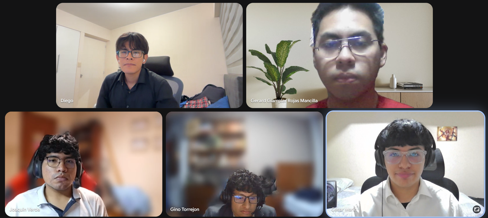
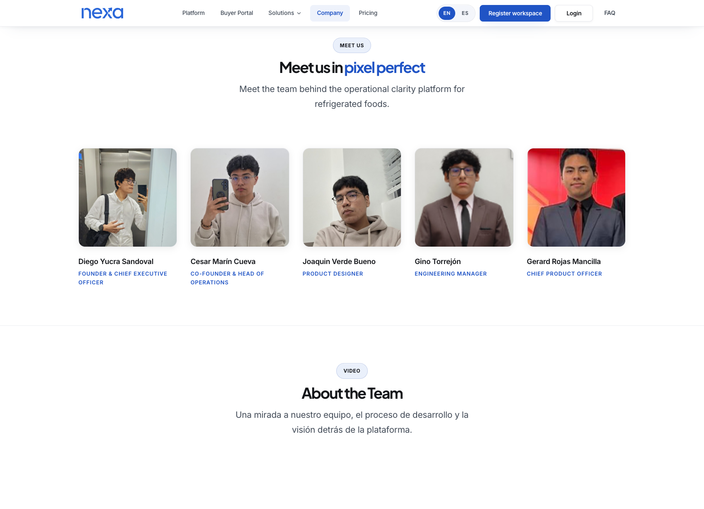

# Conclusiones

## Conclusiones y recomendaciones

### Conclusiones generales

Nexa evolucionó incrementalmente a través de AV1, TB1, AV2 y el cierre técnico de Sprint 4 / TB2, manteniendo continuidad entre investigación, diseño, implementación y documentación académica. En AV1 se establecieron el problema de coordinación en la cadena de frío B2B, los segmentos objetivo, la propuesta de valor, el backlog inicial, la Landing Page y la estructura Docs-as-Code del informe. Esta base permitió convertir una oportunidad de negocio en una propuesta trazable mediante requisitos y artefactos de diseño.

Durante TB1, el alcance se amplió hacia una Web Application revisable. El equipo documentó flujos operativos de coordinación comercial, pedidos, inventario, logística e invoicing mediante mockups, rutas frontend y datos controlados. Esta aproximación permitió revisar recorridos y decisiones UX/UI sin afirmar que ya existía una integración completa con servicios backend.

AV2 incorporó una primera articulación frontend/backend, documentación de Web Services, Swagger/OpenAPI, PostgreSQL y despliegues académicos en Render. Los releases históricos `nexa-website v3.0.0`, `nexa-webapp v2.0.0` y `nexa-platform v1.0.0` se conservan como hitos de esa entrega. Asimismo, `nexa-ecosystem-report v3.0.0` constituye el release documental AV2 del informe y no se presenta como un release TB2.

Sprint 4 consolidó el incremento técnico con los releases finales `nexa-website v4.0.1`, `nexa-webapp v3.0.1` y `nexa-platform v2.0.1`. La Web Application está disponible para revisión académica en https://nexa-webapp.onrender.com, la Platform API en https://nexa-platform-20wt.onrender.com y su interfaz Swagger/OpenAPI en https://nexa-platform-20wt.onrender.com/swagger/index.html. La evidencia complementaria reúne Jira Sprint 4, commits, GitHub Insights, branches, tags, servicios Render e integración multimedia en la Landing Page.

El resultado alcanzado demuestra aprendizaje técnico y documental en gestión de requisitos, diseño orientado al dominio, arquitectura, desarrollo web, versionado y despliegue académico. Sin embargo, este pre-cierre no constituye evidencia de uso sostenido en un entorno comercial, automatización integral, ejecución monetaria ni validación definitiva. Los resultados de Validation Interviews TB2 y nuevas versiones finales de los videos deberán incorporarse únicamente cuando existan registros verificables.

Como recomendación, el equipo debe completar las evidencias pendientes antes de declarar el cierre documental definitivo: registrar las Validation Interviews TB2, verificar los videos finales si se producen nuevas grabaciones y publicar evidencia Git del reporte correspondiente al corte TB2. También conviene mantener separados los resultados de validación, la evidencia técnica y las afirmaciones operativas para conservar rigor académico.

### Contraste con el Lean UX Process

El **Problem Statement** de Nexa identifica como problema central la coordinación manual o desconectada de pedidos B2B en empresas importadoras y distribuidoras medianas de productos refrigerados. La brecha principal es la ausencia de un flujo simple y conectado entre solicitud comercial, validación del pedido, inventario, despacho, documentos, pagos referenciales y visibilidad de temperatura. El cierre técnico TB2 presenta una experiencia coherente para recorrer esas etapas, pero el contraste con el comportamiento real todavía debe completarse mediante entrevistas TB2 documentadas.

Las **Assumptions** del Lean UX Canvas orientaron la solución hacia tres grupos de comportamiento. Primero, se asumió que los usuarios internos comerciales reciben solicitudes mediante canales informales o registros dispersos y deben reinterpretar la información antes de convertirla en pedido. Segundo, se planteó que los usuarios operativos o Account Owner necesitan revisar pedido, disponibilidad, inventario, despacho, documentos y pagos para decidir la siguiente acción. Tercero, se consideró que los compradores B2B requieren consultar catálogo, estado, documentos, pagos e información de cadena de frío con mayor autonomía. También se asumió que WhatsApp, llamadas y hojas de cálculo seguirán funcionando como canales de apoyo durante una adopción inicial.

Las **Hypotheses** H1–H4 permiten contrastar esas assumptions con resultados observables:

- **H1:** el registro estructurado de solicitudes debería reducir la reinterpretación y el retrabajo comercial.
- **H2:** una vista conectada de pedido, inventario y despacho debería mejorar la coordinación operativa.
- **H3:** el portal de consulta debería reducir las consultas manuales del comprador B2B sobre estado, documentos y condiciones de cadena de frío.
- **H4:** la adopción inicial sería más viable si la experiencia digital convive con WhatsApp, llamadas y hojas de cálculo en vez de exigir su reemplazo inmediato.

Los **criterios de éxito** definidos en el Lean UX Process no se interpretan como métricas ya alcanzadas, sino como conductas que deben observarse: usuarios comerciales registrando solicitudes con menor reinterpretación manual; usuarios operativos actualizando información de despacho y temperatura de forma consistente; y compradores B2B consultando estado, documentos, pagos referenciales e información de cadena de frío sin depender únicamente de canales dispersos.

Las **validaciones** históricas documentadas hasta AV2 proporcionan aprendizaje preliminar. Annex C registra evidencia de validación AV2 y la sección 5.3 conserva como antecedente verificable la observación S3 asociada al retorno al catálogo durante una solicitud. Ese antecedente ayuda a formular una recomendación de usabilidad, pero no permite generalizar el comportamiento de los tres segmentos. El pre-cierre técnico TB2 deja el ecosistema disponible para nuevas sesiones; el contraste definitivo con las assumptions, hypotheses y criterios de éxito queda pendiente de entrevistas TB2 reales incorporadas en 5.3 con participante, tarea, timing y evidencia.

### Conclusiones por sprint

#### Sprint 1 / AV1

Sprint 1 estableció la línea base del proyecto. El equipo definió el problema, los segmentos, la propuesta de valor y los primeros artefactos de investigación, además de organizar el repositorio del informe bajo enfoque Docs-as-Code. La Landing Page funcionó como primera evidencia pública y como medio para comunicar la propuesta de Nexa.

La principal contribución de AV1 fue conectar discovery, requisitos iniciales, Product Backlog y diseño visual. Esta coherencia permitió que los incrementos posteriores ampliaran el alcance sin perder trazabilidad documental.

#### Sprint 2 / TB1

Sprint 2 transformó la propuesta inicial en una experiencia frontend revisable. Los flujos para Sales, Warehouse, Logistics y compradores B2B se representaron mediante pantallas, wireflows, mockups y rutas de navegación. El uso de datos controlados permitió comprobar recorridos sin asumir que todos los servicios internos estaban conectados.

La principal contribución de TB1 fue vincular la investigación y el backlog con una interfaz navegable. También evidenció la necesidad de sostener límites claros entre prototipo, frontend desplegado y capacidades backend todavía en evolución.

#### Sprint 3 / AV2

Sprint 3 incorporó la primera versión documentada de Web Services y actualizó WebApp y Landing Page. La evidencia de PostgreSQL, Swagger/OpenAPI, Render, navegación y colaboración mostró una base técnica más madura y una relación más directa entre la interfaz, los contratos de servicio y la persistencia.

Los releases históricos `nexa-website v3.0.0`, `nexa-webapp v2.0.0` y `nexa-platform v1.0.0` registran el corte AV2. Las validaciones y videos publicados en esa etapa se mantienen como evidencia histórica y no se reinterpretan como resultados finales TB2.

#### Sprint 4 / TB2

Sprint 4 documenta el cierre técnico TB2 mediante Jira, tablas de commits, GitHub Insights, branches, tags y los releases finales `nexa-website v4.0.1`, `nexa-webapp v3.0.1` y `nexa-platform v2.0.1`. La evidencia Render registra la WebApp, la Platform API y PostgreSQL dentro del despliegue académico, mientras que Swagger/OpenAPI permite revisar los contratos finales disponibles.

La Landing Page integra los videos About-the-Product y About-the-Team publicados durante AV2 / Sprint 3. Esta integración constituye evidencia multimedia TB2, pero no implica que existan nuevas grabaciones finales. Del mismo modo, no se atribuyen resultados de Validation Interviews TB2 mientras sus sesiones y registros no hayan sido incorporados al informe.

El principal aprendizaje del sprint fue mantener separadas la implementación, la documentación y las afirmaciones de validación. Esta separación permite presentar el avance verificable del ecosistema sin sobredeclarar su alcance y deja preparado el reporte para integrar las evidencias finales pendientes.

### Recomendaciones para el Roadmap

1. Priorizar el flujo recurrente de pedido B2B como núcleo de aprendizaje, desde el registro de la solicitud hasta su seguimiento.
2. Mantener el alcance inmediato en solicitud, validación, disponibilidad, despacho, documentos, pagos referenciales y visibilidad de temperatura.
3. Validar con usuarios comerciales, perfiles operativos o Account Owner y compradores B2B antes de ampliar módulos o automatizaciones.
4. Diseñar una adopción gradual que conviva con WhatsApp, llamadas y hojas de cálculo mientras los usuarios incorporan el flujo digital.
5. Postergar integraciones avanzadas, aplicaciones móviles nativas y automatizaciones extensas hasta obtener evidencia de uso y prioridad.
6. Fortalecer dashboards, métricas operativas y trazabilidad de temperatura como incrementos posteriores sujetos a validación.
7. Usar los resultados de Validation Interviews TB2 para decidir qué partes del flujo mantener, ajustar o postergar en el Roadmap.

Estas recomendaciones representan siguientes pasos posibles y no funcionalidades ya implementadas. La priorización deberá revisarse con evidencia de comportamiento, severidad de problemas y valor percibido por cada segmento.

## Video About-The-Team

El Video About-The-Team disponible corresponde a AV2 / Sprint 3 y documenta el proceso de trabajo del equipo KING, con énfasis en la organización colaborativa, la distribución de responsabilidades, la coordinación de actividades y la construcción progresiva de los artefactos del ecosistema Nexa. A diferencia del Video About-the-Product, esta evidencia se centra en el equipo y en la relación entre sus actividades y el Student Outcome 5.

El video resume la participación de los integrantes en planificación, documentación, diseño, implementación, validación, despliegue académico y revisión de entregables. Los testimonios permiten identificar aportes y aprendizajes individuales, mientras que la secuencia general muestra cómo el liderazgo conjunto, la comunicación y el control de versiones sostuvieron el trabajo colaborativo durante AV2 / Sprint 3.

Durante TB2, el video histórico fue integrado en la página pública Company de `nexa-website`. La sección `about-team-video` aparece después del bloque “Meet us in pixel perfect”, usa un reproductor de YouTube con título descriptivo y permite consultar la evidencia audiovisual desde la Landing Page. Esta integración es evidencia TB2 de publicación multimedia; no implica la existencia de una nueva grabación final TB2.

*Cuadro representativo del Video About-The-Team.*

> *Nota*: La captura corresponde al Video About-The-Team publicado para AV2 / Sprint 3. Elaboración propia.

**URL pública Company:** https://upc-pre-202610-1asi0730-12242-king.github.io/nexa-website/pages/company.html#about-team-video

*Video About-the-Team integrado en la página Company.*

> *Nota*: La captura muestra la integración multimedia TB2 del video histórico About-the-Team en la página Company. Elaboración propia.

*Información del Video About-The-Team.*

| Elemento | Detalle |
|---|---|
| Título académico | `upc-pre-202610-1asi0730-12242-King-about-the-team-sprint3` |
| Entrega asociada | AV2 / Sprint 3 |
| Formato | `.mp4` |
| Duración aproximada | `00:10:19` |
| Microsoft Stream / SharePoint | https://cutt.ly/5t5gH8kj |
| YouTube | https://youtu.be/bX1JmEOxp-k?si=VGuENMApII85dx47 |

> *Nota*: La información corresponde al video AV2 / Sprint 3 actualmente publicado. Si el equipo publica una versión final TB2, deberán reemplazarse las URLs, la captura, la duración y la pauta. Elaboración propia.

*Pauta de secuencias del Video About-The-Team.*

| Inicio | Sección del video | Contenido documentado |
|---|---|---|
| `00:00:00` | Presentación general del equipo | Se introduce al equipo KING y el propósito del video como evidencia del proceso colaborativo realizado durante Nexa. |
| `00:00:45` | Organización del trabajo | Se resume la coordinación de responsabilidades, reuniones, revisiones y comunicación interna. |
| `00:01:45` | Planificación y liderazgo colaborativo | Se explica la distribución de liderazgo, apoyo entre integrantes y seguimiento de compromisos durante AV2 / Sprint 3. |
| `00:03:00` | Desarrollo del informe y artefactos | Se describe el trabajo sobre capítulos, requisitos, diseño, arquitectura y evidencias de implementación. |
| `00:04:30` | Desarrollo de productos digitales | Se resume la participación del equipo en Landing Page, Web Application, Web Services y despliegue académico. |
| `00:06:00` | Colaboración y control de versiones | Se explica el uso de repositorios, commits, ramas, revisión de entregables y trazabilidad del trabajo. |
| `00:07:30` | Testimonios de integrantes | Los integrantes presentan aportes, aprendizajes y relación con el Student Outcome 5. |
| `00:09:40` | Cierre del video | Se sintetizan el aprendizaje colaborativo y la evolución alcanzada durante AV2 / Sprint 3. |

> *Nota*: Los tiempos de inicio son referenciales y corresponden al video AV2 / Sprint 3 actualmente disponible. Elaboración propia.

El contenido mantiene relación con el Student Outcome 5 porque evidencia liderazgo conjunto, planificación, distribución de responsabilidades, coordinación y cumplimiento de objetivos académicos. Si el equipo produce una versión final TB2, deberán actualizarse las URLs, capturas, duración, testimonios y pauta sin reemplazar retrospectivamente el carácter histórico del video actual.
