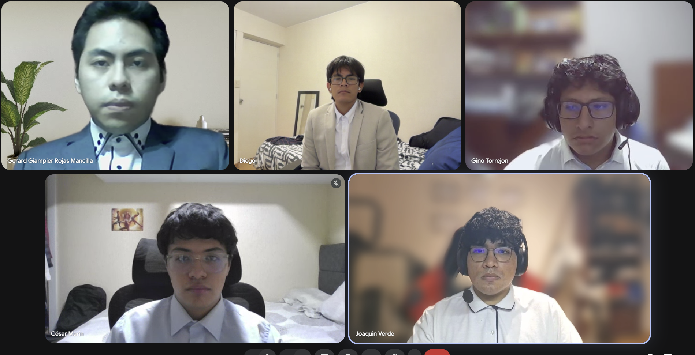

# Anexos

## A.1. Registro de videos del proyecto

*Tabla. Registro de videos según formato Anexo C*

| Sección | Características del video | Sobre el contenido                                                                                                                    | Integración y entrega |
| :--- | :--- |:--------------------------------------------------------------------------------------------------------------------------------------| :--- |
| Needfinding Interviews | Archivo audiovisual en formato `.mp4`, organizado como registro consolidado de entrevistas. Duración según grabación original de las sesiones. | Presenta entrevistas realizadas a los segmentos objetivo y conserva la evidencia usada para el análisis de requisitos del Capítulo 2. | [Video de entrevistas consolidadas (Stream)](https://upcedupe-my.sharepoint.com/:v:/g/personal/u202416289_upc_edu_pe/IQAgxFyTneNaRIUQHtxlf-8VAa51AlWqR6ANBNn5Kw0FCzI?nav=eyJyZWZlcnJhbEluZm8iOnsicmVmZXJyYWxBcHAiOiJPbmVEcml2ZUZvckJ1c2luZXNzIiwicmVmZXJyYWxBcHBQbGF0Zm9ybSI6IldlYiIsInJlZmVycmFsTW9kZSI6InZpZXciLCJyZWZlcnJhbFZpZXciOiJNeUZpbGVzTGlua0NvcHkifX0&e=ou1QC4). También se referencia en la sección 2.2. |
| Prototype Navigation / Product Navigation | Video de navegación esperado en formato `.mp4`, con recorrido claro por las pantallas del prototipo o producto. | Debe mostrar la continuidad de navegación entre pantallas, flujos principales y estados relevantes del producto.                      | [No se registra enlace final en este anexo. Se mantiene como requisito de integración para la evidencia de prototipo/producto cuando el equipo publique el video correspondiente.](https://upcedupe-my.sharepoint.com/:v:/g/personal/u202416289_upc_edu_pe/IQC_h4ewK3lORroKBasX6h8ZAfaE2sjyvPAQbe2h87Q5vx8?nav=eyJyZWZlcnJhbEluZm8iOnsicmVmZXJyYWxBcHAiOiJPbmVEcml2ZUZvckJ1c2luZXNzIiwicmVmZXJyYWxBcHBQbGF0Zm9ybSI6IldlYiIsInJlZmVycmFsTW9kZSI6InZpZXciLCJyZWZlcnJhbFZpZXciOiJNeUZpbGVzTGlua0NvcHkifX0&e=LyV2Kf) |
| Validation Interviews | Video esperado en formato `.mp4`, asociado a entrevistas de validación con usuarios. | Debe presentar validaciones, hallazgos y reacciones de usuarios frente al producto o prototipo.                                       | No se registra enlace final en este anexo. La sección 5.3 permanece sin evidencia audiovisual publicada en TB1. |
| Sprint 1 | Archivo audiovisual en formato `.mp4`, correspondiente al Sprint 1. | Presentación sobre el resumen del desarrollo Sprint 1 por parte de equipo.                                                            | [Video Sprint 1(Stream)](https://upcedupe-my.sharepoint.com/:v:/g/personal/u202416289_upc_edu_pe/IQB6JRrks2ICQpZPn1bPz0STAcx-n8Cn63FWDKnSr6LLgVI?nav=eyJyZWZlcnJhbEluZm8iOnsicmVmZXJyYWxBcHAiOiJPbmVEcml2ZUZvckJ1c2luZXNzIiwicmVmZXJyYWxBcHBQbGF0Zm9ybSI6IldlYiIsInJlZmVycmFsTW9kZSI6InZpZXciLCJyZWZlcnJhbFZpZXciOiJNeUZpbGVzTGlua0NvcHkifX0&e=bgE8uT). |
| Exposición AV1 | Archivo audiovisual en formato `.mp4`, correspondiente a la exposición de la AV1. | Video de exposición que presenta el desarrollo correspondiente al AV1.                                                                | [Video Expo AV1 (Stream)](https://upcedupe-my.sharepoint.com/:v:/g/personal/u202416289_upc_edu_pe/IQCKLhjXP299ToKrmrVs3JehAY5H6ijEJxIYpxdIc8p3f3k?nav=eyJyZWZlcnJhbEluZm8iOnsicmVmZXJyYWxBcHAiOiJPbmVEcml2ZUZvckJ1c2luZXNzIiwicmVmZXJyYWxBcHBQbGF0Zm9ybSI6IldlYiIsInJlZmVycmFsTW9kZSI6InZpZXciLCJyZWZlcnJhbFZpZXciOiJNeUZpbGVzTGlua0NvcHkifX0&e=hyt9lF). |
| Sprint 2 | Archivo audiovisual en formato `.mp4`, correspondiente al Sprint 2. | Presentación sobre el resumen del desarrollo Sprint 2 por parte de equipo.                                                            | [Video Sprint 2(Stream)](https://upcedupe-my.sharepoint.com/:v:/g/personal/u202416289_upc_edu_pe/IQBkbwGskpn2Rq8fM6Tu8kK_ARlxI70KoTYFYefiVr_3Qko?nav=eyJyZWZlcnJhbEluZm8iOnsicmVmZXJyYWxBcHAiOiJPbmVEcml2ZUZvckJ1c2luZXNzIiwicmVmZXJyYWxBcHBQbGF0Zm9ybSI6IldlYiIsInJlZmVycmFsTW9kZSI6InZpZXciLCJyZWZlcnJhbFZpZXciOiJNeUZpbGVzTGlua0NvcHkifX0&e=gGHAPB). |
| Exposición TB1 | Archivo audiovisual en formato `.mp4`, correspondiente a la exposición de la TB1. | Video de exposición que presenta el desarrollo correspondiente al TB1.                                                                | [Video exposición TB1(Stream)](https://upcedupe-my.sharepoint.com/:v:/g/personal/u202416289_upc_edu_pe/IQA0AyXGai_5SKudYrywKiG3AbdTpypEmjmJ9DMpRk-5_sU?nav=eyJyZWZlcnJhbEluZm8iOnsicmVmZXJyYWxBcHAiOiJPbmVEcml2ZUZvckJ1c2luZXNzIiwicmVmZXJyYWxBcHBQbGF0Zm9ybSI6IldlYiIsInJlZmVycmFsTW9kZSI6InZpZXciLCJyZWZlcnJhbFZpZXciOiJNeUZpbGVzTGlua0NvcHkifX0&e=Goikvb). |
| About the Team | Archivo audiovisual en formato `.mp4`, correspondiente a la presentación del equipo. | Presenta a los integrantes de Vultures Devs, roles y organización general del trabajo durante el proyecto.                            | No se registra enlace final en este anexo. Se conserva como requisito de soporte institucional cuando el equipo publique el enlace correspondiente. |
| About the Product | Video esperado en formato `.mp4`, con duración breve y enfoque en propuesta de valor, problema, solución y recorrido principal. | Debe explicar Nexa como producto: problema atendido, segmentos, flujo principal, alcance implementado y límites de la entrega.        | No se registra enlace final en este anexo. La sección 5.4 conserva el formato de registro sin afirmar un video publicado. |

> *Nota:* La tabla conserva los enlaces disponibles y diferencia los videos publicados de los videos aún no registrados. No se agregan enlaces ni evidencias que no estén presentes en el reporte.

## A.2. Evidencia de Needfinding

Como respaldo de la fase de levantamiento de requisitos e investigación de campo (Capítulo 2), se adjunta el video consolidado con las sesiones de entrevistas realizadas a los segmentos objetivo.

| Artefacto | Enlace de Evidencia |
| :--- | :--- |
| **Entrevistas Consolidadas (Todos los Segmentos)** | [Video de Entrevistas Juntas (Stream)](https://upcedupe-my.sharepoint.com/:v:/g/personal/u202323040_upc_edu_pe/IQCQOBuwf0GTTbCMpL2XzFXzAacXrD22oEX1Gat-emtg9u4?nav=eyJyZWZlcnJhbEluZm8iOnsicmVmZXJyYWxBcHAiOiJPbmVEcml2ZUZvckJ1c2luZXNzIiwicmVmZXJyYWxBcHBQbGF0Zm9ybSI6IldlYiIsInJlZmVycmFsTW9kZSI6InZpZXciLCJyZWZlcnJhbFZpZXciOiJNeUZpbGVzTGlua0NvcHkifX0&e=IeXiWj) |

## A.3. Enlaces Maestros de Soporte

El siguiente cuadro concentra los enlaces a las plataformas colaborativas y repositorios utilizados para gestionar el ciclo de vida de Nexa.

| Herramienta / Artefacto | Enlace                                                                                                                                                         |
| :--- |:---------------------------------------------------------------------------------------------------------------------------------------------------------------|
| **Jira Product Backlog** | [Nexa Product Backlog (Jira)](https://team-nexa.atlassian.net/jira/software/projects/NX/boards/1/backlog?epics=visible)                                        |
| **Figma Project (Landing Page)** | [Nexa Landing Page Design](https://www.figma.com/files/team/1586383034175281439/project/587167294)                                                             |
| **Figma Project (Web App)** | [Nexa Web App Design](https://www.figma.com/design/buDa5VZmYjPNokbl4FEJqx/Web-App?node-id=0-1)                                                                 |
| **Repositorio GitHub (Reporte)** | [upc-pre-202610-1asi0729-12010-VulturesD/nexa-report](https://github.com/upc-pre-202610-1asi0729-12010-VulturesD/nexa-report)                                  |
| **Repositorio GitHub (Website)** | [upc-pre-202610-1asi0729-12010-VulturesD/nexa-website](https://github.com/upc-pre-202610-1asi0729-12010-VulturesD/nexa-website)                                          |
| **Repositorio GitHub (Webapp)** | [upc-pre-202610-1asi0729-12010-VulturesD/nexa-webapp](https://github.com/upc-pre-202610-1asi0729-12010-VulturesD/nexa-webapp)                                            |
| **Repositorio GitHub (Backend / Plataforma futura)** | [upc-pre-202610-1asi0729-12010-VulturesD/nexa-platform](https://github.com/upc-pre-202610-1asi0729-12010-VulturesD/nexa-platform)                                        |
| **Landing Page desplegada** | [https://upc-pre-202610-1asi0729-12010-vulturesd.github.io/nexa-website/](https://upc-pre-202610-1asi0729-12010-vulturesd.github.io/nexa-website/)                       |
| **Webapp desplegada TB1** | [https://nexa-webapp-opensource.web.app/login](https://nexa-webapp-opensource.web.app/login) |

## A.4. Evidencia de Coordinación Grupal

Este anexo respalda la subsección **5.2.1.8. Team Collaboration Insights during Sprint**. A continuación, se registran pruebas de coordinación síncrona y asíncrona del equipo, incluyendo capturas de reuniones, revisiones de diseño y acuerdos de trabajo.

### Sprint 1

> *Nota:* Figura. Trabajo colaborativo del equipo Vultures Devs durante el Sprint 1. Elaboración propia.

> *Nota:* Figura. Reunión de coordinación del equipo Vultures Devs durante Sprint 1. Elaboración propia.

> *Nota:* Figura. Práctica de exposición del equipo Vultures Devs para la sustentación AV1. Elaboración propia.

### Sprint 2

> *Nota:* Figura. Reunión de coordinación del equipo Vultures Devs durante Sprint 2. Elaboración propia.

> *Nota:* Figura. Exposición del equipo Vultures Devs para la sustentación TB1. Elaboración propia.
